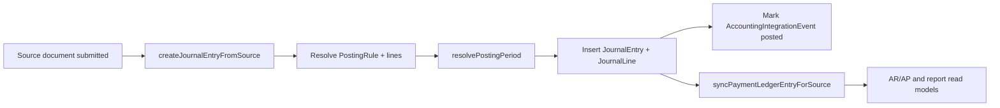
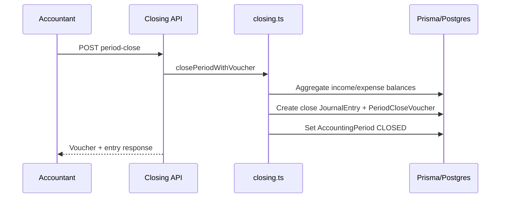
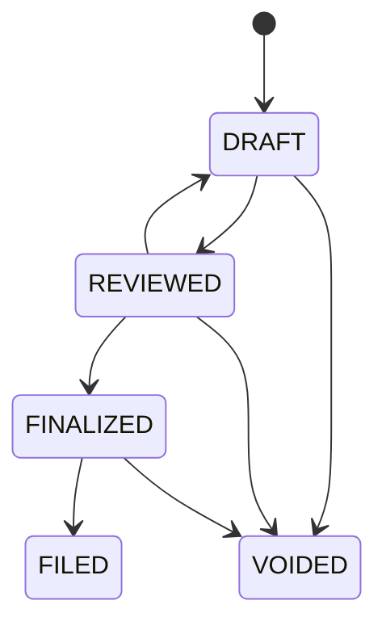

# Accounting Expansion Plan (Codebase-Aligned)

## 1. Purpose
This document is the accounting implementation contract for this repository. It translates stakeholder requirements into the exact modules, routes, services, and data models already present in the codebase.

Primary goals:
- Keep accounting behavior consistent with ERP-style double entry principles.
- Support Zimbabwe VAT and fiscalisation workflows.
- Keep UX navigable by grouping accounting into semantic categories.
- Make reporting deterministic from posted journal data.

Source of truth in code:
- UI routes: `app/accounting/*`
- API routes: `app/api/accounting/*`
- Domain services: `lib/accounting/*`
- Typed client API: `lib/api.ts`
- Persistence: `prisma/schema.prisma`

## 2. Design Principles
- One posting engine for all accounting sources.
- Journal entries are the canonical ledger source.
- AR/AP subledger is maintained in a dedicated payment ledger.
- Governance controls (period lock, freeze date, close voucher) are explicit and auditable.
- VAT returns are lifecycle-managed (`DRAFT -> REVIEWED -> FINALIZED -> FILED` plus `VOIDED`).
- Fiscalisation is integration-ready with retry/sync metadata.

## 3. Accounting Navigation Model (Implemented)
Accounting navigation is now two-level and grouped by semantic category to reduce tab clutter.

### 3.1 Categories
Defined in `lib/accounting/tab-config.ts` and rendered in `components/accounting/accounting-shell.tsx`.

| Category | Tabs |
|---|---|
| Overview | Overview |
| Core | Chart of Accounts, Journals, Periods, Posting Rules |
| Receivables | Receivables, Sales |
| Payables | Payables, Purchases |
| Treasury | Banking, Currency |
| Controls | Assets, Budgets, Cost Centers |
| Tax & Compliance | Tax, Fiscalisation |
| Reports | Financial Reports, Trial Balance, Financial Statements |

### 3.2 UX behavior
- Top nav selects category.
- Second nav shows tabs for the selected category only.
- Feature flags still gate visibility (`lib/accounting/visibility.ts`).

## 4. Module Map (Route -> API -> Service -> Models)

### 4.1 Core Ledger and Controls
UI:
- `/accounting/chart-of-accounts`
- `/accounting/journals`
- `/accounting/periods`
- `/accounting/posting-rules`

API:
- `/api/accounting/coa`
- `/api/accounting/journals`
- `/api/accounting/periods`
- `/api/accounting/posting-rules`
- `/api/accounting/closing/*`

Services:
- `lib/accounting/posting.ts`
- `lib/accounting/ledger.ts`
- `lib/accounting/period-lock.ts`
- `lib/accounting/closing.ts`

Models:
- `AccountingSettings`, `ChartOfAccount`, `AccountingPeriod`
- `JournalEntry`, `JournalLine`
- `PostingRule`, `PostingRuleLine`
- `OpeningBalanceImport`, `PeriodCloseVoucher`

### 4.2 Receivables
UI:
- `/accounting/receivables`
- `/accounting/sales`

API:
- `/api/accounting/sales/customers`
- `/api/accounting/sales/invoices`
- `/api/accounting/sales/receipts`
- `/api/accounting/sales/credit-notes`
- `/api/accounting/sales/write-offs`

Services:
- `lib/accounting/posting.ts`
- `lib/accounting/payment-ledger.ts`

Models:
- `Customer`, `SalesInvoice`, `SalesInvoiceLine`
- `SalesReceipt`, `CreditNote`, `CreditNoteLine`, `SalesWriteOff`
- `PaymentLedgerEntry`

### 4.3 Payables
UI:
- `/accounting/payables`
- `/accounting/purchases`

API:
- `/api/accounting/purchases/vendors`
- `/api/accounting/purchases/bills`
- `/api/accounting/purchases/payments`
- `/api/accounting/purchases/debit-notes`
- `/api/accounting/purchases/write-offs`

Services:
- `lib/accounting/posting.ts`
- `lib/accounting/payment-ledger.ts`

Models:
- `Vendor`, `PurchaseBill`, `PurchaseBillLine`
- `PurchasePayment`, `DebitNote`, `DebitNoteLine`, `PurchaseWriteOff`
- `PaymentLedgerEntry`

### 4.4 Treasury
UI:
- `/accounting/banking`
- `/accounting/currency`

API:
- `/api/accounting/banking/accounts`
- `/api/accounting/banking/transactions`
- `/api/accounting/banking/reconcile`
- `/api/accounting/banking/reconciliations`
- `/api/accounting/currency`

Models:
- `BankAccount`, `BankTransaction`, `BankReconciliation`, `BankStatementLine`
- `CurrencyRate`

### 4.5 Tax and Compliance
UI:
- `/accounting/tax`
- `/accounting/fiscalisation`

API:
- `/api/accounting/tax`
- `/api/accounting/vat-returns`
- `/api/accounting/vat-returns/[id]/review|finalize|file|export`
- `/api/accounting/fiscalisation/config`
- `/api/accounting/fiscalisation/issue`
- `/api/accounting/fiscalisation/receipts`
- `/api/accounting/fiscalisation/receipts/[id]/sync`
- `/api/accounting/fiscalisation/replay`

Services:
- `lib/accounting/vat-return.ts`
- `lib/accounting/fiscalisation.ts`

Models:
- `TaxCode`, `VatReturnSummary`, `VatReturn`, `VatReturnLine`
- `FiscalisationProviderConfig`, `FiscalReceipt`

### 4.6 Reporting
UI:
- `/accounting/financial-reports`
- `/accounting/trial-balance`
- `/accounting/financial-statements`

API:
- `/api/accounting/reports/trial-balance`
- `/api/accounting/reports/financials`
- `/api/accounting/reports/general-ledger`
- `/api/accounting/reports/cash-flow`
- `/api/accounting/reports/ar-aging`
- `/api/accounting/reports/ap-aging`
- `/api/accounting/reports/customer-statement`
- `/api/accounting/reports/vendor-statement`
- `/api/accounting/reports/vat-summary`

Services:
- `lib/accounting/ledger.ts`
- `lib/accounting/payment-ledger.ts`

## 5. End-to-End Posting Architecture

Posting invariants:
- Journal lines must balance (`debit == credit` within tolerance).
- Closed or frozen periods require policy-compliant override.
- Duplicate source posting is idempotent by source key.

## 6. Governance and Close Controls
Implemented controls in `lib/accounting/closing.ts` and related APIs:
- Opening balance import (`/api/accounting/closing/opening-balances`)
- Freeze before date (`/api/accounting/closing/freeze`)
- Period close voucher (`/api/accounting/closing/period-close`)

## 7. VAT Return Lifecycle (Implemented)
VAT returns are managed by `lib/accounting/vat-return.ts` and `/api/accounting/vat-returns/*`.

Lifecycle:
- `DRAFT`: create or refresh from invoice/bill tax lines.
- `REVIEWED`: reviewer sign-off.
- `FINALIZED`: locked computation state for filing readiness.
- `FILED`: filing metadata captured (reference number).
- `VOIDED`: invalidated return.

## 8. Fiscalisation Reliability Layer (Implemented as Integration-Ready)
Current capability in `lib/accounting/fiscalisation.ts`:
- Validates invoice and supplier/customer fiscal fields.
- Stores provider config and request payload envelope.
- Tracks retries and sync metadata (`attemptCount`, `nextRetryAt`, `lastSyncedAt`).
- Supports replay and manual sync endpoints.

Scope note:
- This is adapter-ready and persistence-ready. Full production FDMS transport details (for example mTLS certificate runtime and provider protocol specifics) remain a dedicated integration phase.

## 9. Payment Ledger and Aging
`PaymentLedgerEntry` is now the primary AR/AP subledger for aging.

Behavior:
- Synced during posting for invoice/payment/note/write-off source types.
- AR/AP aging APIs use payment ledger first, then fallback to legacy derivation if needed.

Benefits:
- Faster outstanding and bucket reporting.
- Cleaner reconciliation and allocation audit path.

## 10. Accounting Data Model Additions Delivered
Recent schema additions aligned to stakeholder requirements:
- `PaymentLedgerEntry`
- `VatReturn`, `VatReturnLine`
- `OpeningBalanceImport`
- `PeriodCloseVoucher`
- `AccountingSettings.freezeBeforeDate`
- `AccountingSettings.retainedEarningsAccountId`
- Fiscal provider and receipt reliability fields

## 11. Current Delivery Status Against Stakeholder Requirements

| Requirement Theme | Status | Notes |
|---|---|---|
| CoA + journal posting core | Delivered | Posting rules, journal engine, period policy checks are active. |
| AR/AP documents and posting | Delivered | Sales/purchases/payments/notes/write-offs post through accounting flows. |
| Payment subledger and aging | Delivered | `PaymentLedgerEntry` plus AR/AP aging endpoints updated. |
| VAT return lifecycle | Delivered | Draft, review, finalize, file and export endpoints/UI shipped. |
| Freeze/opening/period close controls | Delivered | New closing APIs and periods UI controls shipped. |
| Fiscalisation integration-ready baseline | Delivered (integration-ready) | Provider config + issue/sync/replay + retry metadata shipped. |
| Full production FDMS transport hardening | Planned | Final provider protocol execution layer remains next phase. |
| Smart bank import matching automation | Partial | Banking and reconciliation exist; advanced matching can be improved. |

## 12. Known Follow-ups (Next Iteration)
- Upgrade opening-balance input UX from raw JSON text to structured line editor.
- Add deeper VAT 7 schedule mapping for foreign currency and withholding breakdowns.
- Complete production-grade FDMS connector runtime and certificate operations playbook.
- Expand automated QA coverage for posting and tax transition paths.

## 13. QA and Release Checklist
- Run `pnpm db:generate` after schema updates.
- Apply DB sync via environment policy (`pnpm db:push` or migration flow).
- Run `pnpm lint`.
- Run `pnpm build`.
- Smoke test:
  - create and post sales/purchase documents
  - verify journal lines and payment ledger entries
  - generate VAT return draft and transition statuses
  - set freeze date and verify lock behavior
  - close a period and verify close voucher entry

## 14. Connection to Platform Holy Grail
Use `docs/expansion-plan/platform-holy-grail.md` as the full platform-wide module map.
This accounting document is the finance domain deep dive and should stay in sync with:
- navigation (`lib/navigation.ts`, `lib/accounting/tab-config.ts`)
- route gating (`lib/platform/gating/route-registry.ts`)
- schema (`prisma/schema.prisma`)
