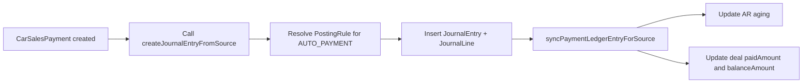

# Auto Sales Module Expansion Plan (Codebase-Aligned)

## 1. Purpose
This document is the auto sales implementation contract for this repository. It translates stakeholder requirements from `zim-smb-market-gameplan.md` and `industry-implementation-plans/auto-implementation-plan.md` into exact modules, routes, services, and data models.

Primary goals:
- Stand up automotive sales pack with lead→deal workflow, inventory, pricing controls, financing, and posting-safe payments.
- Provide executive visibility through dashboards and exports.
- Apply playbook-compliant UI (DetailPageShell, vertical tabs, full-bleed tables).
- Integrate payment posting with accounting engine for AR tracking.

Source of truth in code:
- UI routes: `app/car-sales/*` (alias: `app/autos/*`)
- API routes: `app/api/v2/autos/*`
- Domain services: `lib/autos/*`
- Typed client API: `lib/autos/autos-v2.ts`
- Persistence: `prisma/schema.prisma`

## 2. Design Principles
- **Lead-first funnel**: Leads are the entry point; conversion to deals tracks lineage.
- **Status machines**: Leads, vehicles, and deals follow controlled state transitions.
- **Pricing controls**: Floor prices, approval thresholds, margin guardrails enforced.
- **Payment posting**: Deposits and payments post to GL/AR with idempotent source keys.
- **Delivery blocking**: Delivery state gates on checklist completion and zero balance.
- **Document lifecycle**: Deals follow Draft→Quoted→Reserved→Contracted→Delivered states.

## 3. Navigation Model (To Implement)

### 3.1 Main Navigation
```
/car-sales                  # Dashboard with pipeline, inventory, deals metrics
/car-sales/leads            # Lead directory → /leads/[id] (detail with tabs)
/car-sales/inventory        # Vehicle inventory → /inventory/[id] (detail with tabs)
/car-sales/deals            # Deal directory → /deals/[id] (detail with tabs)
/car-sales/payments         # Payment list → /payments/[id] (detail)
/car-sales/delivery         # Delivery queue → /delivery/[id] (checklist)
/car-sales/financing        # Financing options management
/car-sales/reports          # Reporting hub (pipeline, margin, delivery)
```

## 4. Module Map (Route → API → Service → Models)

### 4.1 Lead Management
**UI:**
- `/car-sales/leads` (list)
- `/car-sales/leads/[id]` (tabs: Overview, Activity, Vehicles, Documents, Audit)

**API:**
- `/api/v2/autos/leads` (list, create, search)
- `/api/v2/autos/leads/[id]` (get, update, status transition)
- `/api/v2/autos/leads/[id]/qualify` (qualification workflow)
- `/api/v2/autos/leads/[id]/convert` (convert to deal with lineage)
- `/api/v2/autos/leads/[id]/activities` (activity log)

**Services:**
- `lib/autos/leads.ts` (CRUD, qualification, assignment, de-duplication)
- `lib/autos/lead-conversion.ts` (convert to deal, preserve lineage)

**Models:**
- `CarSalesLead` (lead number, name, phone, email, source, status, budget range, vehicle interest)
- **Status machine:** NEW → QUALIFIED → NEGOTIATION → WON | LOST | CANCELED

### 4.2 Inventory & Pricing
**UI:**
- `/car-sales/inventory` (list)
- `/car-sales/inventory/[id]` (tabs: Specs, Pricing, Photos, History, Documents, Audit)

**API:**
- `/api/v2/autos/inventory` (list, create, search)
- `/api/v2/autos/inventory/[id]` (get, update, status transition)
- `/api/v2/autos/inventory/[id]/pricing` (update listing/floor/target prices)
- `/api/v2/autos/inventory/[id]/reconditioning` (reconditioning cost log)
- `/api/v2/autos/inventory/[id]/photos` (photo upload/management)
- `/api/v2/autos/inventory/[id]/hold` (reserve vehicle)
- `/api/v2/autos/inventory/[id]/release` (release hold)

**Services:**
- `lib/autos/inventory.ts` (CRUD, pricing rules, hold/release)
- `lib/autos/pricing.ts` (floor price enforcement, margin calculation, approval logic)

**Models:**
- `CarSalesVehicle` (stock number, VIN, make, model, year, color, mileage, cost basis, listing price, floor price, target price, status)
- **Status machine:** INBOUND → IN_STOCK → RESERVED → SOLD → DELIVERED

### 4.3 Deals & Financing
**UI:**
- `/car-sales/deals` (list)
- `/car-sales/deals/[id]` (tabs: Overview, Financials, Documents, Approvals, Audit)

**API:**
- `/api/v2/autos/deals` (list, create from lead+vehicle)
- `/api/v2/autos/deals/[id]` (get, update, status transition)
- `/api/v2/autos/deals/[id]/quote` (generate quote with taxes/fees)
- `/api/v2/autos/deals/[id]/reserve` (reserve with deposit)
- `/api/v2/autos/deals/[id]/contract` (finalize contract)
- `/api/v2/autos/deals/[id]/financing` (financing options, EMI calculator)
- `/api/v2/autos/deals/[id]/trade-in` (trade-in valuation)
- `/api/v2/autos/deals/[id]/approve-discount` (discount approval workflow)
- `/api/v2/autos/deals/[id]/revisions` (revision history)

**Services:**
- `lib/autos/deals.ts` (deal creation, status machine, balance calculation)
- `lib/autos/financing.ts` (EMI calculation, lender templates)
- `lib/autos/trade-in.ts` (trade-in valuation logic)
- `lib/autos/approvals.ts` (maker-checker for discounts, below-floor pricing)

**Models:**
- `CarSalesDeal` (deal number, customer name/phone/email, vehicle, lead reference, sale price, deposit, taxes, fees, net amount, balance, status, reserved until)
- **Status machine:** DRAFT → QUOTED → RESERVED → CONTRACTED → DELIVERY_READY → DELIVERED

**Balance calculation:**
```
netAmount = salePrice + taxAmount + feeAmount - tradeInValue - discount
paidAmount = sum of payments
balanceAmount = netAmount - paidAmount
```

### 4.4 Payments & Posting
**UI:**
- `/car-sales/payments` (list)
- `/car-sales/payments/[id]` (detail with posting reference)

**API:**
- `/api/v2/autos/payments` (list, create)
- `/api/v2/autos/payments/[id]` (get, post to accounting)
- `/api/v2/autos/payments/[id]/void` (void payment with reversal)
- `/api/v2/autos/payments/[id]/refund` (refund workflow)

**Services:**
- `lib/autos/payments.ts` (payment creation, tender validation)
- `lib/autos/payments-posting.ts` (posting integration with accounting engine)

**Models:**
- `CarSalesPayment` (payment number, deal reference, amount, tender type, payment date, posted status, journal entry reference)

**Posting Integration:**
- Payments post via `lib/accounting/posting.ts` with source type `AUTO_PAYMENT`
- Idempotent source key: `AUTO:PAYMENT:{paymentId}`
- Debit: Bank/Cash account
- Credit: Vehicle Sales Revenue / Customer Deposits (liability if deposit)
- Subledger: `PaymentLedgerEntry` for AR tracking

**Overpayment blocking:**
- Payment amount + existing paid amount cannot exceed net amount
- Validation in payment creation API

### 4.5 Delivery & Handover
**UI:**
- `/car-sales/delivery` (delivery queue)
- `/car-sales/delivery/[dealId]` (checklist with sign-off capture)

**API:**
- `/api/v2/autos/delivery/[dealId]/checklist` (get checklist)
- `/api/v2/autos/delivery/[dealId]/checklist` (update checklist items)
- `/api/v2/autos/delivery/[dealId]/complete` (mark delivered with validation)
- `/api/v2/autos/delivery/[dealId]/documents` (document generation/upload)

**Services:**
- `lib/autos/delivery.ts` (checklist management, delivery blocking rules, sign-off capture)

**Models:**
- `CarSalesDeliveryChecklist` (deal reference, insurance verified, registration complete, PDI done, plates attached, keys handed, customer signature)

**Delivery blocking rules:**
- Deal status must be DELIVERY_READY
- Balance must be zero (no outstanding amount)
- All checklist items must be completed
- VIN and plate validation required

### 4.6 After-Sales Hooks
**UI:**
- `/car-sales/service` (service appointment capture)

**API:**
- `/api/v2/autos/service/appointments` (create, list)
- `/api/v2/autos/service/warranties` (warranty/recall flags)
- `/api/v2/autos/service/follow-ups` (reminder scheduling)

**Services:**
- `lib/autos/service.ts` (appointment scheduling, warranty tracking)

**Models:**
- `CarSalesServiceAppointment` (future addition)

### 4.7 Reporting
**UI:**
- `/car-sales/reports` (pipeline, margin, payment, delivery metrics)

**API:**
- `/api/v2/autos/reports/pipeline` (funnel analysis, conversion rates)
- `/api/v2/autos/reports/margin` (cost vs. sale price analysis)
- `/api/v2/autos/reports/payments` (payment status tracking)
- `/api/v2/autos/reports/delivery` (delivery throughput)
- `/api/v2/autos/reports/export` (CSV/PDF export)

**Services:**
- `lib/autos/reports.ts` (report generation, KPI calculation)

## 5. End-to-End Payment Posting Architecture



**Posting invariants:**
- Payment source key: `AUTO:PAYMENT:{paymentId}`
- Journal lines must balance
- Deposits credit liability account until deal contracted
- Final payments credit revenue account
- Overpayment blocked at API level

## 6. Document Lifecycle (To Implement)

**States:** DRAFT → QUOTED → RESERVED → CONTRACTED → DELIVERY_READY → DELIVERED

**Enforced by:** `lib/platform/document-lifecycle.ts` (new service)

**Applies to:**
- `CarSalesDeal`

**Rules:**
- Status transitions require validation (e.g., RESERVED requires deposit)
- No delete after CONTRACTED
- Cancellation creates reversal entries for payments
- Audit timeline captures all transitions

## 7. Approval Workflows

**Trigger:** Discount > threshold OR sale price < floor price

**Action:** Create approval request for manager/finance

**Implementation:** `lib/autos/approvals.ts` (new service)

**Behavior:**
- Deal creation with discount > 10% OR salePrice < vehicle.minApprovalPrice triggers approval
- Approval request created with justification
- Manager/finance reviews and approves/rejects
- Deal status gates on approval

## 8. Acceptance Criteria

- ✅ Navigation exposes lead/inventory/deal/payment/delivery modules
- ✅ Lead detail pages with activity tracking and conversion workflow
- ✅ Vehicle detail pages with VIN, pricing, photos, reconditioning log
- ✅ Deal detail pages with status machine, financials, approval history
- ✅ Payments post via accounting with idempotent keys; overpayment blocked
- ✅ Delivery checklist gates delivery state; balance and checklist validated
- ✅ Dashboards show pipeline, margin, payment, delivery metrics
- ✅ Exports succeed and log audits
- ✅ Approval workflows enforce for discounts/below-floor pricing
- ✅ Timeline audit captures all transitions

## 9. Current Delivery Status

| Requirement Theme | Status | Notes |
|---|---|---|
| Database schema | ✅ Complete | All models exist in `prisma/schema.prisma` |
| Basic dashboard | ✅ Delivered | Shows metrics from `/api/v2` with vertical tabs |
| Detail pages | ❌ Missing | Need lead/vehicle/deal detail pages with tabs |
| Payment workflows | ⚠️ Partial | Basic API exists; posting integration needed |
| Payment posting | ❌ Missing | Posting integration needed |
| Delivery workflows | ❌ Missing | Checklist and blocking rules needed |
| Approval workflows | ❌ Missing | Maker-checker for discounts/pricing needed |
| Reporting | ⚠️ Partial | Basic metrics exist; export/KPI emails needed |

## 10. Implementation Phases

**Phase 1: Detail Pages (Week 1)**
- Lead detail page with activity tracking
- Vehicle detail page with photos and pricing history
- Deal detail page with financials and revision history

**Phase 2: Payment Workflows & Posting (Week 1-2)**
- Payment creation with tender validation
- Posting integration
- Overpayment blocking
- Refund workflows

**Phase 3: Delivery & Approval (Week 2)**
- Delivery checklist management
- Delivery blocking validation
- Approval workflows for discounts/below-floor

**Phase 4: Reporting & Polish (Week 2)**
- Pipeline dashboards
- Margin analysis
- Payment/delivery tracking
- Export capabilities
- Scheduled KPI emails

## 11. QA and Release Checklist

- Run `npm run lint`
- Run `npm run build`
- Smoke test:
  - Create lead and convert to deal
  - Create vehicle with pricing
  - Create deal and process payment
  - Verify journal entry and AR aging
  - Complete delivery checklist
  - Mark deal as delivered
- Verify posting idempotency (duplicate payment attempts rejected)
- Verify overpayment blocking
- Verify delivery blocking (balance/checklist validation)

## 12. Connection to Platform Architecture

This auto sales document should stay in sync with:
- Navigation: `lib/navigation.ts`
- Route gating: `lib/platform/gating/route-registry.ts`
- Feature catalog: `lib/platform/feature-catalog.ts`
- Schema: `prisma/schema.prisma`
- Posting engine: `lib/accounting/posting.ts`
- Document lifecycle: `lib/platform/document-lifecycle.ts` (new)
