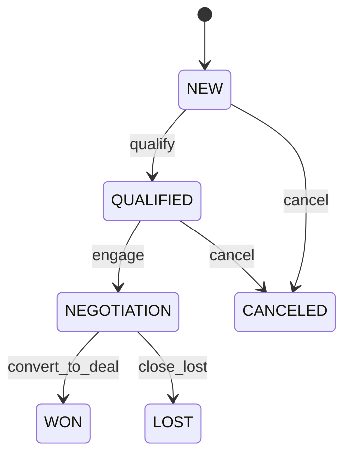
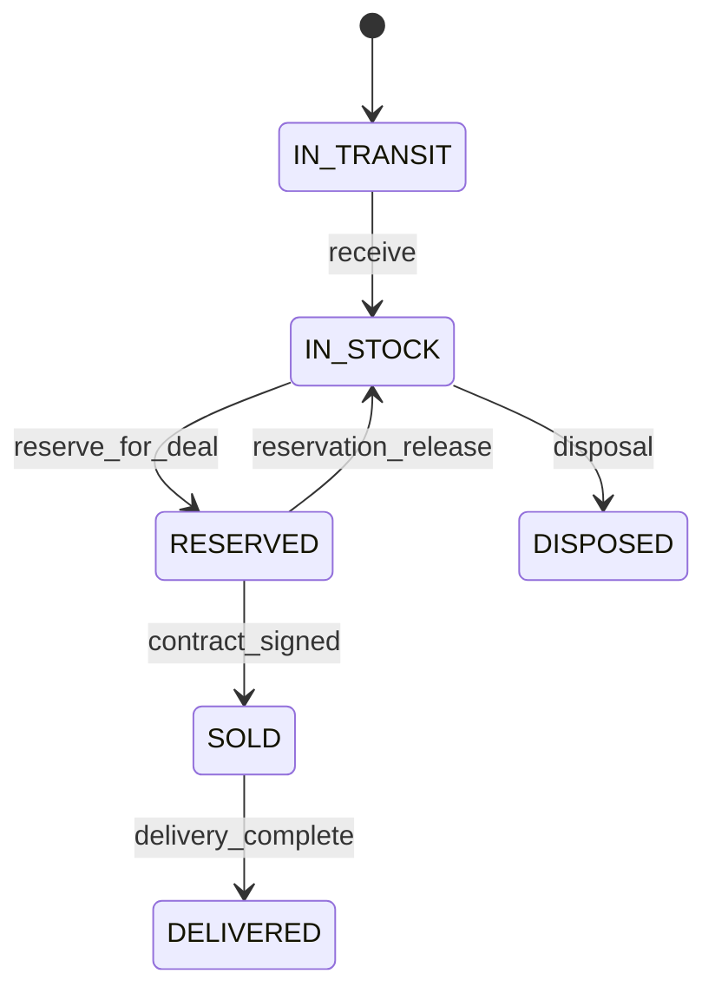
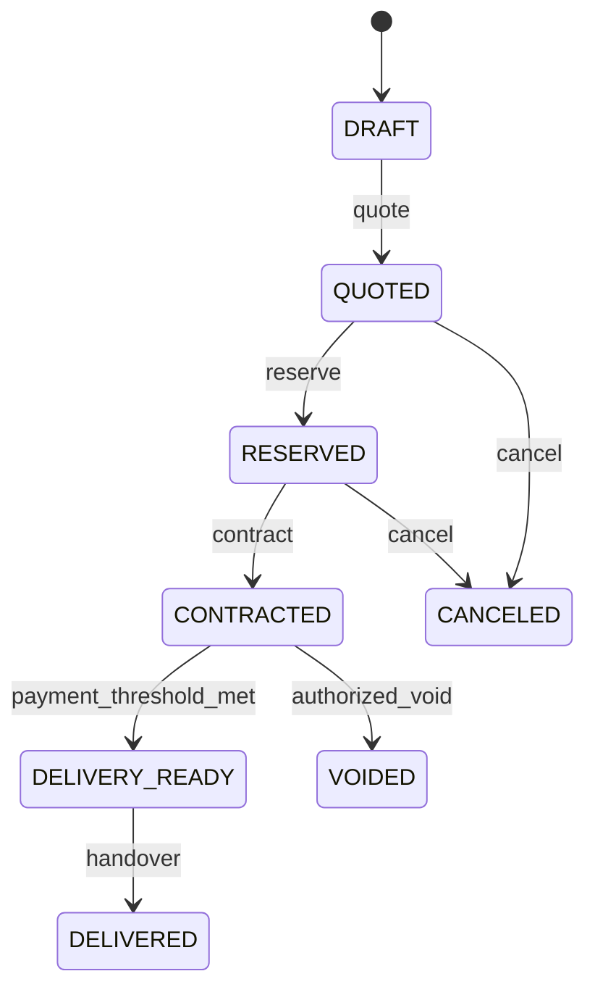

# Car Sales Pack Spec (Full Scope, Implementation-Ready)

## Normative References
1. Platform architecture source of truth: `docs/expansion-plan/platform-holy-grail.md`
2. UX enforcement source of truth: `docs/ux/platform-ux-playbook.md`

## 1. Objective
Deliver a complete dealership workflow from lead intake to delivery and financial settlement, with deterministic inventory control and accounting traceability.

## 2. Scope
### 2.1 In Scope
1. Lead capture, qualification, assignment, conversion.
2. Customer profile and KYC state.
3. Vehicle inventory lifecycle from acquisition to delivery.
4. Deal lifecycle: quote, reserve, contract, payment, delivery, cancellation.
5. Trade-in valuation and settlement integration.
6. Reporting for funnel, stock aging, margin, and salesperson performance.

### 2.2 Out of Scope (Deferred)
| Dependency ID | Deferred Item | Reason | Target Wave |
| --- | --- | --- | --- |
| CAR-DEP-01 | Lender disbursement API | partner integration dependency | Wave 4 |
| CAR-DEP-02 | Workshop/after-sales integration | separate module boundary | Wave 4 |
| CAR-DEP-03 | Marketplace syndication | non-core for transaction controls | Wave 4 |

## 3. Feature-Gating Matrix by Route and Feature Key
Bundle: `ADDON_CAR_SALES_PACK`

| Route/API Prefix | Feature Key | Roles | Notes |
| --- | --- | --- | --- |
| `/car-sales` + `/api/car-sales/dashboard` | `car-sales.home` | sales-manager, sales-agent | dashboard |
| `/car-sales/leads` + `/api/car-sales/leads` | `car-sales.leads.manage` | sales-agent, sales-manager | lead pipeline |
| `/car-sales/customers` + `/api/car-sales/customers` | `car-sales.customers.manage` | sales-agent, finance-officer | KYC and customer records |
| `/car-sales/inventory` + `/api/car-sales/vehicles` | `car-sales.inventory.manage` | inventory-clerk, sales-manager | stock and costing |
| `/car-sales/deals` + `/api/car-sales/deals` | `car-sales.deals.manage` | sales-agent, sales-manager | quote/reserve/contract |
| `/car-sales/payments` + `/api/car-sales/payments` | `car-sales.payments.manage` | cashier, finance-officer | payment and allocation |
| `/car-sales/deliveries` + `/api/car-sales/deliveries` | `car-sales.deliveries.manage` | delivery-officer, sales-manager | handover checklist |
| `/car-sales/reports` + `/api/car-sales/reports` | `car-sales.reports.view` | sales-manager, finance-manager | analytics |

## 4. Data Model: Table-Level Field Sketches and Relations
All tables include `id`, `companyId`, `createdAt`, `updatedAt`.

### 4.1 CRM and Leads
#### `CarSalesCustomer`
| Field | Type | Required | Constraints / Notes |
| --- | --- | --- | --- |
| `customerNo` | string | yes | unique(`companyId`,`customerNo`) |
| `customerType` | enum | yes | `INDIVIDUAL`,`COMPANY` |
| `name` | string | yes |  |
| `phone` | string | yes | index(`companyId`,`phone`) |
| `email` | string | no |  |
| `nationalIdOrRegNo` | string | no | unique when present per tenant |
| `address` | string | no |  |
| `kycStatus` | enum | yes | `PENDING`,`VERIFIED`,`REJECTED` |

#### `CarSalesLead`
| Field | Type | Required | Constraints / Notes |
| --- | --- | --- | --- |
| `leadNo` | string | yes | unique(`companyId`,`leadNo`) |
| `customerId` | uuid | no | FK -> `CarSalesCustomer.id` |
| `source` | enum | yes | `WALK_IN`,`REFERRAL`,`ONLINE`,`PHONE` |
| `interestVehicleType` | string | no |  |
| `budgetMin` | decimal(12,2) | no |  |
| `budgetMax` | decimal(12,2) | no |  |
| `status` | enum | yes | `NEW`,`QUALIFIED`,`NEGOTIATION`,`WON`,`LOST`,`CANCELED` |
| `assignedToUserId` | uuid | no |  |
| `nextActionAt` | datetime | no | follow-up scheduling |

#### `CarSalesLeadActivity`
| Field | Type | Required | Constraints / Notes |
| --- | --- | --- | --- |
| `leadId` | uuid | yes | FK -> lead |
| `activityType` | enum | yes | `CALL`,`VISIT`,`TEST_DRIVE`,`FOLLOW_UP`,`NOTE` |
| `activityAt` | datetime | yes |  |
| `notes` | text | no |  |
| `actorUserId` | uuid | yes |  |

### 4.2 Vehicles and Costs
#### `CarSalesVehicle`
| Field | Type | Required | Constraints / Notes |
| --- | --- | --- | --- |
| `stockNo` | string | yes | unique(`companyId`,`stockNo`) |
| `vin` | string | yes | unique(`companyId`,`vin`) |
| `engineNo` | string | no | unique when present |
| `make` | string | yes |  |
| `model` | string | yes |  |
| `year` | int | yes |  |
| `color` | string | no |  |
| `mileageKm` | int | no |  |
| `siteId` | uuid | yes | storage location |
| `acquisitionDate` | date | yes |  |
| `acquisitionCost` | decimal(12,2) | yes | base cost |
| `status` | enum | yes | `IN_TRANSIT`,`IN_STOCK`,`RESERVED`,`SOLD`,`DELIVERED`,`DISPOSED` |

#### `CarSalesVehicleCost`
| Field | Type | Required | Constraints / Notes |
| --- | --- | --- | --- |
| `vehicleId` | uuid | yes | FK -> vehicle |
| `costType` | enum | yes | `TRANSPORT`,`REPAIR`,`PARTS`,`LICENSING`,`OTHER` |
| `amount` | decimal(12,2) | yes | >0 |
| `postedAt` | datetime | yes |  |
| `reference` | string | no | external invoice/ref |

#### `CarSalesVehiclePricing`
| Field | Type | Required | Constraints / Notes |
| --- | --- | --- | --- |
| `vehicleId` | uuid | yes | FK -> vehicle |
| `listPrice` | decimal(12,2) | yes |  |
| `minApprovalPrice` | decimal(12,2) | yes | floor for approval flow |
| `effectiveFrom` | datetime | yes |  |
| `effectiveTo` | datetime | no |  |
| `setByUserId` | uuid | yes |  |

### 4.3 Deals and Settlement
#### `CarSalesDeal`
| Field | Type | Required | Constraints / Notes |
| --- | --- | --- | --- |
| `dealNo` | string | yes | unique(`companyId`,`dealNo`) |
| `leadId` | uuid | no | FK -> lead |
| `customerId` | uuid | yes | FK -> customer |
| `vehicleId` | uuid | yes | FK -> vehicle |
| `salespersonUserId` | uuid | yes |  |
| `status` | enum | yes | `DRAFT`,`QUOTED`,`RESERVED`,`CONTRACTED`,`DELIVERY_READY`,`DELIVERED`,`CANCELED`,`VOIDED` |
| `quoteAmount` | decimal(12,2) | yes |  |
| `discountAmount` | decimal(12,2) | yes |  |
| `taxAmount` | decimal(12,2) | yes |  |
| `netAmount` | decimal(12,2) | yes |  |
| `balanceAmount` | decimal(12,2) | yes | derived |
| `reservedUntil` | datetime | no | reservation expiry |

Constraints:
1. one active (`RESERVED` or later and not canceled) deal per vehicle.
2. `balanceAmount = netAmount - postedPayments + refunds`.

#### `CarSalesDealDocument`
| Field | Type | Required | Constraints / Notes |
| --- | --- | --- | --- |
| `dealId` | uuid | yes | FK -> deal |
| `docType` | enum | yes | `QUOTE`,`CONTRACT`,`ID_COPY`,`POA`,`DELIVERY_NOTE` |
| `fileUrl` | string | yes |  |
| `status` | enum | yes | `PENDING`,`VALIDATED`,`REJECTED` |

#### `CarSalesTradeIn`
| Field | Type | Required | Constraints / Notes |
| --- | --- | --- | --- |
| `dealId` | uuid | yes | FK -> deal |
| `vin` | string | no | customer vehicle reference |
| `make` | string | yes |  |
| `model` | string | yes |  |
| `year` | int | no |  |
| `valuationAmount` | decimal(12,2) | yes | assessed value |
| `acceptedAmount` | decimal(12,2) | no | approved value |
| `status` | enum | yes | `OFFERED`,`APPROVED`,`REJECTED`,`SETTLED` |

#### `CarSalesPayment`
| Field | Type | Required | Constraints / Notes |
| --- | --- | --- | --- |
| `dealId` | uuid | yes | FK -> deal |
| `paymentNo` | string | yes | unique(`companyId`,`paymentNo`) |
| `paymentDate` | date | yes |  |
| `paymentMethod` | enum | yes | `CASH`,`BANK_TRANSFER`,`CARD`,`MOBILE_MONEY` |
| `reference` | string | no |  |
| `amount` | decimal(12,2) | yes | >0 |
| `status` | enum | yes | `POSTED`,`VOIDED`,`REFUNDED` |

#### `CarSalesDelivery`
| Field | Type | Required | Constraints / Notes |
| --- | --- | --- | --- |
| `dealId` | uuid | yes | FK -> deal |
| `deliveryDate` | datetime | yes |  |
| `deliveredByUserId` | uuid | yes |  |
| `receivedByCustomerName` | string | yes |  |
| `checklistJson` | json | yes | required keys: logbook, spareKey, conditionAccepted |
| `status` | enum | yes | `PENDING`,`COMPLETED`,`REVERSED` |

### 4.4 Relation Summary
1. Lead optionally converts to customer and then deal.
2. Vehicle has many cost/pricing rows; one active deal at a time.
3. Deal has many payments, optional trade-in, and one delivery record.
4. Reporting aggregates use deal status and cost rollups.

## 5. API Route Map with Request/Response Examples
All list APIs support `search`, `page`, `pageSize`, `sortBy`, `sortDir`.

| Method | Route | Feature Key | Purpose |
| --- | --- | --- | --- |
| `POST` | `/api/car-sales/leads` | `car-sales.leads.manage` | create lead |
| `POST` | `/api/car-sales/leads/:id/qualify` | `car-sales.leads.manage` | move to qualified |
| `POST` | `/api/car-sales/vehicles` | `car-sales.inventory.manage` | add stock vehicle |
| `POST` | `/api/car-sales/vehicles/:id/costs` | `car-sales.inventory.manage` | add cost component |
| `POST` | `/api/car-sales/deals` | `car-sales.deals.manage` | create deal |
| `POST` | `/api/car-sales/deals/:id/reserve` | `car-sales.deals.manage` | reserve vehicle |
| `POST` | `/api/car-sales/deals/:id/contract` | `car-sales.deals.manage` | contract deal |
| `POST` | `/api/car-sales/payments` | `car-sales.payments.manage` | post payment |
| `POST` | `/api/car-sales/deliveries` | `car-sales.deliveries.manage` | complete delivery |

`POST /api/car-sales/deals` request:
```json
{
  "customerId": "cust_01",
  "vehicleId": "veh_01",
  "salespersonUserId": "usr_01",
  "quoteAmount": 14500,
  "discountAmount": 500,
  "taxAmount": 0,
  "reservedUntil": "2026-03-05T12:00:00Z"
}
```

Success response:
```json
{
  "ok": true,
  "data": {
    "dealId": "deal_01",
    "dealNo": "DL-2026-0042",
    "status": "QUOTED",
    "balanceAmount": 14000
  },
  "meta": { "requestId": "req_car_01" }
}
```

Error response (reservation collision):
```json
{
  "ok": false,
  "error": {
    "code": "VEHICLE_ALREADY_RESERVED",
    "message": "Vehicle already has an active reservation."
  },
  "meta": { "requestId": "req_car_02" }
}
```

## 6. Workflow State Machines
### 6.1 Lead Lifecycle


### 6.2 Vehicle Lifecycle


### 6.3 Deal Lifecycle


Guards:
1. delivery requires deal in `DELIVERY_READY`.
2. reservation expiry auto-releases vehicle.
3. voided/canceled deals trigger compensation to release inventory.

## 7. Accounting Posting Map by Source Event
| Event | Source Entity | Trigger | Debit | Credit | Notes |
| --- | --- | --- | --- | --- | --- |
| `CAR_VEHICLE_ACQUIRED` | `CarSalesVehicle` | vehicle received | Inventory-Vehicles | AP/Cash | acquisition basis |
| `CAR_VEHICLE_RECON_COST_POSTED` | `CarSalesVehicleCost` | cost posted | Inventory-Vehicles | Cash/AP | capitalize to stock cost |
| `CAR_DEAL_CONTRACTED` | `CarSalesDeal` | status `CONTRACTED` | AR-Customer | Vehicle Sales Revenue | no COGS yet |
| `CAR_DEAL_PAYMENT_RECEIVED` | `CarSalesPayment` | payment posted | Cash/Bank | AR-Customer | partial/full settlement |
| `CAR_DEAL_DELIVERED` | `CarSalesDelivery` | delivery complete | COGS-Vehicles | Inventory-Vehicles | cost recognition |
| `CAR_DEAL_REFUND_POSTED` | `CarSalesPayment` | refund posted | Sales Refund Contra | Cash/Bank | approved refund flow |
| `CAR_TRADEIN_ACCEPTED` | `CarSalesTradeIn` | trade-in approved | Inventory-TradeIn | Trade-in Liability/AR Offset | configuration-dependent |

## 8. Acceptance Criteria and QA/UAT Scenarios
### 8.1 Acceptance Criteria
1. VIN and stock numbers are unique per tenant.
2. Vehicle cannot belong to multiple active deals.
3. Deal balance invariants remain correct after payments/refunds.
4. Delivery cannot complete before payment threshold and checklist completion.
5. Every financial event maps to exactly one accounting integration event.

### 8.2 QA Scenarios
`CAR-QA-01 Tenant boundary`:
1. Create vehicle in Company A.
2. Query in Company B.
3. Expected: forbidden/not found.

`CAR-QA-02 Duplicate VIN guard`:
1. Create vehicle VIN X.
2. Create second VIN X in same tenant.
3. Expected: `VIN_ALREADY_EXISTS`.

`CAR-QA-03 Reservation collision`:
1. Reserve vehicle in Deal A.
2. Reserve same vehicle in Deal B.
3. Expected: `VEHICLE_ALREADY_RESERVED`.

`CAR-QA-04 Delivery guard`:
1. Contracted deal without required payment.
2. Attempt delivery.
3. Expected: `DEAL_NOT_DELIVERY_READY`.

`CAR-QA-05 Overpayment guard`:
1. Deal net amount 14000.
2. Post payments above net.
3. Expected: `OVER_PAYMENT_NOT_ALLOWED`.

### 8.3 UAT Scenarios
`CAR-UAT-01 Lead-to-deal conversion`:
1. Capture lead, qualify, negotiate, and convert.
2. Expected: audit trail and assigned owner continuity.

`CAR-UAT-02 Reserve-to-contract`:
1. Reserve vehicle, upload contract doc, contract deal.
2. Expected: inventory status and deal state synchronized.

`CAR-UAT-03 Payment and delivery`:
1. Post staged payments then deliver.
2. Expected: balance zero/threshold met and delivery checklist archived.

## 9. Risks and Mitigations
| Risk ID | Risk | Mitigation | Owner Role |
| --- | --- | --- | --- |
| CAR-R1 | Inventory race conditions on reservation | transactional reserve service with locking | Backend lead |
| CAR-R2 | Deal cancellation leaves vehicle blocked | mandatory compensation transition on cancel/void | Car Sales module lead |
| CAR-R3 | Margin drift from missed cost postings | require cost completeness check before margin-final state | Finance analyst lead |
| CAR-R4 | Unauthorized delivery completion | role gate + checklist validation | Sales operations lead |
| CAR-R5 | Reconciliation mismatch | daily source-to-event reconciliation report | Finance platform lead |
