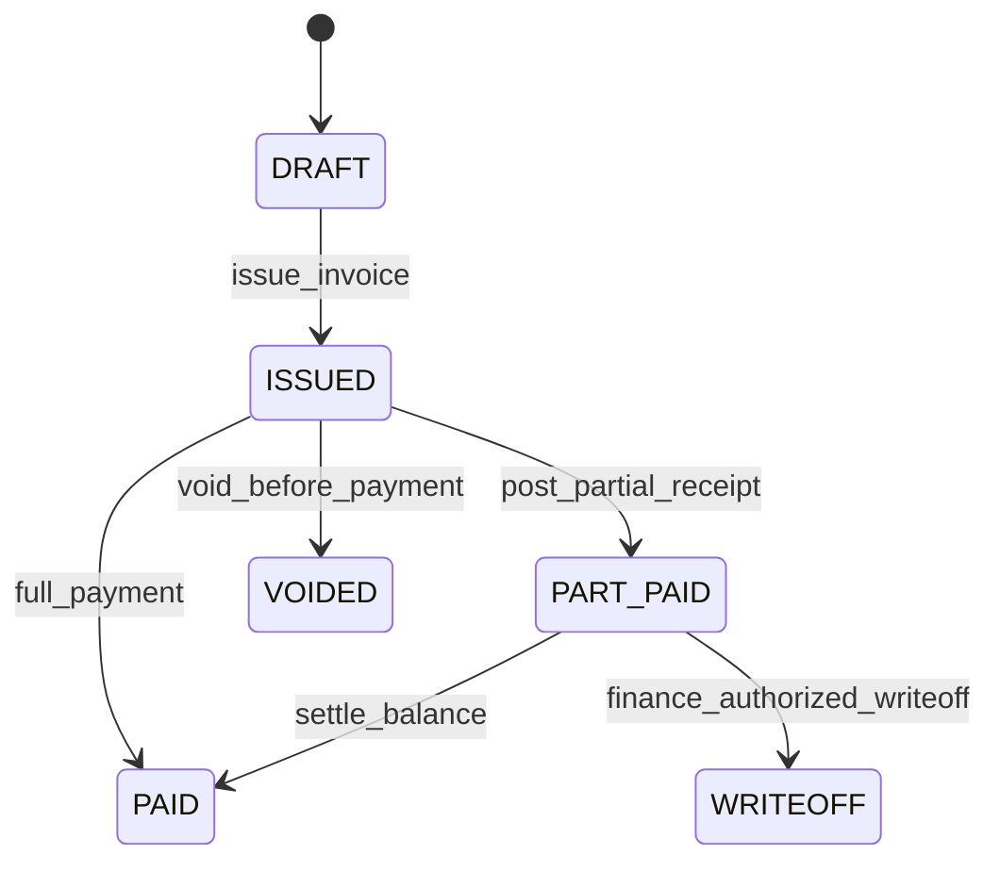
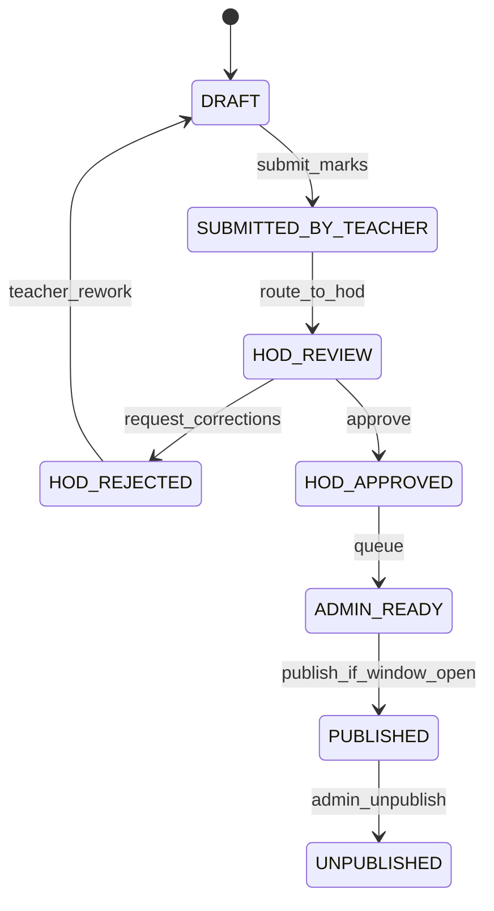
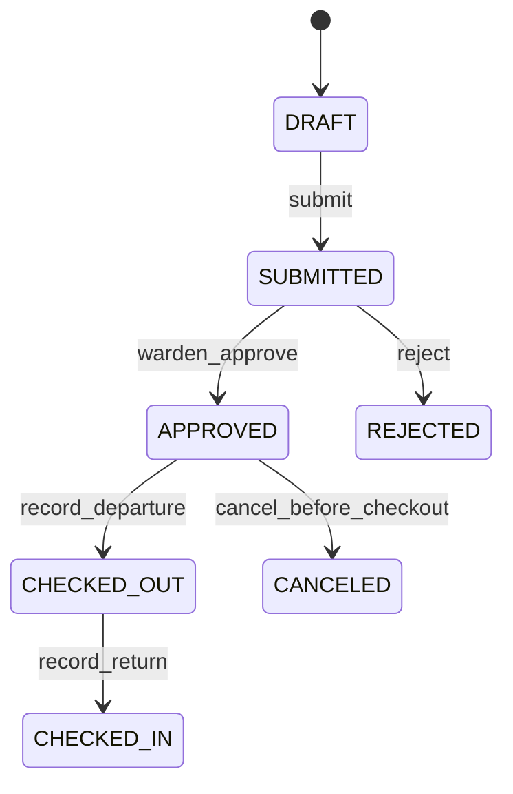
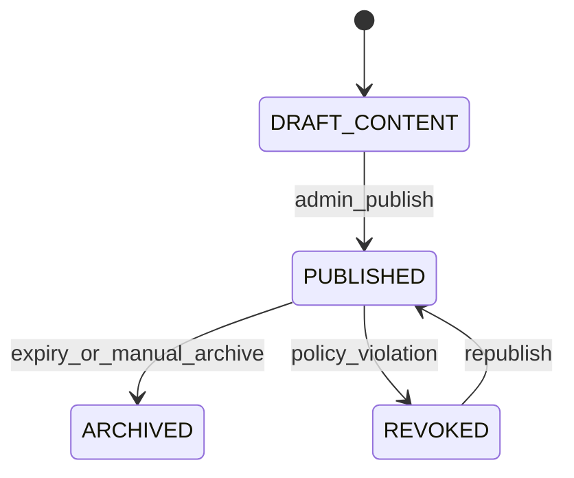

# ERP Expansion Master Plan (Multi-Pack Program Contract)

## Normative References
1. Platform architecture source of truth: `docs/expansion-plan/platform-holy-grail.md`
2. UX enforcement source of truth: `docs/ux/platform-ux-playbook.md`

## 1. Program Intent and Definition of Done
This document is the implementation contract for delivering three production packs in one shared runtime:
1. `Schools`
2. `Car Sales`
3. `Thrift`

Program-level definition of done:
1. All new routes and APIs are tenant-safe (`companyId` hard partition) and entitlement-gated.
2. All critical workflow transitions are server-enforced and auditable.
3. All finance-impacting actions emit deterministic accounting integration events.
4. Pack UX complies with `docs/ux/platform-ux-playbook.md`.
5. QA, UAT, release, and rollback evidence exists for each pack.

## 2. Scope Boundaries
### In Scope
1. Shared platform enablement for multi-pack gating, routing, observability, and accounting event contracts.
2. Full implementation specs for Schools, Car Sales, and Thrift packs.
3. Pilot-first rollout with controlled cohort expansion.

### Out of Scope (Current Program)
1. Per-pack runtime forks or separate databases.
2. Public app marketplace self-install flows.
3. Native mobile clients (web-first delivery only).

## 3. Architecture and Tenancy Invariants
Locked architectural decisions:
1. One app runtime and one database logical boundary.
2. `companyId` is mandatory on all pack entities and all query predicates.
3. Feature entitlements are resolved from catalog + bundle + tenant flags only.
4. Accounting posting remains decoupled via integration events; no direct pack journal writes.

### 3.1 Shared Platform Tables (Field Sketch)
| Table | Key Fields | Constraints | Relations |
| --- | --- | --- | --- |
| `PlatformFeature` | `id`, `featureKey`, `domain`, `defaultEnabled`, `isBillable`, `metadataJson` | unique(`featureKey`) | referenced by bundle items and tenant flags |
| `FeatureBundle` | `id`, `bundleCode`, `name`, `status`, `version` | unique(`bundleCode`) | parent of `FeatureBundleItem` |
| `FeatureBundleItem` | `id`, `bundleId`, `featureId`, `isRequired` | unique(`bundleId`,`featureId`) | many-to-one to bundle + feature |
| `CompanySubscriptionAddon` | `id`, `companyId`, `bundleId`, `status`, `startsAt`, `endsAt` | index(`companyId`,`status`) | enables bundle for tenant |
| `CompanyFeatureFlag` | `id`, `companyId`, `featureId`, `isEnabled`, `source` | unique(`companyId`,`featureId`) | resolved entitlement override |
| `CompanyPackProfile` (optional) | `id`, `companyId`, `packCode`, `configJson`, `isActive` | unique(`companyId`,`packCode`) | pack-specific tenant config |

## 4. Feature-Gating Matrix (Program Baseline)
Bundle codes:
1. `ADDON_SCHOOLS_PACK`
2. `ADDON_CAR_SALES_PACK`
3. `ADDON_THRIFT_PACK`

| Pack | Route Prefix | API Prefix | Feature Key |
| --- | --- | --- | --- |
| Schools | `/schools` | `/api/schools/dashboard` | `schools.home` |
| Schools | `/schools/students` | `/api/schools/students` | `schools.students.manage` |
| Schools | `/schools/boarding` | `/api/schools/boarding` | `schools.boarding.manage` |
| Schools | `/schools/results` | `/api/schools/results` | `schools.results.publish` |
| Schools | `/schools/portal/parent` | `/api/schools/portal/parent` | `schools.portal.parent` |
| Schools | `/schools/portal/student` | `/api/schools/portal/student` | `schools.portal.student` |
| Schools | `/schools/portal/teacher` | `/api/schools/portal/teacher` | `schools.portal.teacher` |
| Car Sales | `/car-sales` | `/api/car-sales/dashboard` | `car-sales.home` |
| Car Sales | `/car-sales/leads` | `/api/car-sales/leads` | `car-sales.leads.manage` |
| Car Sales | `/car-sales/inventory` | `/api/car-sales/vehicles` | `car-sales.inventory.manage` |
| Car Sales | `/car-sales/deals` | `/api/car-sales/deals` | `car-sales.deals.manage` |
| Car Sales | `/car-sales/payments` | `/api/car-sales/payments` | `car-sales.payments.manage` |
| Thrift | `/thrift` | `/api/thrift/dashboard` | `thrift.home` |
| Thrift | `/thrift/intake` | `/api/thrift/bales` | `thrift.intake.manage` |
| Thrift | `/thrift/grading` | `/api/thrift/grading` | `thrift.grading.manage` |
| Thrift | `/thrift/inventory` | `/api/thrift/lots` | `thrift.inventory.manage` |
| Thrift | `/thrift/sales` | `/api/thrift/sales` | `thrift.sales.manage` |

Enforcement order:
1. Resolve route mapping by most-specific prefix.
2. Validate authenticated session.
3. Validate feature entitlement.
4. Validate role/action permission.
5. Enforce state-transition rules.

## 5. Domain Data Blueprint by Pack
### 5.1 Schools (Core Relation Spine)
1. `SchoolStudent` -> many `SchoolEnrollment`, many `SchoolAttendanceLine`, many `SchoolBoardingAllocation`, many `SchoolFeeInvoice`, many `SchoolResultLine`.
2. `SchoolClass` + `SchoolStream` + `SchoolSubject` combine via `SchoolClassSubject` to define teaching assignments.
3. `SchoolResultSheet` (header) -> many `SchoolResultLine` + many moderation actions; publish controlled by `SchoolPublishWindow`.
4. `SchoolFeeInvoice` -> many lines, many receipt allocations, optional waiver/refund records.

### 5.2 Car Sales (Core Relation Spine)
1. `CarSalesLead` optionally converts to `CarSalesCustomer` and `CarSalesDeal`.
2. `CarSalesVehicle` has many `CarSalesVehicleCost` and many pricing versions.
3. `CarSalesDeal` references one active vehicle and customer, with many payments and one delivery.

### 5.3 Thrift (Core Relation Spine)
1. `ThriftBale` -> many `ThriftBaleGradeLine` -> many derived `ThriftLot` records.
2. `ThriftLot` -> many `ThriftStockMovement`, many sale lines, and return/adjustment traces.
3. `ThriftSale` -> many `ThriftSaleLine`; `ThriftReturn` references sale and return lines to reverse stock/cost.

## 6. API Topology and Response Contract
### 6.1 Standard API Envelope
Success envelope:
```json
{
  "ok": true,
  "data": {},
  "meta": {
    "requestId": "req_01HXYZ...",
    "page": 1,
    "pageSize": 25,
    "total": 240
  }
}
```

Error envelope:
```json
{
  "ok": false,
  "error": {
    "code": "FEATURE_NOT_ENABLED",
    "message": "Feature is not enabled for this tenant.",
    "details": {
      "featureKey": "schools.results.publish"
    }
  },
  "meta": {
    "requestId": "req_01HXYZ..."
  }
}
```

### 6.2 Route Families (Representative)
| Domain | Method | Route | Purpose |
| --- | --- | --- | --- |
| Schools | `POST` | `/api/schools/results/sheets/:id/publish` | publish moderated results |
| Schools | `POST` | `/api/schools/boarding/leave-requests/:id/check-out` | boarding movement logging |
| Schools | `POST` | `/api/schools/finance/receipts` | student payment posting |
| Car Sales | `POST` | `/api/car-sales/deals/:id/contract` | contract deal and lock vehicle |
| Car Sales | `POST` | `/api/car-sales/payments` | post deal payment |
| Thrift | `POST` | `/api/thrift/grading/bales/:id/submit` | close grading and create inventory lots |
| Thrift | `POST` | `/api/thrift/sales/:id/post` | post sale and COGS |

## 7. Workflow State Machines (Cross-Pack Critical Flows)
### 7.1 Schools Fee Lifecycle


### 7.2 Schools Result Moderation and Publishing


### 7.3 Schools Boarding Leave Lifecycle


### 7.4 Portal Publish/Access Lifecycle


## 8. Accounting Posting Map (By Source Event)
| Event | Source Entity | Trigger Point | Debit | Credit | Reversal Rule |
| --- | --- | --- | --- | --- | --- |
| `SCHOOL_FEE_INVOICE_ISSUED` | `SchoolFeeInvoice` | invoice status `ISSUED` | AR-Students | Fee Revenue | void event reverses full amount |
| `SCHOOL_FEE_RECEIPT_POSTED` | `SchoolFeeReceipt` | receipt `POSTED` | Cash/Bank | AR-Students | void receipt reverses allocation |
| `SCHOOL_FEE_WAIVER_APPLIED` | `SchoolFeeWaiver` | waiver `APPLIED` | Scholarship Expense | AR-Students | waiver reversal event |
| `CAR_DEAL_CONTRACTED` | `CarSalesDeal` | deal `CONTRACTED` | AR-Customer | Vehicle Revenue | cancel/void reversal event |
| `CAR_DEAL_PAYMENT_RECEIVED` | `CarSalesPayment` | payment `POSTED` | Cash/Bank | AR-Customer | refund creates contra entry |
| `CAR_DEAL_DELIVERED` | `CarSalesDelivery` | delivery `COMPLETED` | COGS-Vehicles | Inventory-Vehicles | reversal only via approved void |
| `THRIFT_BALE_RECEIVED` | `ThriftBale` | bale `RECEIVED` | Inventory-Thrift | AP/Cash | intake void reversal |
| `THRIFT_SALE_POSTED` | `ThriftSale` | sale `POSTED` | Cash/AR | Sales Revenue-Thrift | void/return contra revenue |
| `THRIFT_COGS_RECOGNIZED` | `ThriftSaleLine` | sale `POSTED` | COGS-Thrift | Inventory-Thrift | return reverses proportional COGS |

Event envelope requirements:
1. `idempotencyKey` format: `<module>:<eventType>:<sourceId>:<version>`.
2. Include `companyId`, `currency`, `amount`, `sourceRef`, and `occurredAt`.
3. Dead-letter events must expose recoverable diagnostics.

## 9. Delivery Waves and Exit Criteria
| Wave | Focus | Exit Criteria |
| --- | --- | --- |
| Wave 0 | Platform foundation | catalog, route registry, guardrails, observability ready |
| Wave 1 | Schools | boarding + results + portals + fees pass QA/UAT |
| Wave 2 | Car Sales | lead-to-delivery and settlement pass QA/UAT |
| Wave 3 | Thrift | intake-to-sale traceability and controls pass QA/UAT |
| Wave 4 | Hardening | 30-day KPI targets and risk closure achieved |

## 10. Program Acceptance and QA/UAT Gates
Program acceptance criteria:
1. Zero confirmed cross-tenant data access across new packs.
2. 100% scoped routes mapped in route registry and feature-gated.
3. 100% finance-impacting actions traceable from source document to accounting event.
4. Mandatory workflow guards prevent invalid status transitions.
5. UAT sign-off obtained from each pack's named business owner.

Required QA evidence per pack:
1. Positive path workflow runbook.
2. Negative security and tenancy tests.
3. State-machine guard tests.
4. Accounting reconciliation sample.
5. UX compliance screenshots by view.

## 11. Program Risk Ownership Summary
| Risk Category | Primary Risk | Owner Role | Mitigation |
| --- | --- | --- | --- |
| Tenancy | missing `companyId` filter in new query | Platform lead | lint/review checklist + negative tests |
| Access control | route ungated or action overexposed | Security lead | registry audit + role-action matrix tests |
| Workflow integrity | invalid status jumps | Module leads | transition services with strict guards |
| Finance integrity | event-posting drift | Finance platform lead | idempotent outbox + reconciliation report |
| Release safety | incomplete rollback plan | Release manager | tested feature-disable and data repair runbook |

## 12. Governance and Change Control
1. Any new route requires route-registry mapping PR in same change set.
2. Any new finance-impacting source event requires accounting-map update in same PR.
3. Deferred scope requires dependency ID, owner role, target wave, and interim control.
4. Stop-ship conditions from risk register override timeline commitments.

## 13. Implementation Progress Log
| Date | Branch | Slice | Status | Notes |
| --- | --- | --- | --- | --- |
| 2026-02-27 | `feat/platform-expansion-foundation-v1` | Wave 0 base scaffolding | Completed | Feature catalog/bundles, route gating, templates, portal/module route scaffolds, expansion spec docs. |
| 2026-02-27 | `feat/schools-core-phase1-v1` | Wave 1 Schools core backend (increment 1) | In Progress | Prisma models for schools core + boarding/results state + `/api/v2/schools/*` CRUD/workflow endpoints. |
