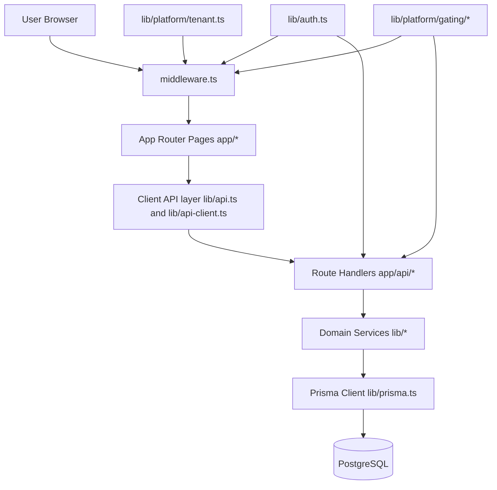
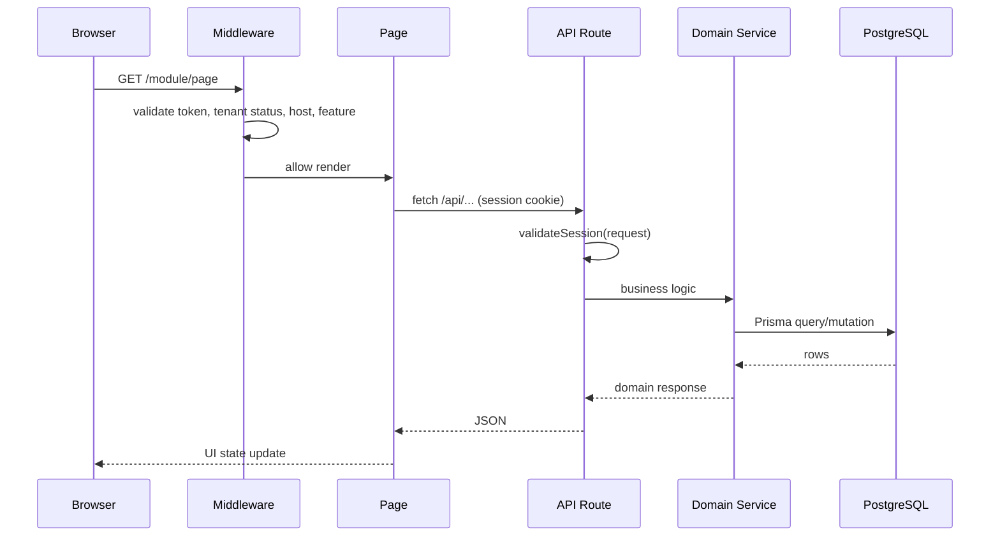
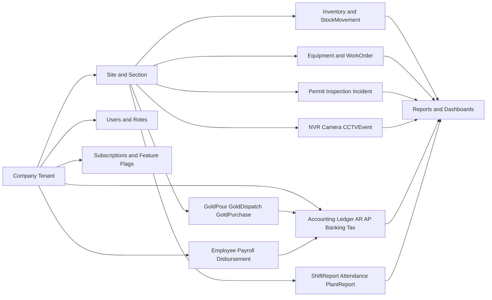
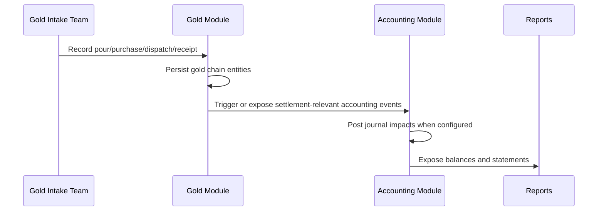
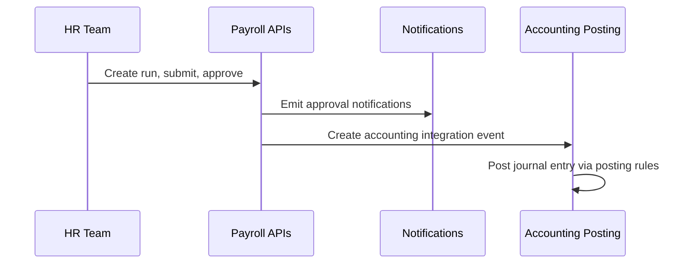
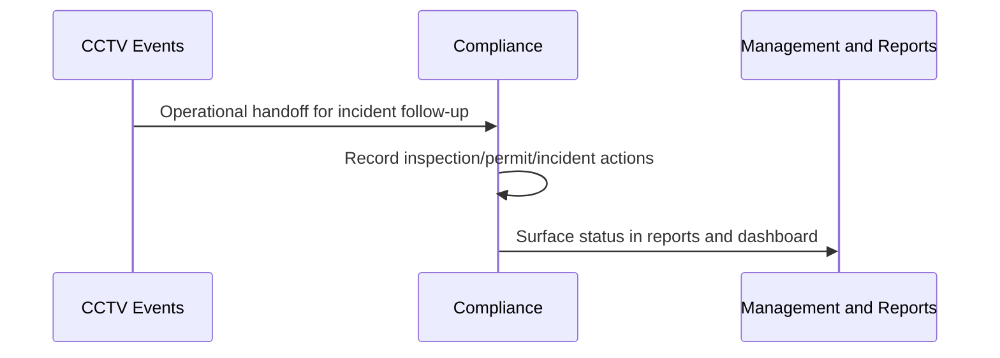
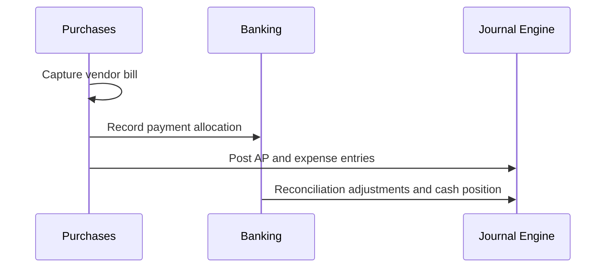
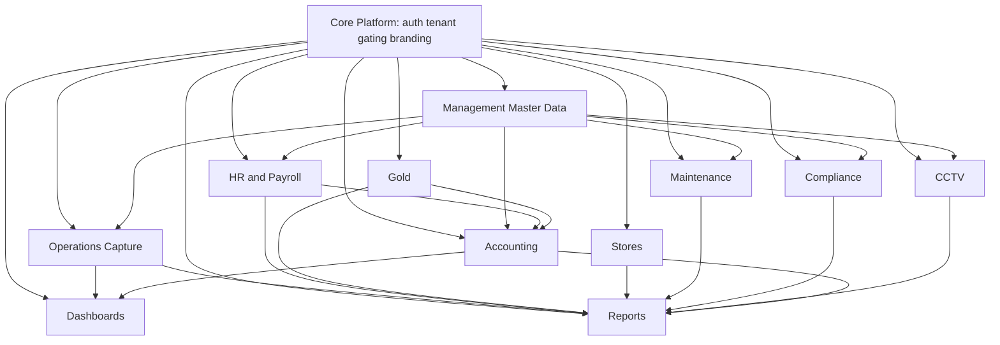

# Platform Holy Grail: End-to-End Architecture and Module Connectivity

## Purpose
This is the canonical architecture document for how the Huchu platform works, module by module, and how modules connect.

It is grounded in the current codebase:
- App Router UI in `app/*`
- APIs in `app/api/*`
- shared logic in `lib/*`
- shared UI in `components/*`
- persisted model in `prisma/schema.prisma`

## 1. Platform At a Glance
Huchu is a multi-tenant mine operations platform where `Company` is the primary tenant boundary. Every major domain module hangs off `companyId` directly or through `Site`.

Core architectural shape:
1. Browser requests page route
2. `middleware.ts` applies auth + tenant + feature gates
3. page components call typed client helpers in `lib/api.ts`
4. API route handlers validate session via `lib/api-utils.ts`
5. domain services in `lib/*` enforce business rules
6. Prisma writes and reads PostgreSQL entities

## 2. Runtime Control Planes

### 2.1 Auth and Session
- NextAuth credentials flow in `lib/auth.ts`
- login route in `app/login/page.tsx`
- session enrichment with tenant claims, enabled features, and host allow-list

### 2.2 Tenant and Host Enforcement
- host parsing and tenant resolution in `lib/platform/tenant.ts`
- route and capability enforcement in `lib/platform/gating/*`
- request-time enforcement in `middleware.ts` and `validateSession`

### 2.3 Feature Catalog and Entitlements
- feature catalog and bundles in `lib/platform/feature-catalog.ts`
- effective entitlement resolution in `lib/platform/entitlements.ts` and `lib/platform/user-entitlements.ts`
- path-to-feature mapping in `lib/platform/gating/route-registry.ts`

### 2.4 App Shell and UX Runtime
- global shell: `app/layout.tsx`, `components/layout/app-shell.tsx`, `components/layout/app-sidebar.tsx`
- providers: `components/providers/app-providers.tsx`
- shared table/form primitives in `components/ui/*` and `components/shared/*`

## 3. Request Lifecycle

## 4. Complete Module Inventory

### 4.1 Top-Level App Route Groups (`app/`)
- `access-blocked`
- `accounting`
- `analytics` (currently API-centric; no dedicated page surface)
- `attendance`
- `cctv`
- `compliance`
- `dashboard`
- `gold`
- `help`
- `human-resources`
- `login`
- `maintenance`
- `management`
- `plant-report`
- `reports`
- `settings`
- `shift-report`
- `status`
- `stores`
- `user-management`

### 4.2 API Domain Groups (`app/api/`)
- `accounting`, `adjustments`, `analytics`, `approvals`, `attendance`, `auth`
- `cctv`, `compensation`, `compliance`, `dashboard`
- `departments`, `disbursements`, `downtime-codes`
- `employee-payments`, `employees`, `equipment`
- `gold`, `hr`, `ids`, `inventory`, `job-grades`
- `notifications`, `payroll`, `plant-reports`
- `sections`, `settings`, `shift-reports`, `sites`, `stock-locations`, `uploads`, `users`, `work-orders`

## 5. Module-By-Module Architecture

## 5.1 Core Platform and Access
**Mission**
Provide authentication, tenant isolation, feature gating, branding, and shared shell experience.

**Primary routes**
- `/login`, `/access-blocked`, `/help`, `/status`, `/settings/branding`

**Key APIs**
- `/api/auth/*`, `/api/settings/branding/*`, `/api/notifications/*`, `/api/uploads/*`

**Core code**
- `lib/auth.ts`
- `middleware.ts`
- `lib/platform/tenant.ts`
- `lib/platform/gating/*`
- `lib/platform/feature-catalog.ts`
- `components/layout/*`

**Core models**
- `Company`, `User`, `CompanySubscription`, `PlatformFeature`, `CompanyFeatureFlag`, `UserFeatureFlag`, `FeatureBundle`, `CompanyBranding`, `CompanyDomain`

**Connections**
- upstream for every module (all requests pass through this control plane)

## 5.2 Executive and Production Dashboards
**Mission**
Provide high-level operating visibility for management.

**Primary routes**
- `/` (executive dashboard)
- `/dashboard` (production dashboard)

**Key APIs**
- `/api/dashboard/executive-overview`
- supporting operations APIs (`/api/plant-reports`, `/api/sites`, and finance summary endpoints)

**Core code**
- `components/dashboard/*`
- `lib/dashboard/*`
- `components/charts/frappe-chart-shell.tsx`

**Core models**
- aggregated reads from `ShiftReport`, `PlantReport`, finance entities, and incidents

**Connections**
- consumes data from accounting, gold, HR, compliance, stores, and maintenance

## 5.3 Operations Capture (Shift, Attendance, Plant)
**Mission**
Capture daily operational records used by downstream modules and reports.

**Primary routes**
- `/shift-report`
- `/attendance`
- `/plant-report`

**Key APIs**
- `/api/shift-reports`
- `/api/attendance`
- `/api/plant-reports`

**Core models**
- `ShiftReport`, `Attendance`, `PlantReport`, `Site`, `Section`

**Connections**
- feeds dashboard, reports, payroll context, and mine performance analytics

## 5.4 Accounting
**Mission**
Provide ledger control, receivables/payables operations, finance governance, and tax/fiscal workflows.

**Primary routes**
- `/accounting` plus all accounting subroutes (`chart-of-accounts`, `journals`, `periods`, `posting-rules`, `receivables`, `payables`, `sales`, `purchases`, `banking`, `assets`, `budgets`, `cost-centers`, `currency`, `tax`, `fiscalisation`, `trial-balance`, `financial-reports`, `financial-statements`)

**Key APIs**
- setup and governance: `/api/accounting/setup`, `/api/accounting/summary`, `/api/accounting/closing/*`
- core masters and posting: `/api/accounting/coa`, `/api/accounting/journals`, `/api/accounting/periods`, `/api/accounting/posting-rules`
- receivables: `/api/accounting/sales/*`
- payables: `/api/accounting/purchases/*`
- treasury: `/api/accounting/banking/*`, `/api/accounting/currency`
- tax and fiscalisation: `/api/accounting/tax`, `/api/accounting/vat-returns/*`, `/api/accounting/fiscalisation/*`
- reports and hubs: `/api/accounting/reports/*`, `/api/accounting/hubs/*`, `/api/accounting/payment-ledger`

**Core code**
- `components/accounting/*`
- `lib/accounting/*`

**Core models**
- `AccountingSettings`, `ChartOfAccount`, `AccountingPeriod`, `JournalEntry`, `JournalLine`, `PostingRule`, `PostingRuleLine`, `AccountingIntegrationEvent`
- `Customer`, `SalesInvoice`, `SalesInvoiceLine`, `SalesReceipt`, `CreditNote`, `SalesWriteOff`
- `Vendor`, `PurchaseBill`, `PurchaseBillLine`, `PurchasePayment`, `DebitNote`, `PurchaseWriteOff`
- `PaymentLedgerEntry`
- `BankAccount`, `BankTransaction`, `BankReconciliation`, `BankStatementLine`
- `TaxCode`, `VatReturnSummary`, `VatReturn`, `VatReturnLine`, `FiscalisationProviderConfig`, `FiscalReceipt`
- `OpeningBalanceImport`, `PeriodCloseVoucher`
- `Budget`, `BudgetLine`, `CostCenter`, `CurrencyRate`, `FixedAsset`

**Connections**
- consumes sales and purchase transactions
- receives event-driven entries from cross-domain operational flows
- feeds finance dashboards and reports

## 5.5 Gold
**Mission**
Track gold chain of custody from intake to settlement and payout.

**Primary routes**
- `/gold`
- intake: `/gold/intake/pours`, `/gold/intake/purchases`
- transit: `/gold/transit/dispatches`
- settlement: `/gold/settlement/receipts`, `/gold/settlement/payouts`
- governance: `/gold/reconciliation`, `/gold/exceptions`, `/gold/audit`, `/gold/prices`, `/gold/payouts`
- quick aliases: `/gold/dispatch`, `/gold/receipt`, `/gold/pour`

**Key APIs**
- `/api/gold/pours`, `/api/gold/purchases`, `/api/gold/dispatches`, `/api/gold/receipts`, `/api/gold/corrections`, `/api/gold/shift-allocations`, `/api/gold/prices`

**Core code**
- `components/gold/gold-shell.tsx`
- `app/gold/components/*`
- `lib/gold/*`

**Core models**
- `GoldPrice`, `GoldPour`, `GoldPurchase`, `GoldDispatch`, `GoldShiftAllocation`, `GoldShiftExpense`, `GoldShiftWorkerShare`

**Connections**
- feeds accounting (sales/purchase/settlement impact)
- integrates with HR payouts and attendance-derived shift allocation context
- powers gold chain reporting

## 5.6 Human Resources and Payroll
**Mission**
Manage workforce records, compensation rules, payroll runs, disbursements, and approvals.

**Primary routes**
- `/human-resources`
- `/human-resources/shift-groups`
- `/human-resources/incidents`
- `/human-resources/compensation`
- `/human-resources/salaries` and `/human-resources/salaries/outstanding`
- `/human-resources/payroll`, `/human-resources/payroll/salary`, `/human-resources/payroll/gold`
- `/human-resources/disbursements`
- `/human-resources/approvals`
- `/human-resources/payouts`

**Key APIs**
- `/api/employees`, `/api/departments`, `/api/job-grades`
- `/api/compensation/*`, `/api/payroll/*`, `/api/disbursements/*`
- `/api/employee-payments/*`, `/api/approvals/history`
- `/api/hr/*` (incidents, disciplinary actions, shift groups, schedules)

**Core code**
- `components/human-resources/*`
- `lib/hr-payroll.ts`, `lib/payroll-periods.ts`

**Core models**
- `Employee`, `Department`, `JobGrade`
- `PayrollPeriod`, `PayrollRun`, `PayrollLineItem`, `PayrollLineComponent`
- `DisbursementBatch`, `DisbursementItem`, `EmployeePayment`
- `ShiftGroup`, `ShiftGroupMember`, `ShiftGroupSchedule`
- `HrIncident`, `DisciplinaryAction`

**Connections**
- feeds accounting posting events
- shares people and org structures with management master data
- interacts with notifications and approval workflow

## 5.7 Stores and Inventory
**Mission**
Manage inventory stock, movement history, receiving/issuing, and fuel ledger.

**Primary routes**
- `/stores/dashboard`, `/stores/inventory`, `/stores/movements`, `/stores/fuel`, `/stores/issue`, `/stores/receive`

**Key APIs**
- `/api/inventory/items`, `/api/inventory/movements`, `/api/stock-locations`

**Core code**
- `components/stores/stores-shell.tsx`
- `scripts/manage-inventory.js`

**Core models**
- `StockLocation`, `InventoryItem`, `StockMovement`

**Connections**
- feeds operational and financial reporting
- can drive procurement and AP relevance in accounting workflows

## 5.8 Maintenance
**Mission**
Track equipment lifecycle, work orders, breakdown logging, and preventive scheduling.

**Primary routes**
- `/maintenance`
- `/maintenance/equipment`
- `/maintenance/work-orders`
- `/maintenance/breakdown`
- `/maintenance/schedule`

**Key APIs**
- `/api/equipment/*`
- `/api/work-orders/*`
- `/api/downtime-codes/*`
- `/api/analytics/downtime`

**Core code**
- `components/maintenance/*`

**Core models**
- `Equipment`, `WorkOrder`

**Connections**
- feeds maintenance and downtime reports
- integrates with master data downtime codes

## 5.9 Compliance
**Mission**
Operate permits, inspections, incidents, and training compliance records.

**Primary routes**
- `/compliance`

**Key APIs**
- `/api/compliance/permits/*`
- `/api/compliance/inspections/*`
- `/api/compliance/incidents/*`
- `/api/compliance/training-records/*`

**Core code**
- `components/compliance/*`
- tabbed single-view orchestration in `app/compliance/page.tsx`

**Core models**
- `Permit`, `Inspection`, `Incident`, `TrainingRecord`

**Connections**
- incident data feeds reports and executive risk visibility
- can be linked operationally with CCTV events and HR incidents

## 5.10 CCTV
**Mission**
Manage surveillance inventory, live sessions, playback, events, and access audit.

**Primary routes**
- `/cctv/overview`, `/cctv/live`, `/cctv/cameras`, `/cctv/nvrs`, `/cctv/events`, `/cctv/playback`, `/cctv/access-logs`

**Key APIs**
- `/api/cctv/nvrs/*`, `/api/cctv/cameras/*`
- `/api/cctv/events`, `/api/cctv/access-logs`
- `/api/cctv/playback/search`
- `/api/cctv/streams/*`, `/api/cctv/stream-token`

**Core code**
- `components/cctv/*`
- `lib/cctv-utils.ts`, `lib/cctv-types.ts`

**Core models**
- `NVR`, `Camera`, `CCTVEvent`, `CameraAccessLog`, plus streaming session models in schema

**Connections**
- security signals can inform compliance or incident response flows
- CCTV events have dedicated reporting surface

## 5.11 Reports
**Mission**
Provide role-friendly report entry point and specialized report pages across domains.

**Primary routes**
- `/reports`
- `/reports/shift`, `/reports/attendance`, `/reports/plant`
- `/reports/stores-movements`, `/reports/fuel-ledger`
- `/reports/maintenance-work-orders`, `/reports/maintenance-equipment`
- `/reports/gold-chain`, `/reports/gold-receipts`
- `/reports/compliance-incidents`, `/reports/cctv-events`, `/reports/audit-trails`, `/reports/downtime`

**Key APIs**
- composed from each module API plus accounting report APIs

**Core code**
- report pages under `app/reports/*`

**Connections**
- terminal analytics layer that consumes all modules

## 5.12 Management and Administration
**Mission**
Centralize master data and user administration workflows.

**Primary routes**
- `/management/master-data`
- `/management/master-data/hr/departments`
- `/management/master-data/hr/job-grades`
- `/management/master-data/operations/sites`
- `/management/master-data/operations/sections`
- `/management/master-data/operations/downtime-codes`
- `/management/users`
- helper redirects and operations under `/user-management/*`

**Key APIs**
- `/api/users/*`, `/api/sites/*`, `/api/sections/*`, `/api/departments/*`, `/api/job-grades/*`

**Core code**
- `components/management/master-data/*`
- `components/user-management/*`

**Core models**
- `User`, `Site`, `Section`, `Department`, `JobGrade`

**Connections**
- supplies reference entities used by HR, operations, maintenance, accounting, compliance, and CCTV

## 5.13 Notifications and Collaboration Layer
**Mission**
Deliver workflow notifications with role-aware actions.

**Primary routes**
- notification center UI components in `components/notifications/*`

**Key APIs**
- `/api/notifications`, `/api/notifications/read`, `/api/notifications/archive`, `/api/notifications/preferences`, `/api/notifications/stream`, `/api/notifications/push-subscriptions`

**Core code**
- `lib/notifications.ts`
- `hooks/use-notification-stream.ts`

**Core models**
- `Notification`, `NotificationRecipient`, `UserNotificationPreference`, `WebPushSubscription`

**Connections**
- used by HR approvals, disbursement flow, and operational alerting patterns

## 5.14 Upload and Document Ingress
**Mission**
Accept controlled uploads with context-based policy.

**Primary APIs**
- `/api/uploads`
- `/api/uploads/passport-photo`

**Core code**
- `lib/uploads/policies.ts`
- `lib/uploads/upload-file.ts`

**Connections**
- currently used heavily by HR employee identity documentation flows

## 6. Data Ownership and Domain Connectivity

## 7. Cross-Module Workflows

### 7.1 Gold to Settlement to Finance

### 7.2 Payroll and Disbursement to Accounting

### 7.3 Incident and Surveillance Loop

### 7.4 Procure to Pay (AP)

## 8. Platform Dependency Graph

## 9. Source of Truth Index (Implementation Map)

### UI and Navigation
- `app/*`
- `components/layout/*`
- `lib/navigation.ts`

### API Layer
- `app/api/*`
- `lib/api-utils.ts`
- `lib/api.ts`
- `lib/api-client.ts`

### Domain Libraries
- accounting: `lib/accounting/*`
- platform controls: `lib/platform/*`
- dashboard: `lib/dashboard/*`
- gold: `lib/gold/*`
- CCTV: `lib/cctv-*`
- notifications: `lib/notifications.ts`
- uploads: `lib/uploads/*`

### Persistence
- `prisma/schema.prisma`
- `lib/prisma.ts`

### Platform Operations Tooling
- `scripts/platform/*`
- `scripts/manage-*.js`

## 10. How to Extend the Platform Safely
1. Add new feature key in `lib/platform/feature-catalog.ts`.
2. Register page and API route feature mapping in `lib/platform/gating/route-registry.ts`.
3. Add navigation entry in `lib/navigation.ts` and module shell tabs if needed.
4. Implement route handlers under `app/api/<domain>` using `validateSession`.
5. Add or extend Prisma models in `prisma/schema.prisma` and update domain services in `lib/*`.
6. Wire reporting and dashboard surfaces only after domain writes are stable.

## 11. Non-Negotiable Platform Invariants
- Tenant boundary is enforced by company context and host checks.
- Feature access is enforced both in middleware and API validation.
- Journal posting must remain balanced and traceable to source events.
- Cross-module reporting is read-model only; source modules own their writes.
- Master data and identity entities are shared contracts and must stay backward compatible.
