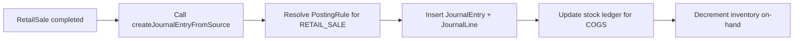

# Retail/Smart Shop Module Expansion Plan (Codebase-Aligned)

## 1. Purpose
This document is the retail/thrift/shop implementation contract for this repository. It translates stakeholder requirements from `zim-smb-market-gameplan.md` and `industry-implementation-plans/retail-implementation-plan.md` into exact modules, routes, services, and data models.

Primary goals:
- Deliver retail pack with catalog/POS, inventory accuracy, purchasing/receiving, promotions, and cash-up flows tied to posting rules.
- Support store + back-office roles with fast, playbook-compliant UI.
- Provide Frappe-style mobile-first POS portal for cashiers.
- Integrate posting for sales, COGS, taxes, tenders with idempotent keys.

Source of truth in code:
- UI routes: `app/thrift/*` (product name: "Smart Shop")
- API routes: `app/api/v2/thrift/*`
- Domain services: `lib/thrift/*` (new)
- Persistence: `prisma/schema.prisma`

## 2. Design Principles
- **POS-first experience**: Cashier portal is the primary interface; back-office is secondary.
- **Frappe-style layout**: Multi-pane horizontal layout for POS (catalog, cart, customer, payments, shift).
- **Mobile-first**: POS must work on tablets/phones with touch-friendly controls.
- **Inventory accuracy**: Stock ledger parity with accounting COGS postings.
- **Offline-safe**: POS queue with idempotency for connectivity issues.
- **Shift-based**: All sales tied to shift; cash-up reconciles shift takings.
- **Posting integration**: Sales/discounts/taxes/COGS/tenders post to GL with source keys.

## 3. Navigation Model (To Implement)

### 3.1 Back-Office Navigation (Manager/Inventory roles)
```
/thrift                     # Dashboard with sales, inventory, shift metrics
/thrift/catalog             # Catalog management (items, variants, SKUs, barcodes)
/thrift/catalog/[id]        # Item detail with pricing, photos, variants
/thrift/promotions          # Promotion rules management
/thrift/inventory           # Inventory tracking (on-hand, movements, adjustments)
/thrift/purchasing          # Purchase orders and receiving
/thrift/purchasing/orders   # PO list → /orders/[id] (detail)
/thrift/purchasing/receive  # GRN list → /receive/[id] (detail)
/thrift/shifts              # Shift list and cash-up
/thrift/shifts/[id]         # Shift detail with transaction breakdown
/thrift/reports             # Reporting hub (sales, margin, shrinkage)
```

### 3.2 POS Portal Navigation (Cashier role)
```
/portal/pos                 # POS home (multi-pane: catalog, cart, payments, shift)
```

**POS Layout (Frappe-style):**
```
┌──────────────────────────────────────────────────────────────┐
│  [Shift: Open] [Cashier: John]           [Help] [Logout]    │
├────────────────────────┬─────────────────────────────────────┤
│                        │                                     │
│  CATALOG / SEARCH      │  CART                               │
│  ┌──────────────────┐  │  ┌───────────────────────────────┐ │
│  │ [Search...     ]│  │  │ Item              Qty    Total │ │
│  └──────────────────┘  │  │ T-Shirt Blue      2      $30  │ │
│                        │  │ Jeans Denim       1      $45  │ │
│  [Categories]          │  │                               │ │
│  □ Clothing            │  │ Subtotal:               $75   │ │
│  □ Shoes               │  │ Tax:                    $7.50 │ │
│  □ Accessories         │  │ Discount:               $0    │ │
│                        │  │ TOTAL:                  $82.50│ │
│  [Items Grid]          │  └───────────────────────────────┘ │
│  ┌────┬────┬────┬────┐ │                                     │
│  │T-S │Jean│Hat │Shoe│ │  [Hold] [Recall] [Clear]           │
│  └────┴────┴────┴────┘ │  [Customer] [Discount] [Refund]    │
│                        │                                     │
│                        │  ──────────────────────────────────│
│                        │  PAYMENT                            │
│                        │  ┌───────────────────────────────┐ │
│                        │  │ Amount Due:         $82.50    │ │
│                        │  │ [Cash] [Card] [Mobile]        │ │
│                        │  │ Tendered:    [$______]        │ │
│                        │  │ Change:      $0.00            │ │
│                        │  │                               │ │
│                        │  │         [COMPLETE SALE]       │ │
│                        │  └───────────────────────────────┘ │
└────────────────────────┴─────────────────────────────────────┘
```

## 4. Module Map (Route → API → Service → Models)

### 4.1 Catalog Management
**UI:**
- `/thrift/catalog` (list)
- `/thrift/catalog/[id]` (detail with variants, pricing, photos)

**API:**
- `/api/v2/thrift/catalog` (list, create, search, bulk import)
- `/api/v2/thrift/catalog/[id]` (get, update, variants)
- `/api/v2/thrift/catalog/[id]/pricing` (price list management)
- `/api/v2/thrift/catalog/[id]/photos` (photo upload)
- `/api/v2/thrift/catalog/barcodes` (barcode generation/assignment)

**Services:**
- `lib/thrift/catalog.ts` (CRUD, variant management, barcode handling)
- `lib/thrift/pricing.ts` (price list management, channel/store pricing)

**Models:**
- `RetailItem` (name, description, category, base price, SKU, barcode, tax category, unit, status)
- `RetailItemVariant` (size, color, SKU, barcode, price)
- `RetailPriceList` (store/channel-specific pricing)

### 4.2 Promotions & Discounts
**UI:**
- `/thrift/promotions` (promotion rules list)

**API:**
- `/api/v2/thrift/promotions` (CRUD)
- `/api/v2/thrift/promotions/[id]/eligibility` (eligibility check)
- `/api/v2/thrift/promotions/apply` (apply promotions to cart)

**Services:**
- `lib/thrift/promotions.ts` (eligibility rules, stack/priority logic, voucher redemption)

**Models:**
- `RetailPromotion` (name, type: BOGO/PERCENT/AMOUNT/BUNDLE, eligibility rules, date range, priority)
- `RetailVoucher` (code, discount, usage limits, redemption tracking)

**Promotion types:**
- BOGO (Buy One Get One)
- PERCENT_OFF (percentage discount)
- AMOUNT_OFF (fixed amount discount)
- BUNDLE (buy X get Y at discount)

### 4.3 POS & Sales
**UI:**
- `/portal/pos` (Frappe-style multi-pane layout)

**API:**
- `/api/v2/thrift/pos/catalog` (catalog with pricing for current store/shift)
- `/api/v2/thrift/pos/cart` (cart operations: add, update, remove)
- `/api/v2/thrift/pos/cart/hold` (hold cart for later)
- `/api/v2/thrift/pos/cart/recall` (recall held cart)
- `/api/v2/thrift/pos/cart/discount` (apply discount with manager override)
- `/api/v2/thrift/pos/sale` (complete sale with payment)
- `/api/v2/thrift/pos/refund` (refund/exchange with receipt reference)
- `/api/v2/thrift/pos/shift` (shift status, open/close)

**Services:**
- `lib/thrift/pos.ts` (cart management, sale completion, refund logic)
- `lib/thrift/pos-posting.ts` (posting integration for sales)

**Models:**
- `RetailSale` (sale number, shift reference, customer, subtotal, tax, discount, total, tender mix, status, posted flag)
- `RetailSaleLine` (item, quantity, price, line total, discount)
- `RetailSalePayment` (tender type: CASH/CARD/MOBILE, amount)
- `RetailHeldCart` (cashier, cart JSON, hold timestamp)

**Posting Integration:**
- Sales post via `lib/accounting/posting.ts` with source type `RETAIL_SALE`
- Idempotent source key: `RETAIL:SALE:{saleId}`
- Journal entries:
  - Debit: Cash/Card Receivable (by tender type)
  - Credit: Sales Revenue
  - Debit: COGS
  - Credit: Inventory
  - Credit: Tax Payable (VAT)
- Subledger: Stock ledger updated for inventory movement

### 4.4 Inventory Management
**UI:**
- `/thrift/inventory` (on-hand list with search/filter)
- `/thrift/inventory/movements` (movement log)
- `/thrift/inventory/adjustments` (adjustment list → /adjustments/[id])
- `/thrift/inventory/transfers` (transfer list → /transfers/[id])
- `/thrift/inventory/counts` (cycle count list → /counts/[id])

**API:**
- `/api/v2/thrift/inventory/on-hand` (on-hand quantities by store/location)
- `/api/v2/thrift/inventory/movements` (movement log)
- `/api/v2/thrift/inventory/adjustments` (create adjustment with reason)
- `/api/v2/thrift/inventory/adjustments/[id]/post` (post adjustment to stock ledger + accounting)
- `/api/v2/thrift/inventory/transfers` (inter-location transfers)
- `/api/v2/thrift/inventory/counts` (cycle count creation, variance resolution)

**Services:**
- `lib/thrift/inventory.ts` (on-hand tracking, movement logging)
- `lib/thrift/stock-ledger.ts` (stock ledger posting, FIFO/LIFO costing)
- `lib/thrift/inventory-posting.ts` (COGS posting integration)

**Models:**
- `RetailInventoryOnHand` (item, location, quantity, reorder point)
- `RetailStockMovement` (item, quantity, type: RECEIPT/ISSUE/ADJUSTMENT/TRANSFER, reference, cost)
- `RetailStockAdjustment` (reason code, items, approval)
- `RetailStockTransfer` (from location, to location, items, status)
- `RetailCycleCount` (location, date, items, variance)

**Stock ledger parity:**
- Every sale, receipt, adjustment, transfer creates stock movement
- Stock movements reconcile to accounting COGS postings
- Inventory valuation = sum of on-hand × cost

### 4.5 Purchasing & Receiving
**UI:**
- `/thrift/purchasing/orders` (PO list)
- `/thrift/purchasing/orders/[id]` (PO detail with lines, receipt tracking)
- `/thrift/purchasing/receive` (GRN list)
- `/thrift/purchasing/receive/[id]` (GRN detail with PO reference, variance)

**API:**
- `/api/v2/thrift/purchasing/orders` (list, create)
- `/api/v2/thrift/purchasing/orders/[id]` (get, update, approve)
- `/api/v2/thrift/purchasing/orders/[id]/receive` (create GRN from PO)
- `/api/v2/thrift/purchasing/receive` (list)
- `/api/v2/thrift/purchasing/receive/[id]` (get, post receipt to inventory)
- `/api/v2/thrift/purchasing/returns` (supplier return workflows)
- `/api/v2/thrift/purchasing/three-way-match` (PO/GRN/invoice variance)

**Services:**
- `lib/thrift/purchasing.ts` (PO creation, approval, receiving)
- `lib/thrift/receiving.ts` (GRN processing, variance handling, landed cost allocation)

**Models:**
- `RetailPurchaseOrder` (PO number, vendor, date, status, lines, total)
- `RetailPurchaseOrderLine` (item, quantity, unit price, line total)
- `RetailGoodsReceipt` (GRN number, PO reference, date, lines, posted flag)
- `RetailGoodsReceiptLine` (item, quantity received, quantity ordered, variance)

**Three-way match:**
- PO → GRN → Vendor invoice
- Variance reporting for quantity/price discrepancies
- Hold/release workflow for invoices with variances

### 4.6 Shift Management & Cash-Up
**UI:**
- `/thrift/shifts` (shift list)
- `/thrift/shifts/[id]` (shift detail with transaction breakdown, cash-up form)

**API:**
- `/api/v2/thrift/shifts/open` (open shift with opening float)
- `/api/v2/thrift/shifts/current` (get current shift for cashier)
- `/api/v2/thrift/shifts/[id]` (get shift detail)
- `/api/v2/thrift/shifts/[id]/close` (close shift with cash-up)
- `/api/v2/thrift/shifts/[id]/variance` (variance report: system vs. counted)
- `/api/v2/thrift/shifts/[id]/deposit` (prepare bank deposit batch)

**Services:**
- `lib/thrift/shifts.ts` (shift lifecycle, cash-up reconciliation)
- `lib/thrift/shift-posting.ts` (shift close posting for variances)

**Models:**
- `RetailShift` (shift number, cashier, register, opening float, opening time, closing time, status)
- `RetailShiftCashUp` (shift reference, expected cash, counted cash, variance, approved by, notes)
- `RetailShiftSummary` (shift reference, total sales, total refunds, tender breakdown)

**Cash-up process:**
1. Cashier counts cash drawer
2. System calculates expected cash (opening float + cash sales - refunds)
3. Variance = counted - expected
4. Manager approves if variance > threshold
5. Shift locked after close (no edits to shift sales)
6. Deposit batch prepared for bank

**Variance posting:**
- If variance: Post adjustment to Cash Over/Short account

### 4.7 Reporting
**UI:**
- `/thrift/reports` (sales, margin, promo, shrinkage, on-hand)

**API:**
- `/api/v2/thrift/reports/sales` (sales by item/store/tender/date)
- `/api/v2/thrift/reports/margin` (gross margin analysis)
- `/api/v2/thrift/reports/promotions` (promo effectiveness, redemption)
- `/api/v2/thrift/reports/shrinkage` (shrinkage tracking)
- `/api/v2/thrift/reports/on-hand-valuation` (inventory valuation)
- `/api/v2/thrift/reports/export` (CSV/PDF export)

**Services:**
- `lib/thrift/reports.ts` (report generation, KPI calculation)

## 5. End-to-End POS Sale Posting Architecture



**Posting invariants:**
- Sale source key: `RETAIL:SALE:{saleId}`
- Journal lines must balance
- COGS calculated from stock ledger (FIFO/LIFO)
- Inventory updated atomically with accounting posting
- Tender mix tracked in separate payment lines

**Journal entry structure:**
```
Debit: Cash/Card Receivable    $82.50
Credit: Sales Revenue           $75.00
Credit: VAT Payable             $7.50

Debit: COGS                     $45.00
Credit: Inventory               $45.00
```

## 6. Document Lifecycle (To Implement)

**States:** DRAFT → POSTED → VOIDED

**Enforced by:** `lib/platform/document-lifecycle.ts` (new service)

**Applies to:**
- `RetailSale`
- `RetailGoodsReceipt`
- `RetailStockAdjustment`

**Rules:**
- No delete after POSTED
- Voiding creates reversal postings
- Audit timeline captures all transitions

## 7. Offline Queue & Idempotency

**Challenge:** POS must work when internet connectivity is intermittent

**Solution:**
- POS operations queue locally (localStorage/IndexedDB)
- Each sale has client-generated UUID as idempotency key
- Server upserts based on UUID (idempotent)
- Retry with exponential backoff
- UI shows sync status (pending/synced/failed)

**Implementation:** `lib/thrift/pos-queue.ts` (new service)

## 8. Manager Override Audit

**Trigger:** Cashier requests discount > threshold OR refund without receipt

**Action:** Manager enters PIN/password to approve

**Implementation:** `lib/thrift/manager-override.ts` (new service)

**Audit log:**
- Capture manager ID, action, reason, timestamp
- Store in `RetailManagerOverride` table

## 9. Acceptance Criteria

- ✅ Navigation exposes catalog, promotions, POS, inventory, purchasing, shifts
- ✅ POS portal uses Frappe-style multi-pane layout (catalog, cart, payments, shift)
- ✅ POS supports scan/search, holds, refunds/exchanges, tender mix, receipts
- ✅ Promotions apply per eligibility rules; vouchers redeem and log usage
- ✅ Inventory moves (receipts, transfers, adjustments, counts) reconcile to COGS postings
- ✅ Purchase orders allow partial receipts; three-way match variances flagged
- ✅ Shift close produces variance report; register locks after close
- ✅ Sales/discounts/taxes/COGS/tenders post with idempotent keys
- ✅ Offline POS queue replays without duplicates
- ✅ Dashboards show sales, margin, promo lift, shrinkage, on-hand
- ✅ Exports succeed and log audits

## 10. Current Delivery Status

| Requirement Theme | Status | Notes |
|---|---|---|
| Database schema | ⚠️ Partial | Need retail-specific models (see schema additions below) |
| Basic dashboard | ✅ Delivered | Shows metrics from `/api/v2` |
| POS portal | ⚠️ Partial | Basic cart exists; needs Frappe-style redesign |
| Catalog management | ⚠️ Partial | Basic CRUD exists; needs variant/barcode support |
| Promotions | ❌ Missing | Promotion engine needed |
| Inventory tracking | ❌ Missing | Stock ledger and COGS posting needed |
| Purchasing | ❌ Missing | PO/GRN workflows needed |
| Shift management | ❌ Missing | Shift lifecycle and cash-up needed |
| Posting integration | ❌ Missing | Sales/COGS posting needed |
| Offline queue | ❌ Missing | Idempotent queue needed |

## 11. Schema Additions Needed

```prisma
model RetailItem {
  id          String   @id @default(uuid())
  companyId   String
  sku         String
  barcode     String?
  name        String
  description String?
  category    String?
  basePrice   Float
  cost        Float?
  taxCategory String?
  unit        String   @default("unit")
  status      String   @default("ACTIVE") // ACTIVE, INACTIVE
  createdAt   DateTime @default(now())
  updatedAt   DateTime @updatedAt

  company     Company  @relation(fields: [companyId], references: [id], onDelete: Cascade)
  variants    RetailItemVariant[]

  @@unique([companyId, sku])
  @@index([companyId, barcode])
}

model RetailItemVariant {
  id        String   @id @default(uuid())
  itemId    String
  sku       String
  barcode   String?
  name      String   // e.g., "Blue / Large"
  price     Float
  cost      Float?

  item      RetailItem @relation(fields: [itemId], references: [id], onDelete: Cascade)

  @@unique([itemId, sku])
}

model RetailSale {
  id              String   @id @default(uuid())
  companyId       String
  saleNumber      String
  shiftId         String?
  customerId      String?
  customerName    String?
  subtotal        Float
  taxAmount       Float
  discountAmount  Float
  totalAmount     Float
  status          String   @default("COMPLETED") // COMPLETED, VOIDED
  saleDate        DateTime
  cashierId       String
  posted          Boolean  @default(false)
  journalEntryId  String?
  createdAt       DateTime @default(now())

  company         Company @relation(fields: [companyId], references: [id], onDelete: Cascade)
  lines           RetailSaleLine[]
  payments        RetailSalePayment[]

  @@unique([companyId, saleNumber])
  @@index([companyId, shiftId])
}

model RetailSaleLine {
  id            String   @id @default(uuid())
  saleId        String
  itemId        String
  itemName      String
  quantity      Float
  unitPrice     Float
  discountAmount Float   @default(0)
  lineTotal     Float

  sale          RetailSale @relation(fields: [saleId], references: [id], onDelete: Cascade)
}

model RetailSalePayment {
  id            String   @id @default(uuid())
  saleId        String
  tenderType    String   // CASH, CARD, MOBILE
  amount        Float
  reference     String?  // card transaction reference

  sale          RetailSale @relation(fields: [saleId], references: [id], onDelete: Cascade)
}

model RetailShift {
  id              String   @id @default(uuid())
  companyId       String
  shiftNumber     String
  cashierId       String
  registerId      String?
  openingFloat    Float
  openedAt        DateTime
  closedAt        DateTime?
  status          String   @default("OPEN") // OPEN, CLOSED

  company         Company @relation(fields: [companyId], references: [id], onDelete: Cascade)

  @@unique([companyId, shiftNumber])
}

model RetailInventoryOnHand {
  id            String   @id @default(uuid())
  companyId     String
  itemId        String
  locationId    String
  quantity      Float
  reorderPoint  Float?

  company       Company @relation(fields: [companyId], references: [id], onDelete: Cascade)

  @@unique([companyId, itemId, locationId])
}

model RetailStockMovement {
  id            String   @id @default(uuid())
  companyId     String
  itemId        String
  locationId    String
  movementType  String   // RECEIPT, ISSUE, ADJUSTMENT, TRANSFER
  quantity      Float
  cost          Float?
  referenceType String?  // SALE, PURCHASE, ADJUSTMENT
  referenceId   String?
  movementDate  DateTime
  createdAt     DateTime @default(now())

  company       Company @relation(fields: [companyId], references: [id], onDelete: Cascade)

  @@index([companyId, itemId, movementDate])
}
```

## 12. Implementation Phases

**Phase 1: POS Portal Redesign (Week 1)**
- Frappe-style multi-pane layout
- Catalog search with barcode support
- Cart operations (add, update, remove, hold, recall)
- Tender mix and payment processing
- Receipt generation

**Phase 2: Posting Integration (Week 1-2)**
- Sales posting (revenue, tax, COGS)
- Inventory stock ledger
- COGS calculation (FIFO/LIFO)
- Idempotent source keys
- Offline queue

**Phase 3: Inventory & Purchasing (Week 2)**
- On-hand tracking
- Stock movements log
- Adjustments with reason codes
- PO creation and approval
- GRN processing with variance
- Three-way match

**Phase 4: Shift Management & Cash-Up (Week 2)**
- Shift open/close
- Cash-up reconciliation
- Variance approval
- Deposit batch preparation
- Register lock after close

**Phase 5: Catalog & Promotions (Week 3)**
- Item/variant management
- Barcode generation
- Price lists by store/channel
- Promotion engine (BOGO, percent, amount, bundle)
- Voucher redemption

**Phase 6: Reporting & Polish (Week 3)**
- Sales dashboards
- Margin analysis
- Promo effectiveness
- Shrinkage tracking
- On-hand valuation
- Export capabilities

## 13. QA and Release Checklist

- Run `npm run lint`
- Run `npm run build`
- Smoke test:
  - Open POS portal and complete sale
  - Verify journal entry and stock movement
  - Process refund and verify reversal
  - Create PO and receive goods
  - Adjust inventory and verify COGS impact
  - Close shift and complete cash-up
  - Generate reports and export
- Verify posting idempotency (duplicate sale attempts rejected)
- Verify offline queue (disconnect network, complete sale, reconnect)
- Verify shift lock (cannot edit sales after shift close)

## 14. Connection to Platform Architecture

This retail document should stay in sync with:
- Navigation: `lib/navigation.ts`
- Route gating: `lib/platform/gating/route-registry.ts`
- Feature catalog: `lib/platform/feature-catalog.ts`
- Schema: `prisma/schema.prisma`
- Posting engine: `lib/accounting/posting.ts`
- Document lifecycle: `lib/platform/document-lifecycle.ts` (new)
