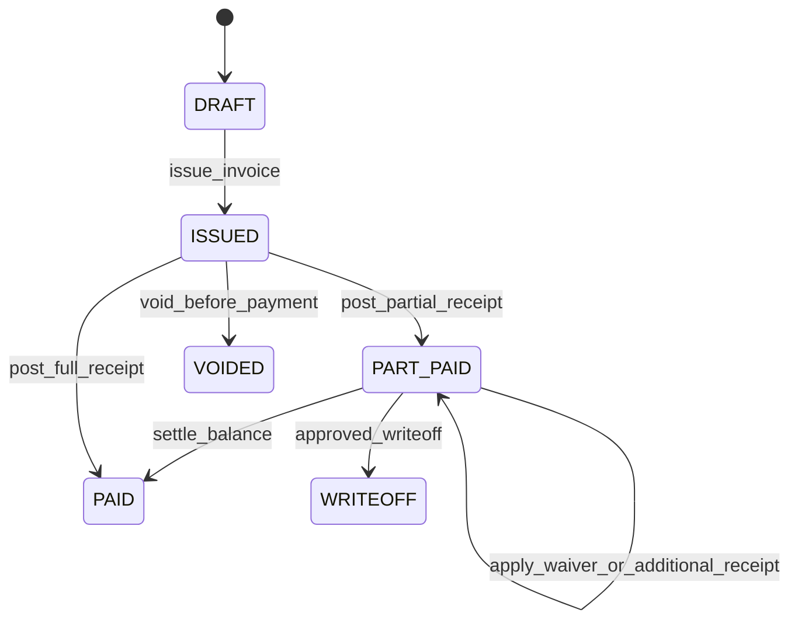
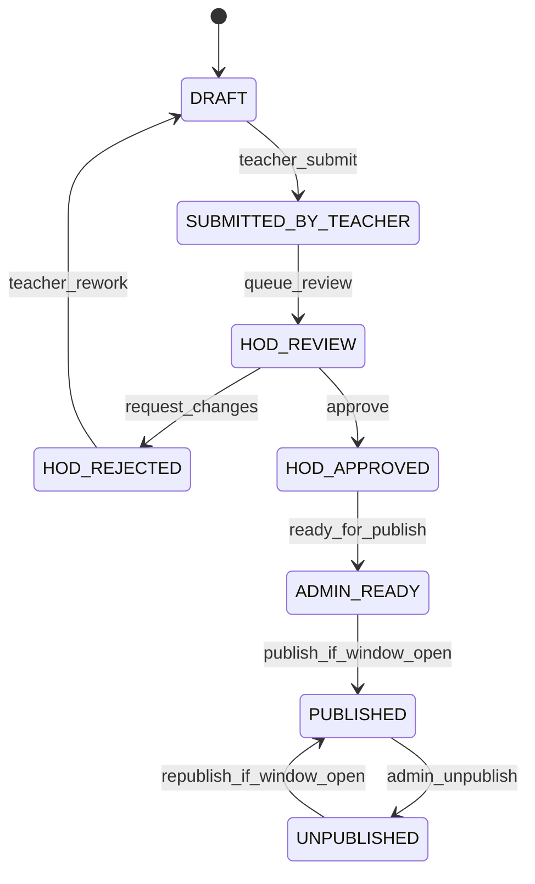
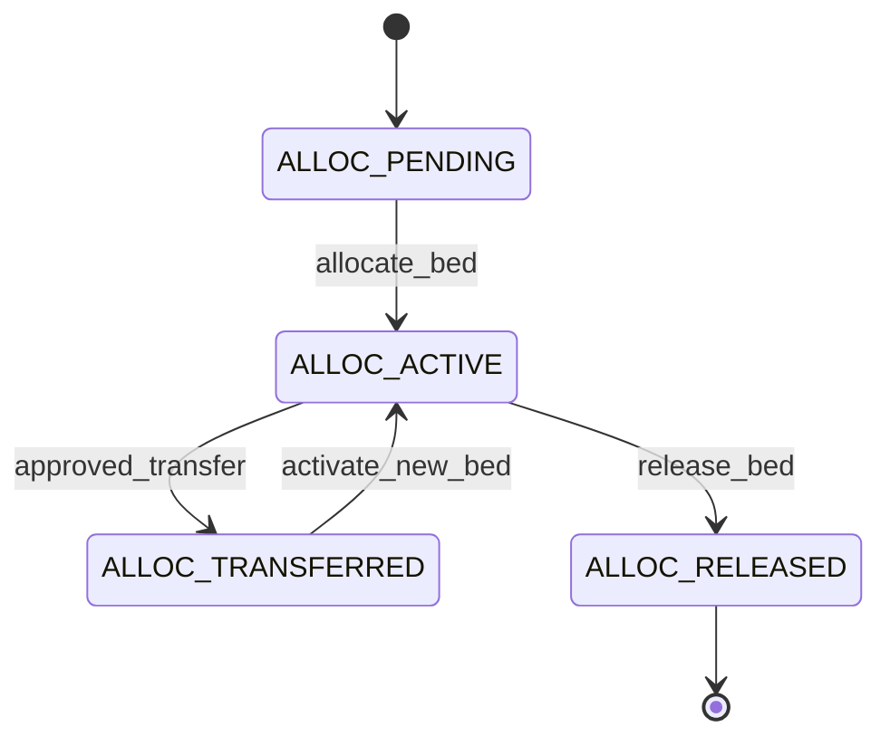
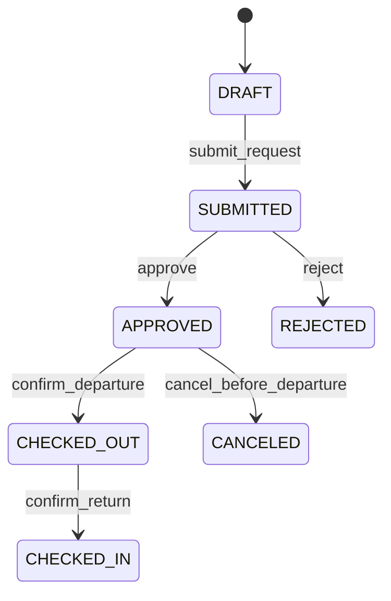
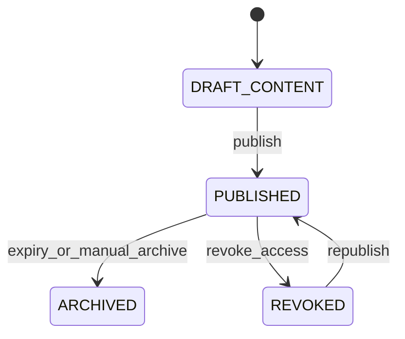

# Schools Pack Spec (Full Scope, Implementation-Ready)

## Normative References
1. Platform architecture source of truth: `docs/expansion-plan/platform-holy-grail.md`
2. UX enforcement source of truth: `docs/ux/platform-ux-playbook.md`

## 1. Objective
Deliver a complete school operations pack covering academics, boarding, results, fee billing, and role portals with strict tenancy, authorization, and accounting controls.

Primary outcomes:
1. End-to-end student lifecycle from admission to graduation/withdrawal.
2. Full boarding operations with bed occupancy integrity and movement audit.
3. Full results engine with moderation chain and controlled publish windows.
4. Parent/student/teacher portals with explicit permission boundaries.
5. Deterministic fee invoicing, receipts, waivers, refunds, and accounting events.

## 2. Scope
### 2.1 In Scope
1. Student, guardian, teacher, and academic master data.
2. Admissions, enrollment, class/subject assignment.
3. Attendance (daily/class sessions) and attendance reporting.
4. Boarding infrastructure, allocations, leave/outing, movement logs, warden operations.
5. Assessment setup, mark capture, moderation workflow, report card publishing.
6. Fee structures, invoices, receipts, allocations, waivers, refunds, and statements.
7. Parent/student/teacher portals and notices.
8. Role-based operations, feature-gated routes, and auditing.

### 2.2 Out of Scope (Deferred)
| Dependency ID | Deferred Item | Reason | Target Wave |
| --- | --- | --- | --- |
| SCH-DEP-01 | Automated timetable solver | CRUD + conflict checks sufficient in current release | Wave 4 |
| SCH-DEP-02 | National exam authority direct submission API | external dependency and policy review needed | Wave 4 |
| SCH-DEP-03 | Native mobile app and push notifications | web portal is primary first-release channel | Wave 4 |

## 3. Roles and Permission Baseline
| Role | Core Responsibilities | Must Never Do |
| --- | --- | --- |
| `school-admin` | configure academics, publish windows, final publish/unpublish | enter marks on behalf of teacher without audit flag |
| `registrar` | admissions, student records, guardian links | post financial receipts |
| `teacher` | attendance capture, mark entry, sheet submission | publish report cards |
| `hod` | moderation review, request changes, approve | bypass audit on moderation actions |
| `warden` | hostel allocations, leave approval, check-in/check-out | publish academic results |
| `bursar` | invoice issue, receipt posting, waivers/refunds | edit academic scores |
| `parent` | view linked child fees/results/notices/attendance | access unlinked student |
| `student` | view own timetable/results/fees/notices | access another student data |

## 4. Feature-Gating Matrix by Route and Feature Key
Bundle: `ADDON_SCHOOLS_PACK`

### 4.1 Page Routes
| Route Prefix | Feature Key | Primary Roles | Notes |
| --- | --- | --- | --- |
| `/schools` | `schools.home` | school-admin, registrar, teacher | dashboard summaries only |
| `/schools/students` | `schools.students.manage` | school-admin, registrar | CRUD + guardian links |
| `/schools/admissions` | `schools.admissions.manage` | school-admin, registrar | applicant pipeline |
| `/schools/academics` | `schools.academics.manage` | school-admin, academic-admin | year/term/class/subject config |
| `/schools/timetable` | `schools.timetable.manage` | school-admin, timetable-admin | conflict checks at save |
| `/schools/attendance` | `schools.attendance.capture` | teacher, class-teacher, school-admin | submit/lock attendance sessions |
| `/schools/boarding` | `schools.boarding.manage` | warden, school-admin | allocations, leave, movement logs |
| `/schools/assessments` | `schools.assessment.manage` | teacher, hod | templates and score capture |
| `/schools/results/moderation` | `schools.results.moderate` | hod, school-admin | review queues and comments |
| `/schools/results/publish` | `schools.results.publish` | school-admin | publish window and report release |
| `/schools/finance` | `schools.finance.billing` | bursar, finance-admin | invoicing and receipts |
| `/schools/notices` | `schools.notices.manage` | school-admin, communications | audience-targeted notices |
| `/schools/reports` | `schools.reports.view` | school-admin, hod, bursar | operational and audit reports |
| `/schools/portal/parent` | `schools.portal.parent` | parent | linked-child scoped |
| `/schools/portal/student` | `schools.portal.student` | student | self-scoped |
| `/schools/portal/teacher` | `schools.portal.teacher` | teacher | assignment-scoped |

### 4.2 API Route Families
| API Prefix | Feature Key | Actor Gate | State/Scope Guard |
| --- | --- | --- | --- |
| `/api/schools/students` | `schools.students.manage` | registrar/admin | company + student ownership checks |
| `/api/schools/admissions` | `schools.admissions.manage` | registrar/admin | admission status transitions only |
| `/api/schools/attendance` | `schools.attendance.capture` | teacher/admin | class assignment and lock state checks |
| `/api/schools/boarding` | `schools.boarding.manage` | warden/admin | bed occupancy + boarding-only student checks |
| `/api/schools/assessments` | `schools.assessment.manage` | teacher/hod | weight and editability checks |
| `/api/schools/results/moderation` | `schools.results.moderate` | hod/admin | moderation chain enforcement |
| `/api/schools/results/publish` | `schools.results.publish` | admin | publish window and approval checks |
| `/api/schools/finance` | `schools.finance.billing` | bursar/finance-admin | allocation and balance invariants |
| `/api/schools/portal/parent` | `schools.portal.parent` | parent | guardian link + permission flags |
| `/api/schools/portal/student` | `schools.portal.student` | student | `studentId == linkedStudentId` |
| `/api/schools/portal/teacher` | `schools.portal.teacher` | teacher | class-subject assignment only |

## 5. Data Model: Table-Level Field Sketches and Relations
All tables include `id`, `companyId`, `createdAt`, `updatedAt`.

### 5.1 Identity and Relationship Tables
#### `SchoolStudent`
| Field | Type | Required | Constraints / Notes |
| --- | --- | --- | --- |
| `studentNo` | string | yes | unique(`companyId`,`studentNo`) |
| `admissionNo` | string | no | unique when present |
| `firstName` | string | yes |  |
| `lastName` | string | yes |  |
| `dateOfBirth` | date | yes |  |
| `gender` | enum | yes | `MALE`,`FEMALE`,`OTHER` |
| `status` | enum | yes | `APPLICANT`,`ACTIVE`,`SUSPENDED`,`GRADUATED`,`WITHDRAWN` |
| `currentClassId` | uuid | no | FK -> `SchoolClass.id` |
| `currentStreamId` | uuid | no | FK -> `SchoolStream.id` |
| `isBoarding` | boolean | yes | gate for hostel features |
| `admissionDate` | date | no | set when admitted |

#### `SchoolGuardian`
| Field | Type | Required | Constraints / Notes |
| --- | --- | --- | --- |
| `guardianNo` | string | yes | unique(`companyId`,`guardianNo`) |
| `firstName` | string | yes |  |
| `lastName` | string | yes |  |
| `phone` | string | yes | index(`companyId`,`phone`) |
| `email` | string | no |  |
| `address` | string | no |  |
| `nationalId` | string | no | unique when present per tenant |

#### `SchoolStudentGuardian`
| Field | Type | Required | Constraints / Notes |
| --- | --- | --- | --- |
| `studentId` | uuid | yes | FK -> `SchoolStudent.id` |
| `guardianId` | uuid | yes | FK -> `SchoolGuardian.id` |
| `relationship` | enum | yes | `MOTHER`,`FATHER`,`AUNT`,`UNCLE`,`SIBLING`,`OTHER` |
| `isPrimary` | boolean | yes | max one primary per student enforced by app rule |
| `canReceiveFinancials` | boolean | yes | controls parent portal finance visibility |
| `canReceiveAcademicResults` | boolean | yes | controls parent portal result visibility |
| `isPickupAuthorized` | boolean | yes | optional operational control |

Constraints:
1. unique(`companyId`,`studentId`,`guardianId`).
2. no orphan links (same-tenant FK assertions).

#### `SchoolTeacherProfile`
| Field | Type | Required | Constraints / Notes |
| --- | --- | --- | --- |
| `userId` | uuid | yes | unique(`companyId`,`userId`) |
| `employeeCode` | string | yes | unique(`companyId`,`employeeCode`) |
| `department` | string | no |  |
| `isClassTeacher` | boolean | yes |  |
| `isHod` | boolean | yes |  |
| `isActive` | boolean | yes | soft deactivation without history loss |

### 5.2 Academic Structure Tables
#### `SchoolAcademicYear`
| Field | Type | Required | Constraints / Notes |
| --- | --- | --- | --- |
| `yearCode` | string | yes | unique(`companyId`,`yearCode`) |
| `name` | string | yes |  |
| `startDate` | date | yes |  |
| `endDate` | date | yes | `endDate > startDate` |
| `status` | enum | yes | `PLANNED`,`ACTIVE`,`CLOSED` |

#### `SchoolTerm`
| Field | Type | Required | Constraints / Notes |
| --- | --- | --- | --- |
| `academicYearId` | uuid | yes | FK -> `SchoolAcademicYear.id` |
| `termCode` | string | yes | unique(`companyId`,`academicYearId`,`termCode`) |
| `name` | string | yes |  |
| `startDate` | date | yes |  |
| `endDate` | date | yes |  |
| `status` | enum | yes | `PLANNED`,`ACTIVE`,`CLOSED` |

#### `SchoolClass`
| Field | Type | Required | Constraints / Notes |
| --- | --- | --- | --- |
| `classCode` | string | yes | unique(`companyId`,`classCode`) |
| `name` | string | yes |  |
| `level` | int | yes | reporting and ranking use |
| `capacity` | int | yes | non-negative |
| `classTeacherUserId` | uuid | no | FK -> user/teacher |

#### `SchoolStream`
| Field | Type | Required | Constraints / Notes |
| --- | --- | --- | --- |
| `classId` | uuid | yes | FK -> `SchoolClass.id` |
| `streamCode` | string | yes | unique(`companyId`,`classId`,`streamCode`) |
| `name` | string | yes |  |
| `capacity` | int | yes |  |

#### `SchoolSubject`
| Field | Type | Required | Constraints / Notes |
| --- | --- | --- | --- |
| `subjectCode` | string | yes | unique(`companyId`,`subjectCode`) |
| `name` | string | yes |  |
| `isCore` | boolean | yes |  |
| `passMark` | decimal(5,2) | yes | range 0-100 |

#### `SchoolClassSubject`
| Field | Type | Required | Constraints / Notes |
| --- | --- | --- | --- |
| `classId` | uuid | yes | FK -> class |
| `streamId` | uuid | no | FK -> stream |
| `subjectId` | uuid | yes | FK -> subject |
| `teacherUserId` | uuid | yes | FK -> teacher profile/user |
| `termId` | uuid | yes | FK -> term |

Constraints:
1. unique(`companyId`,`classId`,`streamId`,`subjectId`,`termId`).
2. used by teacher portal scoping and attendance/marks authorization.

### 5.3 Attendance Tables
#### `SchoolAttendanceSession`
| Field | Type | Required | Constraints / Notes |
| --- | --- | --- | --- |
| `termId` | uuid | yes | FK -> term |
| `classId` | uuid | yes | FK -> class |
| `streamId` | uuid | no | FK -> stream |
| `attendanceDate` | date | yes |  |
| `sessionType` | enum | yes | `AM`,`PM`,`FULL_DAY`,`SUBJECT` |
| `subjectId` | uuid | no | required when `sessionType=SUBJECT` |
| `capturedByUserId` | uuid | yes | actor |
| `status` | enum | yes | `DRAFT`,`SUBMITTED`,`LOCKED` |
| `submittedAt` | datetime | no |  |
| `lockedAt` | datetime | no |  |

Constraint:
1. unique(`companyId`,`classId`,`streamId`,`attendanceDate`,`sessionType`,`subjectId`).

#### `SchoolAttendanceLine`
| Field | Type | Required | Constraints / Notes |
| --- | --- | --- | --- |
| `sessionId` | uuid | yes | FK -> attendance session |
| `studentId` | uuid | yes | FK -> student |
| `status` | enum | yes | `PRESENT`,`ABSENT`,`LATE`,`EXCUSED` |
| `remark` | string | no |  |

Constraint:
1. unique(`companyId`,`sessionId`,`studentId`).

### 5.4 Boarding Tables (Deep Coverage)
#### `SchoolHostel`
| Field | Type | Required | Constraints / Notes |
| --- | --- | --- | --- |
| `hostelCode` | string | yes | unique(`companyId`,`hostelCode`) |
| `name` | string | yes |  |
| `genderPolicy` | enum | yes | `MALE`,`FEMALE`,`MIXED` |
| `capacity` | int | yes | derived occupancy checks |
| `status` | enum | yes | `ACTIVE`,`INACTIVE` |

#### `SchoolHostelRoom`
| Field | Type | Required | Constraints / Notes |
| --- | --- | --- | --- |
| `hostelId` | uuid | yes | FK -> hostel |
| `roomCode` | string | yes | unique(`companyId`,`hostelId`,`roomCode`) |
| `floor` | string | no |  |
| `capacity` | int | yes |  |
| `status` | enum | yes | `ACTIVE`,`INACTIVE`,`MAINTENANCE` |

#### `SchoolHostelBed`
| Field | Type | Required | Constraints / Notes |
| --- | --- | --- | --- |
| `roomId` | uuid | yes | FK -> room |
| `bedCode` | string | yes | unique(`companyId`,`roomId`,`bedCode`) |
| `status` | enum | yes | `AVAILABLE`,`OCCUPIED`,`MAINTENANCE`,`BLOCKED` |

#### `SchoolBoardingAllocation`
| Field | Type | Required | Constraints / Notes |
| --- | --- | --- | --- |
| `studentId` | uuid | yes | FK -> student (`isBoarding=true`) |
| `hostelId` | uuid | yes | FK -> hostel |
| `roomId` | uuid | yes | FK -> room |
| `bedId` | uuid | yes | FK -> bed |
| `termId` | uuid | yes | FK -> term |
| `allocationDate` | date | yes |  |
| `allocatedByUserId` | uuid | yes | actor |
| `status` | enum | yes | `ACTIVE`,`TRANSFERRED`,`RELEASED`,`ENDED` |
| `endedAt` | datetime | no | required when non-active |

Constraints:
1. at most one active allocation per student.
2. at most one active allocation per bed.

#### `SchoolBoardingTransfer`
| Field | Type | Required | Constraints / Notes |
| --- | --- | --- | --- |
| `studentId` | uuid | yes |  |
| `fromAllocationId` | uuid | yes | FK -> old allocation |
| `toAllocationId` | uuid | yes | FK -> new allocation |
| `reason` | string | yes |  |
| `approvedByUserId` | uuid | yes | warden/admin |
| `effectiveDate` | date | yes |  |

#### `SchoolLeaveRequest`
| Field | Type | Required | Constraints / Notes |
| --- | --- | --- | --- |
| `studentId` | uuid | yes | must have active boarding allocation |
| `requestType` | enum | yes | `LEAVE`,`OUTING` |
| `startDateTime` | datetime | yes |  |
| `endDateTime` | datetime | yes | `end > start` |
| `destination` | string | yes |  |
| `guardianContact` | string | yes |  |
| `status` | enum | yes | `DRAFT`,`SUBMITTED`,`APPROVED`,`CHECKED_OUT`,`CHECKED_IN`,`REJECTED`,`CANCELED` |
| `approvedByUserId` | uuid | no | required when approved |
| `actualCheckoutAt` | datetime | no | set at check-out |
| `actualCheckinAt` | datetime | no | set at check-in |

#### `SchoolBoardingMovementLog`
| Field | Type | Required | Constraints / Notes |
| --- | --- | --- | --- |
| `studentId` | uuid | yes |  |
| `leaveRequestId` | uuid | yes | FK -> leave request |
| `movementType` | enum | yes | `CHECK_OUT`,`CHECK_IN`,`TRANSFER`,`BED_RELEASE` |
| `recordedByUserId` | uuid | yes | actor |
| `recordedAt` | datetime | yes |  |
| `notes` | string | no |  |

### 5.5 Results Engine Tables (Deep Coverage)
#### `SchoolAssessmentTemplate`
| Field | Type | Required | Constraints / Notes |
| --- | --- | --- | --- |
| `name` | string | yes |  |
| `termId` | uuid | yes | FK -> term |
| `classId` | uuid | yes | FK -> class |
| `streamId` | uuid | no | optional stream-specific template |
| `subjectId` | uuid | yes | FK -> subject |
| `assessmentType` | enum | yes | `CONTINUOUS`,`MIDTERM`,`EXAM`,`PRACTICAL` |
| `weightPercent` | decimal(5,2) | yes | cumulative weight guard at class+subject+term |
| `maxScore` | decimal(6,2) | yes | >0 |
| `status` | enum | yes | `DRAFT`,`ACTIVE`,`ARCHIVED` |

#### `SchoolAssessmentEntry`
| Field | Type | Required | Constraints / Notes |
| --- | --- | --- | --- |
| `templateId` | uuid | yes | FK -> template |
| `studentId` | uuid | yes | FK -> student |
| `score` | decimal(6,2) | yes | range 0..maxScore |
| `gradeSymbol` | string | no | derived by grading scale |
| `entryStatus` | enum | yes | `DRAFT`,`SUBMITTED`,`LOCKED` |
| `enteredByUserId` | uuid | yes | actor |
| `submittedAt` | datetime | no |  |

Constraint: unique(`companyId`,`templateId`,`studentId`).

#### `SchoolResultSheet`
| Field | Type | Required | Constraints / Notes |
| --- | --- | --- | --- |
| `termId` | uuid | yes | FK -> term |
| `classId` | uuid | yes | FK -> class |
| `streamId` | uuid | no | FK -> stream |
| `subjectId` | uuid | yes | FK -> subject |
| `status` | enum | yes | `DRAFT`,`SUBMITTED_BY_TEACHER`,`HOD_REVIEW`,`HOD_REJECTED`,`HOD_APPROVED`,`ADMIN_READY`,`PUBLISHED`,`UNPUBLISHED` |
| `submittedByUserId` | uuid | no |  |
| `submittedAt` | datetime | no |  |
| `hodReviewedByUserId` | uuid | no |  |
| `publishedByUserId` | uuid | no |  |
| `publishedAt` | datetime | no |  |

Constraint: unique(`companyId`,`termId`,`classId`,`streamId`,`subjectId`).

#### `SchoolResultLine`
| Field | Type | Required | Constraints / Notes |
| --- | --- | --- | --- |
| `resultSheetId` | uuid | yes | FK -> result sheet |
| `studentId` | uuid | yes | FK -> student |
| `continuousScore` | decimal(6,2) | yes | computed from weighted continuous templates |
| `examScore` | decimal(6,2) | yes | computed from exam templates |
| `totalScore` | decimal(6,2) | yes | normalized total |
| `gradeSymbol` | string | yes | grading scale lookup |
| `positionInClass` | int | no | populated on finalize |
| `remark` | string | no | teacher/hod/admin remark rules |

Constraint: unique(`companyId`,`resultSheetId`,`studentId`).

#### `SchoolResultModerationAction`
| Field | Type | Required | Constraints / Notes |
| --- | --- | --- | --- |
| `resultSheetId` | uuid | yes | FK -> result sheet |
| `actionType` | enum | yes | `SUBMIT`,`REQUEST_CHANGES`,`APPROVE`,`REJECT`,`PUBLISH`,`UNPUBLISH` |
| `fromStatus` | enum | yes | prior state |
| `toStatus` | enum | yes | resulting state |
| `actorUserId` | uuid | yes | teacher/hod/admin |
| `comment` | string | no | required for reject/request changes |
| `actedAt` | datetime | yes |  |

#### `SchoolPublishWindow`
| Field | Type | Required | Constraints / Notes |
| --- | --- | --- | --- |
| `termId` | uuid | yes | FK -> term |
| `classId` | uuid | no | null means global term publish window |
| `openAt` | datetime | yes |  |
| `closeAt` | datetime | yes | `closeAt > openAt` |
| `status` | enum | yes | `SCHEDULED`,`OPEN`,`CLOSED` |
| `createdByUserId` | uuid | yes | admin |

#### `SchoolReportCard`
| Field | Type | Required | Constraints / Notes |
| --- | --- | --- | --- |
| `studentId` | uuid | yes | FK -> student |
| `termId` | uuid | yes | FK -> term |
| `classId` | uuid | yes | FK -> class |
| `publishStatus` | enum | yes | `DRAFT`,`PUBLISHED`,`REVOKED` |
| `generatedByUserId` | uuid | yes | actor |
| `generatedAt` | datetime | yes |  |
| `publishedAt` | datetime | no |  |
| `snapshotJson` | json | yes | immutable result snapshot |

### 5.6 Finance Tables
#### `SchoolFeeStructure`
| Field | Type | Required | Constraints / Notes |
| --- | --- | --- | --- |
| `name` | string | yes |  |
| `termId` | uuid | yes | FK -> term |
| `classId` | uuid | yes | FK -> class |
| `currency` | string | yes | ISO code |
| `status` | enum | yes | `DRAFT`,`ACTIVE`,`ARCHIVED` |

#### `SchoolFeeStructureLine`
| Field | Type | Required | Constraints / Notes |
| --- | --- | --- | --- |
| `feeStructureId` | uuid | yes | FK -> fee structure |
| `feeCode` | string | yes | configurable revenue mapping key |
| `description` | string | yes |  |
| `amount` | decimal(12,2) | yes | >=0 |
| `isMandatory` | boolean | yes |  |

Constraint: unique(`companyId`,`feeStructureId`,`feeCode`).

#### `SchoolFeeInvoice`
| Field | Type | Required | Constraints / Notes |
| --- | --- | --- | --- |
| `invoiceNo` | string | yes | unique(`companyId`,`invoiceNo`) |
| `studentId` | uuid | yes | FK -> student |
| `termId` | uuid | yes | FK -> term |
| `issueDate` | date | yes |  |
| `dueDate` | date | yes | `dueDate >= issueDate` |
| `status` | enum | yes | `DRAFT`,`ISSUED`,`PART_PAID`,`PAID`,`VOIDED`,`WRITEOFF` |
| `totalAmount` | decimal(12,2) | yes | derived from lines |
| `paidAmount` | decimal(12,2) | yes | derived from allocations |
| `waivedAmount` | decimal(12,2) | yes | derived from waivers |
| `balanceAmount` | decimal(12,2) | yes | invariant >= 0 |

#### `SchoolFeeInvoiceLine`
| Field | Type | Required | Constraints / Notes |
| --- | --- | --- | --- |
| `invoiceId` | uuid | yes | FK -> invoice |
| `feeCode` | string | yes | fee catalog key |
| `description` | string | yes |  |
| `amount` | decimal(12,2) | yes | >=0 |

#### `SchoolFeeReceipt`
| Field | Type | Required | Constraints / Notes |
| --- | --- | --- | --- |
| `receiptNo` | string | yes | unique(`companyId`,`receiptNo`) |
| `studentId` | uuid | yes | FK -> student |
| `receiptDate` | date | yes |  |
| `paymentMethod` | enum | yes | `CASH`,`BANK_TRANSFER`,`CARD`,`MOBILE_MONEY` |
| `reference` | string | no |  |
| `amountReceived` | decimal(12,2) | yes | >0 |
| `status` | enum | yes | `POSTED`,`VOIDED` |

#### `SchoolFeeReceiptAllocation`
| Field | Type | Required | Constraints / Notes |
| --- | --- | --- | --- |
| `receiptId` | uuid | yes | FK -> receipt |
| `invoiceId` | uuid | yes | FK -> invoice |
| `allocatedAmount` | decimal(12,2) | yes | >0 and <= invoice balance |

Constraint: unique(`companyId`,`receiptId`,`invoiceId`).

#### `SchoolFeeWaiver`
| Field | Type | Required | Constraints / Notes |
| --- | --- | --- | --- |
| `studentId` | uuid | yes | FK -> student |
| `termId` | uuid | yes | FK -> term |
| `invoiceId` | uuid | no | optional invoice-targeted waiver |
| `waiverType` | enum | yes | `SCHOLARSHIP`,`DISCOUNT`,`HARDSHIP` |
| `amount` | decimal(12,2) | yes | >0 |
| `status` | enum | yes | `DRAFT`,`APPROVED`,`APPLIED`,`REJECTED` |
| `approvedByUserId` | uuid | no | required when approved |

#### `SchoolFeeRefund`
| Field | Type | Required | Constraints / Notes |
| --- | --- | --- | --- |
| `studentId` | uuid | yes | FK -> student |
| `receiptId` | uuid | yes | FK -> receipt |
| `amount` | decimal(12,2) | yes | <= refundable amount |
| `reason` | string | yes |  |
| `status` | enum | yes | `REQUESTED`,`APPROVED`,`PAID`,`REJECTED`,`VOIDED` |
| `approvedByUserId` | uuid | no | required for approved |

### 5.7 Portal Access and Content Tables
#### `SchoolPortalLink`
| Field | Type | Required | Constraints / Notes |
| --- | --- | --- | --- |
| `userId` | uuid | yes | FK -> user |
| `portalRole` | enum | yes | `PARENT`,`STUDENT`,`TEACHER` |
| `studentId` | uuid | no | required for student role |
| `guardianId` | uuid | no | required for parent role |
| `teacherProfileId` | uuid | no | required for teacher role |
| `status` | enum | yes | `ACTIVE`,`INACTIVE`,`SUSPENDED` |

#### `SchoolNotice`
| Field | Type | Required | Constraints / Notes |
| --- | --- | --- | --- |
| `title` | string | yes |  |
| `body` | text | yes | markdown/plain text |
| `audienceType` | enum | yes | `ALL`,`PARENTS`,`STUDENTS`,`TEACHERS`,`CLASS`,`BOARDERS` |
| `classId` | uuid | no | required when `audienceType=CLASS` |
| `publishStatus` | enum | yes | `DRAFT`,`PUBLISHED`,`ARCHIVED`,`REVOKED` |
| `publishedAt` | datetime | no |  |
| `expiresAt` | datetime | no | optional auto-archive |

### 5.8 Relation Summary (Critical)
1. `SchoolStudent` 1..n `SchoolEnrollment`, `SchoolAttendanceLine`, `SchoolFeeInvoice`, `SchoolResultLine`, `SchoolBoardingAllocation`.
2. `SchoolGuardian` n..n `SchoolStudent` via `SchoolStudentGuardian`.
3. `SchoolClass` 1..n `SchoolStream`; `SchoolClassSubject` links class/subject/teacher/term.
4. `SchoolResultSheet` 1..n `SchoolResultLine`; 1..n `SchoolResultModerationAction`.
5. `SchoolFeeInvoice` 1..n `SchoolFeeInvoiceLine`; n..n receipts via `SchoolFeeReceiptAllocation`.
6. `SchoolHostel` 1..n rooms; room 1..n beds; bed 1..n allocations over time.
7. `SchoolPortalLink` anchors user to scoped portal identity.

## 6. API Route Map with Request/Response Examples
All list APIs support `search`, `page`, `pageSize`, `sortBy`, `sortDir`.

### 6.1 Students and Guardians
| Method | Route | Feature Key | Purpose |
| --- | --- | --- | --- |
| `POST` | `/api/schools/students` | `schools.students.manage` | create student + optional guardian links |
| `GET` | `/api/schools/students` | `schools.students.manage` | list/filter students |
| `GET` | `/api/schools/students/:id` | `schools.students.manage` | student profile detail |
| `POST` | `/api/schools/students/:id/guardians` | `schools.students.manage` | link guardian permissions |

`POST /api/schools/students` request:
```json
{
  "studentNo": "STU-2026-0041",
  "firstName": "Rumbidzai",
  "lastName": "Ncube",
  "dateOfBirth": "2011-09-16",
  "gender": "FEMALE",
  "isBoarding": true,
  "currentClassId": "cls_01",
  "currentStreamId": "str_01",
  "guardianLinks": [
    {
      "guardianId": "g_01",
      "relationship": "MOTHER",
      "isPrimary": true,
      "canReceiveFinancials": true,
      "canReceiveAcademicResults": true
    }
  ]
}
```

Success response:
```json
{
  "ok": true,
  "data": {
    "id": "stu_01",
    "studentNo": "STU-2026-0041",
    "status": "ACTIVE"
  },
  "meta": { "requestId": "req_01" }
}
```

### 6.2 Attendance
| Method | Route | Feature Key | Purpose |
| --- | --- | --- | --- |
| `POST` | `/api/schools/attendance/sessions` | `schools.attendance.capture` | create session and lines |
| `POST` | `/api/schools/attendance/sessions/:id/submit` | `schools.attendance.capture` | submit session for lock |
| `POST` | `/api/schools/attendance/sessions/:id/lock` | `schools.attendance.capture` | final lock by admin |

`POST /api/schools/attendance/sessions` request:
```json
{
  "termId": "term_01",
  "classId": "class_02",
  "streamId": "stream_b",
  "attendanceDate": "2026-02-27",
  "sessionType": "AM",
  "lines": [
    { "studentId": "stu_01", "status": "PRESENT" },
    { "studentId": "stu_02", "status": "ABSENT", "remark": "Clinic visit" }
  ]
}
```

### 6.3 Boarding Operations
| Method | Route | Feature Key | Purpose |
| --- | --- | --- | --- |
| `POST` | `/api/schools/boarding/allocations` | `schools.boarding.manage` | allocate bed |
| `POST` | `/api/schools/boarding/transfers` | `schools.boarding.manage` | transfer student between beds |
| `POST` | `/api/schools/boarding/leave-requests` | `schools.boarding.manage` | create leave/outing request |
| `POST` | `/api/schools/boarding/leave-requests/:id/approve` | `schools.boarding.manage` | approve/reject request |
| `POST` | `/api/schools/boarding/leave-requests/:id/check-out` | `schools.boarding.manage` | record departure |
| `POST` | `/api/schools/boarding/leave-requests/:id/check-in` | `schools.boarding.manage` | record return |

`POST /api/schools/boarding/allocations` request:
```json
{
  "studentId": "stu_01",
  "termId": "term_01",
  "hostelId": "hos_01",
  "roomId": "rm_04",
  "bedId": "bed_04b",
  "allocationDate": "2026-01-14",
  "reason": "Term 1 boarding placement"
}
```

Success response:
```json
{
  "ok": true,
  "data": {
    "allocationId": "alloc_01",
    "status": "ACTIVE",
    "bedStatus": "OCCUPIED"
  },
  "meta": { "requestId": "req_02" }
}
```

Error response example (double occupancy):
```json
{
  "ok": false,
  "error": {
    "code": "BED_ALREADY_OCCUPIED",
    "message": "Selected bed already has an active allocation.",
    "details": { "bedId": "bed_04b" }
  },
  "meta": { "requestId": "req_03" }
}
```

### 6.4 Results Engine and Moderation
| Method | Route | Feature Key | Purpose |
| --- | --- | --- | --- |
| `POST` | `/api/schools/assessments/templates` | `schools.assessment.manage` | create/activate assessment template |
| `POST` | `/api/schools/assessments/templates/:id/entries/bulk-upsert` | `schools.assessment.manage` | bulk mark capture |
| `POST` | `/api/schools/results/sheets/:id/submit` | `schools.assessment.manage` | teacher submits for review |
| `POST` | `/api/schools/results/sheets/:id/hod-request-changes` | `schools.results.moderate` | moderation rejection with comment |
| `POST` | `/api/schools/results/sheets/:id/hod-approve` | `schools.results.moderate` | HOD approval |
| `POST` | `/api/schools/results/publish/windows` | `schools.results.publish` | define publish window |
| `POST` | `/api/schools/results/sheets/:id/publish` | `schools.results.publish` | publish approved sheet |
| `POST` | `/api/schools/results/sheets/:id/unpublish` | `schools.results.publish` | revoke publication |

`POST /api/schools/results/sheets/:id/publish` request:
```json
{
  "publishWindowId": "pubw_01",
  "comment": "Term 1 approved release"
}
```

Success response:
```json
{
  "ok": true,
  "data": {
    "resultSheetId": "rs_01",
    "status": "PUBLISHED",
    "publishedAt": "2026-04-16T07:10:00Z"
  },
  "meta": { "requestId": "req_10" }
}
```

Error response example (window closed):
```json
{
  "ok": false,
  "error": {
    "code": "PUBLISH_WINDOW_CLOSED",
    "message": "Results can only be published inside an open publish window."
  },
  "meta": { "requestId": "req_11" }
}
```

### 6.5 Finance APIs
| Method | Route | Feature Key | Purpose |
| --- | --- | --- | --- |
| `POST` | `/api/schools/finance/invoices` | `schools.finance.billing` | issue invoice |
| `POST` | `/api/schools/finance/receipts` | `schools.finance.billing` | post receipt + allocations |
| `POST` | `/api/schools/finance/waivers` | `schools.finance.billing` | create waiver request |
| `POST` | `/api/schools/finance/waivers/:id/approve` | `schools.finance.billing` | approve/apply waiver |
| `POST` | `/api/schools/finance/refunds` | `schools.finance.billing` | create refund request |
| `POST` | `/api/schools/finance/refunds/:id/pay` | `schools.finance.billing` | settle approved refund |

`POST /api/schools/finance/receipts` request:
```json
{
  "studentId": "stu_01",
  "receiptDate": "2026-01-22",
  "paymentMethod": "BANK_TRANSFER",
  "reference": "TRX-10982",
  "amountReceived": 250,
  "allocations": [
    { "invoiceId": "inv_01", "allocatedAmount": 200 },
    { "invoiceId": "inv_03", "allocatedAmount": 50 }
  ]
}
```

Success response:
```json
{
  "ok": true,
  "data": {
    "receiptId": "rcp_01",
    "status": "POSTED",
    "remainingUnallocated": 0
  },
  "meta": { "requestId": "req_20" }
}
```

### 6.6 Portal APIs
| Method | Route | Feature Key | Scope Guard |
| --- | --- | --- | --- |
| `GET` | `/api/schools/portal/parent/children` | `schools.portal.parent` | linked guardian records only |
| `GET` | `/api/schools/portal/parent/children/:studentId/fees` | `schools.portal.parent` | requires `canReceiveFinancials=true` |
| `GET` | `/api/schools/portal/parent/children/:studentId/results` | `schools.portal.parent` | requires `canReceiveAcademicResults=true` + published |
| `GET` | `/api/schools/portal/student/me/results` | `schools.portal.student` | own records only |
| `GET` | `/api/schools/portal/student/me/timetable` | `schools.portal.student` | own class timetable |
| `GET` | `/api/schools/portal/teacher/me/classes` | `schools.portal.teacher` | assigned classes only |
| `POST` | `/api/schools/portal/teacher/me/marks` | `schools.portal.teacher` | only editable sheets and assigned subject |
| `POST` | `/api/schools/portal/teacher/me/attendance` | `schools.portal.teacher` | assigned class/subject only |

## 7. Portal Capability and Permission Contract
### 7.1 Parent Portal
Allowed capabilities:
1. View linked children list and profile summary.
2. View fee statements, invoices, receipts, and balances for children where `canReceiveFinancials=true`.
3. View published results/report cards where `canReceiveAcademicResults=true`.
4. View attendance summaries and parent-targeted/class-targeted notices.

Hard restrictions:
1. No access to unrelated students.
2. No access to unpublished results.
3. No write actions for marks, attendance, or financial records.

### 7.2 Student Portal
Allowed capabilities:
1. View own timetable, attendance, results, report cards, notices.
2. View own fee status and receipts (read-only).

Hard restrictions:
1. Student cannot access sibling/peer data.
2. Student cannot view moderation comments flagged internal-only.

### 7.3 Teacher Portal
Allowed capabilities:
1. View assigned class-subject rosters and pending tasks.
2. Capture attendance for assigned sessions.
3. Enter/edit marks while sheet is editable.
4. Submit result sheets and respond to moderation comments.

Hard restrictions:
1. Teacher cannot publish/unpublish results.
2. Teacher cannot capture attendance outside assignment scope.

## 8. Workflow State Machines
### 8.1 Fees Workflow: Invoice/Receipt/Waiver/Refund


Transition guards:
1. Receipt allocation sum must be `<= amountReceived`.
2. Invoice balance must remain `>= 0`.
3. Write-off requires finance approval role.
4. Refund allowed only from posted receipt with refundable balance.

### 8.2 Results Moderation and Publish Workflow


Transition guards:
1. `publish` requires `HOD_APPROVED` and open publish window.
2. `unpublish` requires admin role and reason.
3. Every transition writes `SchoolResultModerationAction` row.
4. On publish, immutable `SchoolReportCard.snapshotJson` is generated/refreshed.

### 8.3 Boarding Workflow: Allocation and Leave/Outing


Leave/outing workflow:


Transition guards:
1. Student must have active boarding allocation before approval/check-out.
2. Check-in cannot occur before check-out timestamp.
3. Movement logs mandatory at check-out/check-in.

### 8.4 Portal Publish/Access Workflow (Notices and Report Cards)


Access guards:
1. Parent/student portals display content only in `PUBLISHED` state.
2. Report cards additionally require results sheet status `PUBLISHED`.
3. Parent access subject to guardian permission flags.

## 9. Accounting Posting Map by Source Event
| Event Type | Source Entity | Trigger Condition | Debit | Credit | Dimensions |
| --- | --- | --- | --- | --- | --- |
| `SCHOOL_FEE_INVOICE_ISSUED` | `SchoolFeeInvoice` | status `ISSUED` | Accounts Receivable - Students | Fee Revenue | `studentId`,`termId`,`classId`,`feeCode` |
| `SCHOOL_FEE_RECEIPT_POSTED` | `SchoolFeeReceipt` | status `POSTED` | Cash/Bank | Accounts Receivable - Students | `studentId`,`receiptNo` |
| `SCHOOL_FEE_WAIVER_APPLIED` | `SchoolFeeWaiver` | status `APPLIED` | Scholarship/Discount Expense | Accounts Receivable - Students | `waiverType`,`studentId` |
| `SCHOOL_FEE_REFUND_PAID` | `SchoolFeeRefund` | status `PAID` | Fee Refund Contra Revenue / Expense | Cash/Bank | `studentId`,`receiptId` |
| `SCHOOL_FEE_WRITEOFF_POSTED` | `SchoolFeeInvoice` | status `WRITEOFF` | Bad Debt Expense | Accounts Receivable - Students | `invoiceId`,`termId` |
| `SCHOOL_FEE_RECEIPT_VOIDED` | `SchoolFeeReceipt` | status `VOIDED` | Accounts Receivable - Students | Cash/Bank | reverse prior receipt allocations |

Event controls:
1. Idempotency key: `schools:<eventType>:<sourceId>:<version>`.
2. Event payload includes base currency, source currency, and FX rate when applicable.
3. Failed postings are retried and escalated to dead-letter queue after max attempts.

## 10. Acceptance Criteria
### 10.1 Functional Acceptance
1. Student and guardian uniqueness constraints are tenant-safe and enforced.
2. Boarding bed cannot have more than one active allocation.
3. Results cannot publish outside an open publish window.
4. Parents only see linked child records and permission-granted areas.
5. Teacher cannot submit attendance/marks outside assigned class-subject.
6. Invoice/receipt/waiver/refund arithmetic maintains non-negative balances.
7. Accounting events emit exactly once per state-triggering action.

### 10.2 Non-Functional Acceptance
1. P95 list API latency under agreed threshold for standard page sizes.
2. All protected routes enforce feature gate and role checks.
3. Audit trail exists for moderation and financial approvals.

## 11. QA and UAT Scenario Catalog
### 11.1 QA Scenarios (Deterministic)
`SCH-QA-01 Tenant isolation`:
1. Create student in Company A.
2. Query by Company B.
3. Expected: forbidden or not found.

`SCH-QA-02 Boarding double occupancy prevention`:
1. Allocate bed to Student A.
2. Allocate same bed to Student B.
3. Expected: `BED_ALREADY_OCCUPIED`.

`SCH-QA-03 Boarding leave guard`:
1. Student with no active allocation submits leave.
2. Expected: `NO_ACTIVE_BOARDING_ALLOCATION`.

`SCH-QA-04 Results moderation enforcement`:
1. Teacher submits sheet.
2. Teacher attempts publish endpoint.
3. Expected: `ACTION_NOT_ALLOWED`.

`SCH-QA-05 Publish window enforcement`:
1. Sheet in `ADMIN_READY`.
2. Publish outside configured window.
3. Expected: `PUBLISH_WINDOW_CLOSED`.

`SCH-QA-06 Parent finance visibility flag`:
1. Parent link with `canReceiveFinancials=false`.
2. Request child fees endpoint.
3. Expected: `ACTION_NOT_ALLOWED`.

`SCH-QA-07 Receipt over-allocation`:
1. Invoice balance `100`.
2. Post allocation `120`.
3. Expected: `OVER_ALLOCATION`.

`SCH-QA-08 Attendance class boundary`:
1. Teacher assigned class 2A.
2. Submit attendance for class 3B.
3. Expected: `CLASS_NOT_ASSIGNED`.

`SCH-QA-09 Waiver approval flow`:
1. Apply waiver without approval.
2. Expected: blocked transition `WAIVER_NOT_APPROVED`.

`SCH-QA-10 Report card snapshot immutability`:
1. Publish report card.
2. Edit draft marks later.
3. Expected: published snapshot unchanged until republish.

### 11.2 UAT Scenarios (Business Sign-Off)
`SCH-UAT-01 Registrar admissions flow`:
1. Create applicant, approve, enroll into class/stream.
2. Expected: student active and visible in class roster.

`SCH-UAT-02 Warden term-start allocation`:
1. Allocate boarders for a new term.
2. Expected: occupancy dashboards and bed statuses are correct.

`SCH-UAT-03 Teacher mark entry and submission`:
1. Bulk upload marks and submit sheet.
2. Expected: validation feedback and status progression are clear.

`SCH-UAT-04 HOD moderation cycle`:
1. Request changes then approve resubmission.
2. Expected: audit log and comments are visible and complete.

`SCH-UAT-05 Admin publish`:
1. Open publish window and publish reports.
2. Expected: parent and student portals immediately reflect published content.

`SCH-UAT-06 Bursar fee cycle`:
1. Issue invoice, post part payment, apply waiver, and close balance.
2. Expected: statements and balances reconcile exactly.

`SCH-UAT-07 Parent portal daily use`:
1. Parent views two linked children with different permissions.
2. Expected: each child shows only permitted finance/result content.

`SCH-UAT-08 Incident recovery drill`:
1. Void erroneous receipt and post corrected receipt.
2. Expected: accounting events and balances reconcile with audit history.

## 12. Risks and Mitigations
| Risk ID | Risk | Mitigation | Owner Role |
| --- | --- | --- | --- |
| SCH-R1 | Unauthorized portal access to unrelated student | enforce guardian/student link checks on every portal query | Security lead |
| SCH-R2 | Boarding over-capacity due to race condition | transactional bed allocation with row-level lock and active-allocation uniqueness | Backend lead |
| SCH-R3 | Results published before moderation completion | strict state machine + publish-window guard + audit trail | Schools module lead |
| SCH-R4 | Fee balance drift from improper allocations | server-side allocation invariant checks and daily reconciliation report | Finance lead |
| SCH-R5 | Teacher overreach across classes | class-subject assignment check in attendance and mark APIs | Academic operations lead |
| SCH-R6 | Missing moderation evidence for disputes | mandatory moderation action rows and immutable report snapshots | Compliance lead |
| SCH-R7 | Inconsistent portal visibility flags | central permission evaluator using `SchoolStudentGuardian` flags | Portal product lead |
| SCH-R8 | Accounting event loss/retry gaps | outbox + retry policy + dead-letter ownership | Finance platform lead |

## 13. Release Readiness (Schools)
1. All Schools routes/APIs mapped and feature-gated.
2. Boarding, results, fees, and portals pass QA scenarios `SCH-QA-01..10`.
3. UAT sign-offs captured from registrar, academic lead, warden lead, and bursar.
4. Accounting reconciliation report matches source docs for sampled period.
5. Rollback plan validated (disable bundle + preserve historical read access).
