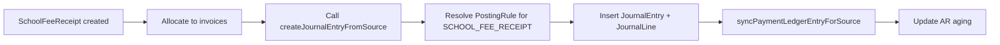

# Schools Module Expansion Plan (Codebase-Aligned)

## 1. Purpose
This document is the schools implementation contract for this repository. It translates stakeholder requirements from `zim-smb-market-gameplan.md` and `industry-implementation-plans/school-implementation-plan.md` into exact modules, routes, services, and data models.

Primary goals:
- Deliver production-ready school management covering enrollment, academics, finance, hostels, and portals.
- Keep finance flows tenant-safe with posting rules, idempotent receipts, and period locks.
- Apply playbook-compliant UI (DetailPageShell, vertical tabs, full-bleed tables).
- Provide standalone portal experiences for parents, students, teachers, and HODs.

Source of truth in code:
- UI routes: `app/schools/*`
- API routes: `app/api/v2/schools/*`
- Domain services: `lib/schools/*`
- Typed client API: `lib/schools/schools-v2.ts`
- Persistence: `prisma/schema.prisma`

## 2. Design Principles
- **Fee-first wedge**: School fees and receipts are the primary entry point; academics/boarding follow.
- **Portal isolation**: Portal users (parents, students, teachers) see only their shell, no main dashboard.
- **Posting integration**: Fee receipts post to GL/AR with idempotent source keys via accounting posting engine.
- **Document lifecycle**: Enrollment, invoices, receipts, result sheets follow Draft→Submitted→Posted→Cancelled states.
- **Audit trails**: Timeline comments on all critical actions (submit, cancel, waive, refund, publish).

## 3. Navigation Model (To Implement)

### 3.1 Main Navigation (Admin/Registrar/Bursar)
```
/schools                    # Dashboard with enrollment, finance, academics metrics
/schools/admissions         # Enrollment intake and verification
/schools/students           # Student directory (list) → /students/[id] (detail with tabs)
/schools/guardians          # Guardian directory → /guardians/[id] (detail)
/schools/teachers           # Teacher directory → /teachers/[id] (detail with classes/subjects)
/schools/classes            # Class/stream setup
/schools/subjects           # Subject catalog
/schools/timetable          # Timetable builder
/schools/attendance         # Daily roll call
/schools/finance            # Finance hub (invoices, receipts, waivers, arrears)
/schools/finance/structures # Fee structure templates
/schools/finance/invoices   # Invoice list → /invoices/[id] (detail)
/schools/finance/receipts   # Receipt list → /receipts/[id] (detail with allocation)
/schools/finance/waivers    # Waiver list
/schools/finance/refunds    # Refund list
/schools/results            # Results hub (sheets, moderation, publish windows)
/schools/results/sheets     # Result sheet list → /sheets/[id] (detail with scores)
/schools/results/moderation # Moderation queue
/schools/results/publish    # Publish window management
/schools/boarding           # Boarding hub (hostels, allocations, leave)
/schools/boarding/hostels   # Hostel list → /hostels/[id] (detail with rooms/beds)
/schools/boarding/allocations # Allocation list
/schools/boarding/leave     # Leave request list
/schools/reports            # Reporting hub (collections, arrears, enrollment, occupancy)
/schools/documents          # Document templates and bulk operations
```

### 3.2 Portal Navigation (Isolated shells)
```
/portal/parent              # Parent portal (balances, statements, receipts, notices)
/portal/student             # Student portal (timetable, attendance, results, fees)
/portal/teacher             # Teacher portal (registers, marks entry, moderation)
```

## 4. Module Map (Route → API → Service → Models)

### 4.1 Enrollment & Student Records
**UI:**
- `/schools/admissions`
- `/schools/students`
- `/schools/students/[id]` (tabs: Identity, Finance, Academics, Boarding, Documents, Audit)

**API:**
- `/api/v2/schools/students` (list, create, update)
- `/api/v2/schools/students/[id]` (get, update)
- `/api/v2/schools/students/[id]/enrollment` (enrollment history)
- `/api/v2/schools/students/[id]/guardians` (linked guardians)
- `/api/v2/schools/students/[id]/documents` (document uploads)
- `/api/v2/schools/enrollments` (bulk operations, approval)

**Services:**
- `lib/schools/enrollment.ts` (create, verify, activate, duplicate detection)
- `lib/schools/students.ts` (CRUD, search, document management)

**Models:**
- `SchoolStudent` (admission number, national ID, health flags, hostel eligibility)
- `SchoolGuardian` (name, phone, email, national ID)
- `SchoolStudentGuardian` (link table with relationship type)
- `SchoolEnrollment` (per term, status: DRAFT/VERIFIED/ACTIVE)

### 4.2 Teachers & Academic Structure
**UI:**
- `/schools/teachers`
- `/schools/teachers/[id]` (tabs: Identity, Classes, Subjects, Performance, Documents)
- `/schools/classes`
- `/schools/subjects`
- `/schools/timetable`

**API:**
- `/api/v2/schools/teachers` (list, create, update)
- `/api/v2/schools/teachers/[id]` (get, update, class assignments)
- `/api/v2/schools/classes` (CRUD, stream management)
- `/api/v2/schools/subjects` (CRUD, teacher assignments)
- `/api/v2/schools/timetable` (schedule management, conflict detection)

**Services:**
- `lib/schools/teachers.ts` (CRUD, class/subject assignment, HOD workflows)
- `lib/schools/academic-structure.ts` (class/stream/subject management)
- `lib/schools/timetable.ts` (schedule builder, conflict resolution)

**Models:**
- `SchoolTeacherProfile` (linked to Employee via triggers)
- `SchoolAcademicYear`, `SchoolTerm`
- `SchoolClass`, `SchoolStream`
- `SchoolSubject`, `SchoolClassSubject` (assignment table)

### 4.3 Fees & Billing
**UI:**
- `/schools/finance`
- `/schools/finance/structures` (fee templates per grade/term)
- `/schools/finance/invoices` (list) → `/invoices/[id]` (detail)
- `/schools/finance/receipts` (list) → `/receipts/[id]` (detail with allocation breakdown)
- `/schools/finance/waivers`
- `/schools/finance/refunds`

**API:**
- `/api/v2/schools/fees/structures` (CRUD for templates)
- `/api/v2/schools/fees/invoices` (list, bulk generate by term, get detail)
- `/api/v2/schools/fees/invoices/[id]` (get, void)
- `/api/v2/schools/fees/receipts` (list, create, allocate)
- `/api/v2/schools/fees/receipts/[id]` (get, post to accounting)
- `/api/v2/schools/fees/waivers` (create, approve)
- `/api/v2/schools/fees/refunds` (create, approve, post)
- `/api/v2/schools/fees/arrears` (aging report)
- `/api/v2/schools/fees/statements/[studentId]` (statement generation)

**Services:**
- `lib/schools/fees.ts` (structure management, invoice generation, waiver/refund logic)
- `lib/schools/receipts.ts` (receipt creation, allocation rules, overpayment handling)
- `lib/schools/fees-posting.ts` (posting integration with accounting engine)

**Models:**
- `SchoolFeeStructure`, `SchoolFeeStructureLine` (templates with components)
- `SchoolFeeInvoice`, `SchoolFeeInvoiceLine` (per student per term)
- `SchoolFeeReceipt`, `SchoolFeeReceiptAllocation` (payment with allocations)
- `SchoolFeeWaiver` (discount/scholarship with approval)

**Posting Integration:**
- Receipts post via `lib/accounting/posting.ts` with source type `SCHOOL_FEE_RECEIPT`
- Idempotent source key: `SCHOOL:FEE_RECEIPT:{receiptId}`
- Debit: Bank/Cash account
- Credit: Student Fees Revenue account
- Subledger: `PaymentLedgerEntry` for AR tracking

### 4.4 Attendance & Conduct
**UI:**
- `/schools/attendance` (daily roll call by class)
- `/schools/conduct` (incident/discipline log)

**API:**
- `/api/v2/schools/attendance/sessions` (create daily session)
- `/api/v2/schools/attendance/sessions/[id]/lines` (mark attendance)
- `/api/v2/schools/attendance/reports` (analytics, absence summary)
- `/api/v2/schools/conduct/incidents` (CRUD)

**Services:**
- `lib/schools/attendance.ts` (session management, absence notifications)
- `lib/schools/conduct.ts` (incident workflows, sanctions, escalation)

**Models:**
- `SchoolAttendanceSession`, `SchoolAttendanceSessionLine`
- `SchoolConductIncident` (future addition)

### 4.5 Assessments & Results
**UI:**
- `/schools/results`
- `/schools/results/sheets` (list) → `/sheets/[id]` (detail with score entry)
- `/schools/results/moderation` (approval queue)
- `/schools/results/publish` (publish window management)

**API:**
- `/api/v2/schools/results/sheets` (list, create, import scores)
- `/api/v2/schools/results/sheets/[id]` (get, update scores)
- `/api/v2/schools/results/sheets/[id]/submit` (submit for moderation)
- `/api/v2/schools/results/sheets/[id]/moderate` (HOD/principal approval)
- `/api/v2/schools/results/sheets/[id]/publish` (publish to portals)
- `/api/v2/schools/results/publish-windows` (CRUD, gate publishing)

**Services:**
- `lib/schools/results.ts` (score entry, gradebook calculation, moderation)
- `lib/schools/publishing.ts` (publish window enforcement, fee threshold gate)

**Models:**
- `SchoolResultSheet` (per subject per term per class)
- `SchoolResultLine` (scores per student)
- `SchoolResultModerationAction` (approval audit trail)
- `SchoolPublishWindow` (publish timing controls)

### 4.6 Boarding
**UI:**
- `/schools/boarding`
- `/schools/boarding/hostels` (list) → `/hostels/[id]` (detail with rooms/beds, occupancy)
- `/schools/boarding/allocations` (allocation management)
- `/schools/boarding/leave` (leave request list)

**API:**
- `/api/v2/schools/boarding/hostels` (CRUD)
- `/api/v2/schools/boarding/hostels/[id]/rooms` (room management)
- `/api/v2/schools/boarding/hostels/[id]/beds` (bed inventory)
- `/api/v2/schools/boarding/allocations` (allocate student to bed, check capacity/gender)
- `/api/v2/schools/boarding/allocations/[id]/check-in` (check-in log)
- `/api/v2/schools/boarding/allocations/[id]/check-out` (check-out log)
- `/api/v2/schools/boarding/leave` (leave request CRUD, approval)

**Services:**
- `lib/schools/boarding.ts` (allocation logic, capacity enforcement, gender policy)
- `lib/schools/boarding-leave.ts` (leave request workflows, approval)

**Models:**
- `SchoolHostel` (code, name, capacity, gender policy)
- `SchoolHostelRoom` (code, capacity)
- `SchoolHostelBed` (code, status)
- `SchoolBoardingAllocation` (student→bed per term)
- `SchoolLeaveRequest` (leave workflow with approval)
- `SchoolBoardingMovementLog` (check-in/out audit)

### 4.7 Portals (Isolated Shells)
**UI:**
- `/portal/parent` (balances, statements, receipts, notices)
- `/portal/student` (timetable, attendance, results, fees)
- `/portal/teacher` (registers, marks entry, moderation tasks)

**API:**
- `/api/v2/schools/portal/parent/[guardianId]/students` (linked students)
- `/api/v2/schools/portal/parent/[guardianId]/balances` (fee balances)
- `/api/v2/schools/portal/parent/[guardianId]/statements` (statements)
- `/api/v2/schools/portal/student/[studentId]/timetable`
- `/api/v2/schools/portal/student/[studentId]/attendance`
- `/api/v2/schools/portal/student/[studentId]/results`
- `/api/v2/schools/portal/teacher/[teacherId]/classes`
- `/api/v2/schools/portal/teacher/[teacherId]/marks`

**Services:**
- `lib/schools/portal.ts` (portal data aggregation, permission checks)

**Models:**
- Reuse existing models with portal-specific views/filters

### 4.8 Reporting
**UI:**
- `/schools/reports` (collections, arrears, enrollment, occupancy)

**API:**
- `/api/v2/schools/reports/collections` (fee collection summary)
- `/api/v2/schools/reports/arrears` (arrears aging)
- `/api/v2/schools/reports/enrollment` (enrollment stats)
- `/api/v2/schools/reports/occupancy` (hostel occupancy)
- `/api/v2/schools/reports/export` (CSV/PDF export)

**Services:**
- `lib/schools/reports.ts` (report generation, export)

## 5. End-to-End Fee Receipt Posting Architecture



**Posting invariants:**
- Receipt source key: `SCHOOL:FEE_RECEIPT:{receiptId}`
- Journal lines must balance
- Overpayment carried as credit or advance liability
- Allocations tracked in `SchoolFeeReceiptAllocation`

## 6. Document Lifecycle (To Implement)

**States:** DRAFT → SUBMITTED → POSTED → CANCELLED

**Enforced by:** `lib/platform/document-lifecycle.ts` (new service)

**Applies to:**
- `SchoolEnrollment`
- `SchoolFeeInvoice`
- `SchoolFeeReceipt`
- `SchoolResultSheet`

**Rules:**
- No delete after POSTED
- Cancellation creates reversal document
- Audit timeline captures all transitions

## 7. Cross-Entity Triggers (Teacher→Employee)

**Trigger:** When `SchoolTeacherProfile` is created

**Action:** Create or link `Employee` record

**Implementation:** `lib/schools/teacher-employee-sync.ts` (new service)

**Behavior:**
- On teacher create: Create employee if not exists, link via `employeeId`
- On teacher update: Update employee name, contact details
- On employee update: Update teacher profile if linked
- Bidirectional sync with conflict resolution (teacher profile wins)

## 8. Portal Isolation Architecture

**Navigation:**
- Portal users have `role` in `PARENT | STUDENT | TEACHER | HOD`
- Sidebar renders portal-specific navigation from `lib/navigation.ts`
- Main dashboard routes (`/`, `/dashboard`) redirect to portal home

**Route gating:**
- Portal routes gated by `portal.*` feature keys
- `lib/platform/gating/portal-check.ts` (new middleware)

**Session context:**
- Session includes `portalContext: { role, entityId }` for parent/student/teacher
- API endpoints validate portal context and filter data

## 9. Acceptance Criteria

- ✅ Navigation exposes all schools modules with one-table-per-view layouts
- ✅ Student/teacher/guardian detail pages with tabs (Identity, Finance, Academics, etc.)
- ✅ Fee structure templates generate invoices by term with bulk preview
- ✅ Receipts post via accounting with idempotent keys; allocations tracked
- ✅ Waivers/refunds adjust balances with audit trail
- ✅ Hostel allocation respects capacity and gender policy; occupancy accurate
- ✅ Attendance captured daily; notifications triggered for absences
- ✅ Assessments allow score import/entry; produce term reports with publish controls
- ✅ Dashboards show collections, arrears, enrollment, occupancy; exports succeed and log audits
- ✅ All critical actions (submit/cancel/waive/refund/publish) require permissions and leave timeline audit notes
- ✅ Portals isolated; parent/student/teacher see only their shell; no main dashboard access

## 10. Current Delivery Status

| Requirement Theme | Status | Notes |
|---|---|---|
| Database schema | ✅ Complete | All models exist in `prisma/schema.prisma` |
| Basic dashboard | ✅ Delivered | Shows metrics from `/api/v2` |
| Detail pages | ❌ Missing | Need student/teacher/guardian/hostel detail pages with tabs |
| Fee workflows | ⚠️ Partial | Basic API exists; needs invoice generation, receipt posting |
| Receipt posting | ❌ Missing | Posting integration needed |
| Portals | ⚠️ Partial | Portal login exists; content shells incomplete |
| Academics | ⚠️ Partial | Basic result sheets exist; moderation/publishing incomplete |
| Boarding | ⚠️ Partial | Basic allocation API exists; leave/check-in incomplete |
| Reporting | ❌ Missing | Export and scheduled reports needed |

## 11. Implementation Phases

**Phase 1: Core CRUD & Detail Pages (Week 1)**
- Student detail page with tabs
- Teacher detail page with tabs
- Guardian directory and detail
- Hostel detail page with rooms/beds/occupancy

**Phase 2: Finance Workflows (Week 2)**
- Fee structure templates
- Bulk invoice generation
- Receipt workflows with allocation
- Posting integration
- Waiver and refund workflows

**Phase 3: Portals (Week 2-3)**
- Parent portal (balances, statements, receipts)
- Student portal (timetable, attendance, results)
- Teacher portal (registers, marks entry)
- HOD workflows

**Phase 4: Academics & Boarding (Week 3)**
- Result sheet score entry
- Moderation workflows
- Publishing with fee gate
- Boarding allocation
- Leave request workflows
- Check-in/out logs

**Phase 5: Reporting & Polish (Week 3)**
- Collections dashboard
- Arrears aging
- Enrollment stats
- Hostel occupancy
- CSV/PDF exports
- Scheduled reports

## 12. QA and Release Checklist

- Run `npm run lint`
- Run `npm run build`
- Smoke test:
  - Create student with guardian
  - Generate fee invoice
  - Post receipt and verify journal entry
  - Allocate to hostel bed
  - Enter result scores and publish
  - Access parent/student/teacher portals
- Verify posting idempotency (duplicate receipt attempts rejected)
- Verify portal isolation (parent cannot access main dashboard)

## 13. Connection to Platform Architecture

This schools document should stay in sync with:
- Navigation: `lib/navigation.ts`
- Route gating: `lib/platform/gating/route-registry.ts`
- Feature catalog: `lib/platform/feature-catalog.ts`
- Schema: `prisma/schema.prisma`
- Posting engine: `lib/accounting/posting.ts`
- Document lifecycle: `lib/platform/document-lifecycle.ts` (new)
