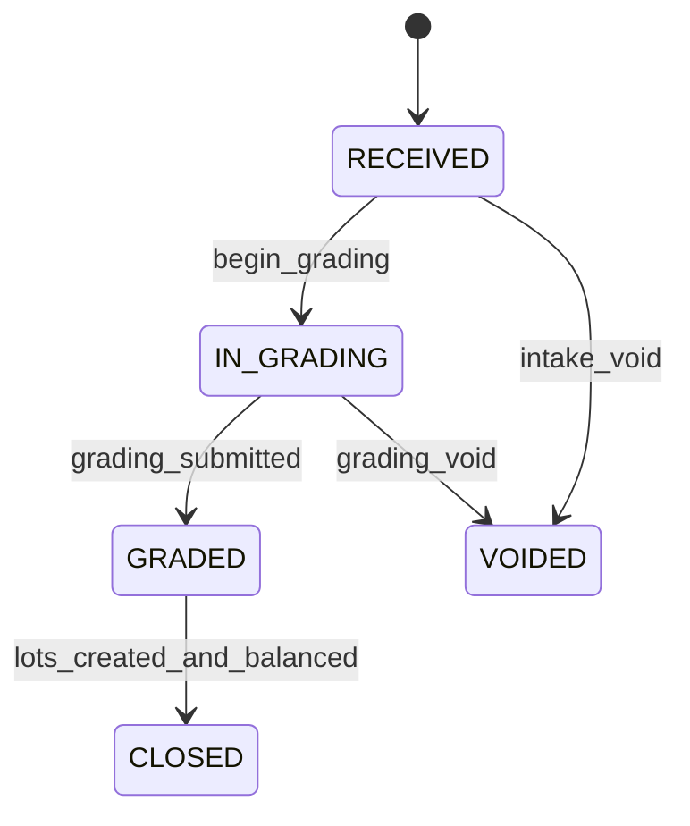
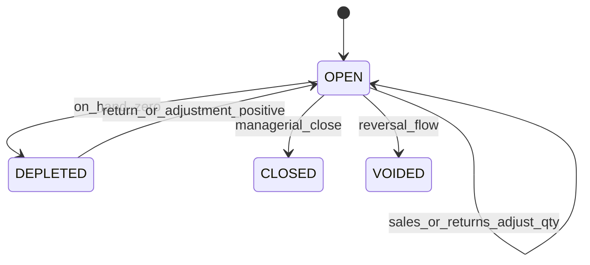
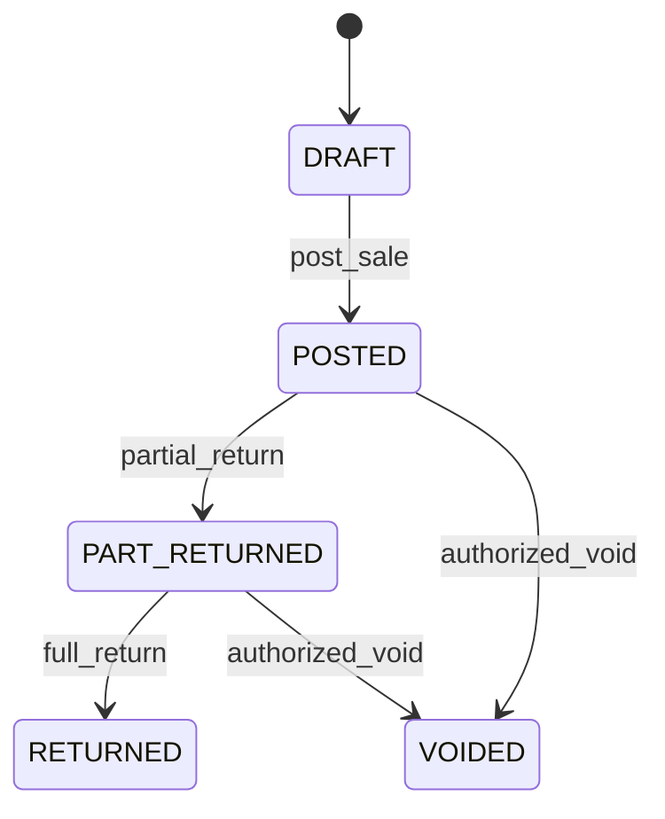

# Thrift Pack Spec (Full Scope Implementation Contract)

## Normative References
1. Platform architecture source of truth: `docs/expansion-plan/platform-holy-grail.md`
2. UX enforcement source of truth: `docs/ux/platform-ux-playbook.md`

## 1. Objective
Deliver a full thrift operations pack from bale intake through grading, lot inventory, sales, returns, and margin reporting with strict traceability.

## 2. Scope
### 2.1 In Scope
1. Supplier onboarding and procurement references.
2. Bale intake with gross/net measures and landed cost.
3. Grading and sorting into SKU lots.
4. Lot-based inventory with traceability to source bale(s).
5. Sales workflow:
- retail
- wholesale
- mixed lot sale lines
6. Returns, voids, and stock/cost reversals.
7. Stock adjustments and shrinkage analysis.
8. Reporting:
- bale-to-sale traceability
- stock aging by lot
- shrinkage variance
- gross margin by period/category

### 2.2 Out of Scope (Tracked)
| Dependency ID | Deferred Item | Reason | Target Wave |
| --- | --- | --- | --- |
| THR-DEP-01 | Dynamic AI pricing recommendations | non-core for transaction integrity | Wave 4 |
| THR-DEP-02 | Consumer e-commerce integration | separate commerce stream | Wave 4 |
| THR-DEP-03 | Barcode scanner native mobile integration | web-first workflow in current release | Wave 4 |

## 3. Route Map
1. `/thrift`
2. `/thrift/suppliers`
3. `/thrift/intake`
4. `/thrift/grading`
5. `/thrift/inventory`
6. `/thrift/sales`
7. `/thrift/returns`
8. `/thrift/adjustments`
9. `/thrift/reports`

## 4. Feature Keys and Gating Matrix
Bundle: `ADDON_THRIFT_PACK`

| Route Group | Page Prefix | API Prefix | Feature Key | Roles |
| --- | --- | --- | --- | --- |
| Home | `/thrift` | `/api/thrift/dashboard` | `thrift.home` | thrift-manager, thrift-clerk |
| Suppliers | `/thrift/suppliers` | `/api/thrift/suppliers` | `thrift.suppliers.manage` | procurement-clerk, thrift-manager |
| Intake | `/thrift/intake` | `/api/thrift/bales` | `thrift.intake.manage` | intake-clerk, thrift-manager |
| Grading | `/thrift/grading` | `/api/thrift/grading` | `thrift.grading.manage` | grader, thrift-manager |
| Inventory | `/thrift/inventory` | `/api/thrift/lots` | `thrift.inventory.manage` | store-clerk, thrift-manager |
| Sales | `/thrift/sales` | `/api/thrift/sales` | `thrift.sales.manage` | cashier, sales-clerk |
| Returns | `/thrift/returns` | `/api/thrift/returns` | `thrift.returns.manage` | cashier, thrift-manager |
| Adjustments | `/thrift/adjustments` | `/api/thrift/adjustments` | `thrift.adjustments.manage` | thrift-manager, stock-auditor |
| Reports | `/thrift/reports` | `/api/thrift/reports` | `thrift.reports.view` | thrift-manager, finance-manager |

## 5. Data Model (Entity Groups and Fields)
All tables include `id`, `companyId`, `createdAt`, `updatedAt`.

### 5.1 Procurement and Intake
1. `ThriftSupplier`
- `supplierCode`
- `name`
- `phone`
- `email`
- `address`
- `status` (`ACTIVE`, `INACTIVE`)
2. `ThriftPurchaseOrder`
- `poNo`
- `supplierId`
- `orderDate`
- `expectedArrivalDate`
- `status` (`DRAFT`, `ISSUED`, `PART_RECEIVED`, `RECEIVED`, `CANCELED`)
- unique `(companyId, poNo)`
3. `ThriftBale`
- `baleNo`
- `supplierId`
- `purchaseOrderId` (nullable)
- `siteId`
- `receivedAt`
- `grossWeightKg`
- `tareWeightKg`
- `netWeightKg`
- `currency`
- `landedCostAmount`
- `status` (`RECEIVED`, `IN_GRADING`, `GRADED`, `CLOSED`, `VOIDED`)
- unique `(companyId, baleNo)`
4. `ThriftBaleCostLine`
- `baleId`
- `costType` (`PURCHASE`, `FREIGHT`, `CLEARANCE`, `HANDLING`, `OTHER`)
- `amount`
- `reference`

### 5.2 Grading and SKU Classification
1. `ThriftGrade`
- `gradeCode`
- `name`
- `description`
- `defaultMarkupPercent`
- unique `(companyId, gradeCode)`
2. `ThriftCategory`
- `categoryCode`
- `name`
- unique `(companyId, categoryCode)`
3. `ThriftSku`
- `skuCode`
- `name`
- `gradeId`
- `categoryId`
- `uom` (`PIECE`, `KG`, `BUNDLE`)
- `status`
- unique `(companyId, skuCode)`
4. `ThriftBaleGradeLine`
- `baleId`
- `gradeId`
- `categoryId`
- `skuId`
- `qty`
- `estimatedSellValue`
- `recordedByUserId`

### 5.3 Lot Inventory and Movements
1. `ThriftLot`
- `lotNo`
- `baleId`
- `skuId`
- `siteId`
- `receivedQty`
- `onHandQty`
- `reservedQty`
- `unitCost`
- `status` (`OPEN`, `DEPLETED`, `CLOSED`, `VOIDED`)
- unique `(companyId, lotNo)`
2. `ThriftStockMovement`
- `movementNo`
- `lotId`
- `movementType` (`INTAKE`, `GRADE_IN`, `GRADE_OUT`, `SALE`, `RETURN_IN`, `ADJUSTMENT_POS`, `ADJUSTMENT_NEG`, `VOID_REVERSAL`)
- `qty`
- `unitCost`
- `unitPrice` (nullable)
- `referenceType`
- `referenceId`
- `postedAt`
- unique `(companyId, movementNo)`
3. `ThriftStockCount`
- `countNo`
- `siteId`
- `countDate`
- `status` (`DRAFT`, `POSTED`, `VOIDED`)
4. `ThriftStockCountLine`
- `stockCountId`
- `lotId`
- `systemQty`
- `countedQty`
- `varianceQty`

### 5.4 Sales and Returns
1. `ThriftSale`
- `saleNo`
- `saleType` (`RETAIL`, `WHOLESALE`)
- `customerName`
- `customerPhone`
- `saleDate`
- `status` (`DRAFT`, `POSTED`, `VOIDED`, `PART_RETURNED`, `RETURNED`)
- `totalAmount`
- `costAmount`
- `marginAmount`
- unique `(companyId, saleNo)`
2. `ThriftSaleLine`
- `saleId`
- `lotId`
- `skuId`
- `qty`
- `unitPrice`
- `lineTotal`
- `lineCost`
3. `ThriftReturn`
- `returnNo`
- `saleId`
- `returnDate`
- `reason`
- `status` (`DRAFT`, `POSTED`, `VOIDED`)
- `refundAmount`
- unique `(companyId, returnNo)`
4. `ThriftReturnLine`
- `returnId`
- `saleLineId`
- `lotId`
- `qty`
- `refundAmount`

### 5.5 Adjustments and Control
1. `ThriftStockAdjustment`
- `adjustmentNo`
- `lotId`
- `adjustmentType` (`DAMAGE`, `LOSS`, `RECLASSIFICATION`, `COUNT_CORRECTION`)
- `qtyDelta`
- `unitCost`
- `reason`
- `status` (`DRAFT`, `APPROVED`, `POSTED`, `VOIDED`)
- `requestedByUserId`
- `approvedByUserId`
- unique `(companyId, adjustmentNo)`

## 6. API Surface and Representative Payload Contracts
All list APIs support `search`, `page`, `pageSize`, `sortBy`, `sortDir`.

### 6.1 Intake
1. `POST /api/thrift/bales`
```json
{
  "baleNo": "BAL-2026-0194",
  "supplierId": "uuid",
  "siteId": "uuid",
  "receivedAt": "2026-02-27T09:00:00Z",
  "grossWeightKg": 92.3,
  "tareWeightKg": 2.3,
  "currency": "USD",
  "landedCostAmount": 420
}
```

### 6.2 Grading
1. `POST /api/thrift/grading/bales/:id/submit`
```json
{
  "lines": [
    { "gradeId": "uuid-g1", "categoryId": "uuid-c1", "skuId": "uuid-s1", "qty": 34, "estimatedSellValue": 238 },
    { "gradeId": "uuid-g2", "categoryId": "uuid-c3", "skuId": "uuid-s8", "qty": 22, "estimatedSellValue": 96 }
  ]
}
```

### 6.3 Sales
1. `POST /api/thrift/sales`
```json
{
  "saleType": "RETAIL",
  "customerName": "Walk-in Customer",
  "saleDate": "2026-02-27",
  "lines": [
    { "lotId": "uuid-lot-1", "qty": 3, "unitPrice": 12 },
    { "lotId": "uuid-lot-2", "qty": 1, "unitPrice": 18 }
  ]
}
```
2. `POST /api/thrift/sales/:id/post`
```json
{
  "confirmTotal": 54
}
```
3. `POST /api/thrift/returns`
```json
{
  "saleId": "uuid-sale",
  "returnDate": "2026-02-28",
  "reason": "Damaged seams",
  "lines": [
    { "saleLineId": "uuid-line", "qty": 1, "refundAmount": 12 }
  ]
}
```

### 6.4 Adjustments
1. `POST /api/thrift/adjustments`
```json
{
  "lotId": "uuid-lot",
  "adjustmentType": "DAMAGE",
  "qtyDelta": -2,
  "reason": "Water damage identified in stock room"
}
```
2. `POST /api/thrift/adjustments/:id/approve`
```json
{
  "approvalComment": "Validated during cycle count."
}
```

## 7. Workflow State Machines
### 7.1 Bale Lifecycle


### 7.2 Lot Lifecycle


### 7.3 Sale Lifecycle


## 8. Accounting Posting Mappings
| Event | Source | Debit | Credit | Notes |
| --- | --- | --- | --- | --- |
| `THRIFT_BALE_RECEIVED` | Bale intake | Inventory - Thrift | Accounts Payable / Cash | landed cost basis |
| `THRIFT_STOCK_ADJUSTMENT_NEG` | Negative adjustment | Inventory Shrinkage Expense | Inventory - Thrift | approved adjustment only |
| `THRIFT_STOCK_ADJUSTMENT_POS` | Positive adjustment | Inventory - Thrift | Inventory Gain / Correction | count correction cases |
| `THRIFT_SALE_POSTED` | Sale | Cash/AR | Sales Revenue - Thrift | per sale document |
| `THRIFT_COGS_RECOGNIZED` | Sale posting | COGS - Thrift | Inventory - Thrift | cost from lot unit cost |
| `THRIFT_RETURN_POSTED` | Return | Sales Returns / Contra Revenue | Cash/AR | reverse revenue side |
| `THRIFT_RETURN_COST_REVERSAL` | Return | Inventory - Thrift | COGS - Thrift | reverse cost side |
| `THRIFT_SALE_VOIDED` | Void | reversal of sale and COGS entries | reversal of sale and COGS entries | idempotent reversal event |

## 9. UX Contract
1. Intake, grading, inventory, sales, returns, and adjustments each use separate active table contexts.
2. Grading page uses expandable parent row (bale) and child rows (grade lines) with lazy load.
3. Single controls row for search, filters, and pagination.
4. Numeric values (qty, cost, margin, dates) are mono.
5. Invalid actions hidden by state:
- cannot post draft adjustments without approval
- cannot return from voided sale

## 10. Acceptance Criteria and Test Scenarios
### 10.1 Functional Criteria
1. Bale number uniqueness per tenant.
2. Cannot post sale if any line quantity exceeds lot `onHandQty`.
3. Lot traceability always links sale line to lot and lot to bale.
4. Posted return increases lot on-hand by returned quantity.
5. Margin equals `totalAmount - costAmount` after each post.

### 10.2 Deterministic Test Scenarios
`THR-T01 Tenant isolation`:
1. Create bale in Company A.
2. Query in Company B.
3. Expected: forbidden/not found.

`THR-T02 Oversell prevention`:
1. Lot on hand `5`.
2. Attempt sale line qty `6`.
3. Expected: `INSUFFICIENT_STOCK`.

`THR-T03 Traceability completeness`:
1. Post sale from lot L.
2. Query traceability report for sale line.
3. Expected: includes `sale -> lot -> bale` chain.

`THR-T04 Adjustment approval guard`:
1. Create negative adjustment in `DRAFT`.
2. Attempt post without approval.
3. Expected: `ADJUSTMENT_NOT_APPROVED`.

`THR-T05 Return cost reversal`:
1. Post sale with known unit cost.
2. Post return of part quantity.
3. Expected: COGS reversal and inventory increase match returned qty * unit cost.

## 11. Risks and Mitigations
| Risk ID | Risk | Mitigation | Owner Role |
| --- | --- | --- | --- |
| THR-R1 | Stock drift from manual handling errors | mandatory stock count workflow with controlled adjustments | Thrift operations lead |
| THR-R2 | Margin distortion from incomplete landed costs | enforce bale cost lines before grading closure | Finance lead |
| THR-R3 | Sale/return race conditions | transactional lot quantity updates with locking | Backend lead |
| THR-R4 | Weak traceability for audit | non-null references for movements and periodic traceability integrity checks | Data integrity lead |
| THR-R5 | Unauthorized stock write-downs | approval workflow and role constraints on adjustments | Risk and controls lead |
