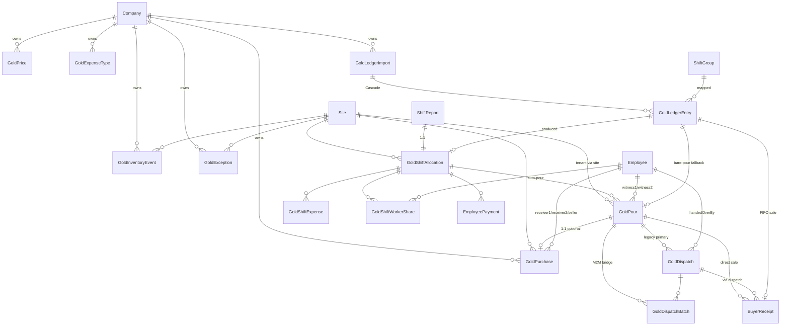

# Gold Module — Architecture & UI/UX Review

**Date:** 2026-05-09
**Branch:** `main` (HEAD `5b83c6362`)
**Scope:** `app/gold/**`, `app/api/gold/**`, `lib/gold/**`, Prisma Gold models (`prisma/schema.prisma:2020-2442`), and integrations with auth, accounting, HR/payroll, attendance, scrap-metal, inventory, notifications, documents, audit, settings, and reports.

This is a four-part report produced by parallel deep-reads of the Gold module. Read the **Executive Summary** for the punch list. Each subsequent chapter is a self-contained deep dive that cites file:line for every finding.

---

## Table of contents

1. [Executive summary](#1-executive-summary)
2. [Top 10 P0 findings (cross-cutting)](#2-top-10-p0-findings-cross-cutting)
3. [Backend architecture](#3-backend-architecture--gold-module)
4. [Data model](#4-data-model--gold-module)
5. [UI / UX review](#5-uiux-review--gold-module)
6. [Cross-module integrations](#6-crossmodule-integrations--gold)
7. [Consolidated prioritised action plan (detailed, by file)](#7-consolidated-prioritised-action-plan)
8. [Resolved questions (team answers, 2026-05-09)](#8-resolved-questions-team-answers-2026-05-09)
9. [Import workflow redesign (new chapter)](#9-import-workflow-redesign-new-chapter)
10. [Live React #418 / #310 errors on import pages — root causes](#10-live-react-418--310-errors-on-import-pages--root-causes)
11. [Testing baseline (pre-flight for the P0 migrations)](#11-testing-baseline-preflight-for-the-p0-migrations)
12. [Operational runbook for the import workflow](#12-operational-runbook-for-the-import-workflow)
13. [**Roadmap — Product Planning stack rank (canonical execution order)**](#13-roadmap--product-planning-stack-rank-canonical-execution-order)
14. [Document changelog](#14-document-changelog)
15. [**Plan-of-record refinements (Jira epic review, 2026-05-09)**](#15-planofrecord-refinements-jira-epic-review-20260509)

---

## 1. Executive summary

The Gold module is the most active and most consequential module in Huchu. It owns the chain of custody from **production / public-buying → vault → dispatch → buyer settlement → worker payout**, and it is wired into accounting, HR/payroll, attendance, and notifications. The module works — but several classes of issue stack up to material risk:

| Theme | Count | Worst case |
|---|---|---|
| **Data integrity** (FIFO race, inventory drift, append-only-ledger violation, Float for money) | ~15 P0/P1 | Double-sale of the same gold bar; balances drift; rolled-back imports retroactively change historical on-hand |
| **GL completeness** (in-transit, vault inflows, AP/AR subledgers) | ~6 P0 | Gold In-Transit account (1300) is never debited; AP/AR don't see gold purchases or sales |
| **Authorisation gaps** (no role gates on intake/import/rollback) | ~10 P0 | Any clerk can commit a 500-row CSV that creates payroll liabilities and journal entries |
| **State / atomicity drift** (accounting captured outside source tx) | 7 endpoints | Source row commits, integration event missing → silent ledger drift |
| **Schema** (Float for grams + USD, JSON-as-text, missing companyId, missing indexes, legacy column names) | ~30 columns | Compounding rounding error; can't enforce per-tenant uniques; "Mdara/Boys" rename incomplete in DB |
| **UX** (forms in two homes, UTC defaults, 1182-line import page, `window.confirm` for destructive actions, hydration hazards) | ~25 P0/P1 | Operator misclicks "Roll back" with no styled confirm; mobile forms overflow; React #418/#310 still latent on non-import pages |
| **Integrations / boundary leaks** (HR module branches on gold internals; gold UI imported from attendance) | 5 leaks | HR cannot evolve independent of gold |

**The single most dangerous finding** is that `GoldInventoryEvent` is **not actually append-only** — `lib/gold/import-cleanup.ts:117-128` and `app/api/gold/imports/[id]/commit/route.ts:103-111` `deleteMany` from it on rollback / re-commit / reset-failed. Any reconciliation snapshot taken before a rollback is silently invalidated, with no audit trail of why the balance changed. Every other ledger-grade guarantee in the module flows through this table; if it isn't append-only, the module's integrity story is broken.

The **second most dangerous** is that `dispatch-created` and `pour-created` accounting events are queued with status `IGNORED` (`pours/route.ts:254`, `dispatches/route.ts:289`) — meaning the GL never debits Gold-In-Transit (1300) and never debits Gold-Inventory (1250) for bare/purchase pours. The accounting integration looks like it works — events appear in the AccountingIntegrationEvent table — but several event types are dead-on-arrival.

**Quick wins available today** (low effort, high impact):
- Drop "Mdara / Boys" from user-facing copy in `app/gold/import/page.tsx:104-106` (10-second fix).
- Replace `window.confirm` on the import detail page with `AlertDialog` and mark Rollback `variant="destructive"` (`import/[id]/page.tsx:557, 579, 599`).
- Replace direct `toLocaleString()` on list pages with `<ClientDate>` (the recent hotfix only patched import pages).
- Default form datetime fields to local time, not UTC (one-line fix per form).

**Strategic build, scoped in chapter 9:** the Import workflow is the strategic surface of this module — mines run paper or Excel ledgers, and import is the recurring reconciliation between their books and the system. The current 985-line route handler + 1182-line page is hot-fixed but not engineered for that mission. Chapter 9 scopes the rebuild: lifecycle states, background worker, mapping presets, list/rename/archive, period-close, reconciliation reports, append-only rollback, UI lock for concurrent operators, end-to-end audit. Phased over ~10 sprints across five workstreams; Phase 0 (the data-foundation P0s) blocks everything else.

**Canonical execution order: chapter 13.** Product Planning's stack rank in §13 is the authoritative sequencing for delivery. Chapter 7 catalogues every action item with file paths and rationale; chapter 13 puts them in the order engineering should pick them up. The one-line summary from Product:

> *Trust the ledger, trust permissions, trust posting, trust imports, then improve operator experience.*

---

## 2. Top 10 P0 findings (cross-cutting)

These are sorted by combined severity × blast-radius. Each maps to chapter sections that go deeper.

| # | Finding | File | Severity |
|---|---|---|---|
| 1 | `GoldInventoryEvent` is mutated/deleted on rollback — append-only in spirit only | `lib/gold/import-cleanup.ts:117-128`; `app/api/gold/imports/[id]/commit/route.ts:103-111` | P0 |
| 2 | FIFO sale linker has no per-site lock; `(goldDispatchId, goldPourId)` unique fails when both are NULL — concurrent commits double-sell a pour | `lib/gold/fifo-link.ts:63-138`; `prisma/schema.prisma:2207` | P0 |
| 3 | All weights and money columns are `Float`; `Math.max(0, +(x).toFixed(4))` masks negative balances | `prisma/schema.prisma:2059-2069, 2218-2232, 2302`; `lib/gold/inventory.ts:101` | P0 |
| 4 | Multi-tenant scope reaches via `site.companyId`; tenancy missing on root rows; per-company uniques (`pourBarId`, `receiptNumber`) impossible | every Gold transactional model | P0 |
| 5 | No role gate on `pours/purchases/dispatches/receipts/imports/commit/rollback` — clerk can post journal entries and create payroll liabilities | `app/api/gold/**/route.ts` (every POST) | P0 |
| 6 | `dispatch-created` and `pour-created` accounting events are queued with status `IGNORED` — GL never debits 1300 In-Transit or 1250 Inventory for purchase/bare pours | `app/api/gold/dispatches/route.ts:289`; `app/api/gold/pours/route.ts:254` | P0 |
| 7 | `gold/purchases` POST creates no inventory event; `gold/dispatches` POST creates no inventory OUT — `getOnHandGrams` misreports while in transit | `app/api/gold/purchases/route.ts:223`; `app/api/gold/dispatches/route.ts:236` | P0 |
| 8 | Cross-site pours can be packed into one dispatch; downstream queries pin to the primary pour's `siteId` only | `app/api/gold/dispatches/route.ts:164-266`; `summary/route.ts:97-105` | P0 |
| 9 | Shift-allocation worker shares: attendance pulled by `(siteId, date, shift)` only, not by `shiftGroupId` — dilutes per-worker share when two crews share a shift label | `app/api/gold/shift-allocations/route.ts:210-220` | P0 |
| 10 | Hydration hazard from `toLocaleString()` direct calls on list pages (recent hotfix only patched import pages) | `app/gold/intake/pours/page.tsx:85,183`; `intake/purchases/page.tsx:85`; `transit/dispatches/page.tsx:131`; `settlement/receipts/page.tsx:127`; `intake/pours/[id]/page.tsx:135,156`; `insights/allocations/page.tsx:276` | P0 |

The detailed reports below give an additional ~40 P1 findings and ~30 P2/P3 polish items.

---

## 3. Backend architecture — Gold module

### 3.1 Module map

**Routes** (Next.js App Router, all under `app/api/gold/`):

- `corrections/route.ts` — JSON-blob append-only correction log stored on `GoldPour.corrections`.
- `dispatches/route.ts`, `dispatches/[id]/route.ts` — multi-batch dispatch creation; legacy single-pour FK plus `GoldDispatchBatch` join.
- `expense-types/route.ts` (+ `[id]`) — master data for shift expenses (CRUD-ish; soft-delete only).
- `imports/route.ts`, `imports/[id]/{route,commit,rollback,reset-failed,entries/[entryId]}/route.ts` — CSV ledger import lifecycle.
- `pours/route.ts` (+ `[id]`) — manual pour creation; auto-creates inventory IN.
- `prices/route.ts` (+ `[id]`) — gold price master, no DELETE.
- `purchases/route.ts` — purchase from public/employee → auto-creates a `GoldPour(sourceType=PURCHASE_PUBLIC)`. **No GET-by-id** route present.
- `receipts/route.ts` (+ `[id]`, `batch/route.ts`) — sales / buyer payments; per-pour or per-dispatch.
- `shift-allocations/route.ts` (+ `[id]`, `submit`, `approve`, `reject`) — DRAFT→SUBMITTED→APPROVED workflow plus auto-pour and per-worker payments.
- `shift-output/route.ts` — single-shot manual entry mirroring the import-commit production path.
- `summary/route.ts` — read-only KPI dashboard.

**Lib** (`lib/gold/`):

- `valuation.ts` — `goldPrice` snapshot helpers.
- `inventory.ts` — `recordInventoryEvent`, `getOnHandGrams`, `getOnHandBySite`.
- `fifo-link.ts` — pours → buyer-receipt linker for ledger sales rows.
- `import-cleanup.ts` — `purgeImportArtifacts` + `resetEntriesAfterPurge` shared by commit/rollback/reset-failed.
- `import-parsing.ts` — CSV parser, leader-name normalisation, Excel serial dates.
- `tab-config.ts`, `visibility.ts` — UI-only nav config.

**Models touched** (`prisma/schema.prisma:2020-2442` plus `AdjustmentEntry@1441`):
`GoldPrice`, `GoldExpenseType`, `GoldPour`, `GoldPurchase`, `GoldDispatch`, `GoldDispatchBatch`, `BuyerReceipt`, `GoldShiftAllocation`, `GoldShiftExpense`, `GoldShiftWorkerShare`, `GoldInventoryEvent`, `GoldException`, `GoldLedgerImport`, `GoldLedgerEntry`. All numeric weight/USD columns are `Float` (no `Decimal`).

Recent change activity centres on the import flow (`hotfix/import-editable-preview`, `power tools (rollback, delete, reset-failed)`, `Mdara/Boys → Company/Workers`, `solo-leader auto-pour`, `hydration-safe dates`). The import endpoints carry the most complexity and most defensive code paths.

### 3.2 State machines (inferred)

**`GoldLedgerImport.status`** — `DRAFT` → `MAPPING` → `PREVIEW` → `COMMITTED` | `FAILED`; `COMMITTED`/`FAILED` → `ROLLED_BACK` (rollback); `FAILED` → `PREVIEW` (reset-failed). Enforced at: `imports/[id]/route.ts:67-69, 138-145`; `rollback/route.ts:43-50`; `reset-failed/route.ts:67-75`. **Gap:** `POST /imports` only ever creates with `status: "MAPPING"` (`imports/route.ts:74`); `DRAFT` and `PREVIEW` transitions are never written from server code.

**`GoldLedgerEntry.status`** — `PENDING` (fresh) | `ANOMALY` | `CREATED` | `FAILED` | `SKIPPED` (declared, never written). `rowsSkipped` at `commit/route.ts:951-952` is computed by subtraction, so any row not in `productionEntries` and not in `saleEntries` silently inflates the counter.

**`GoldShiftAllocation.workflowStatus`** — `DRAFT` → `SUBMITTED` → `APPROVED` | `REJECTED` → back to `SUBMITTED` via re-submit. Two-step (`isTwoStepActionAllowed`) on approve/reject. **Gap:** Submit clears `approvedById/At` (`submit/route.ts:52-53`) but not `submittedAt/By` on approve→re-submit cycles.

**`GoldPour`** — implicit, no formal status field. Lifecycle inferred from related rows: `_count.receipts > 0` ⇒ "Sold"; `_count.dispatches > 0` ⇒ "In transit"; `goldShiftAllocationId` ⇒ "Auto-pour"; `sourceType=PURCHASE_PUBLIC` ⇒ "Purchased". No way to "void" a pour without deleting it; no audit on edit.

**`GoldDispatch` / `BuyerReceipt`** — no state column. Both are write-once: no PATCH/DELETE for either model. Refunds, voids, partial dispatches are not modelable.

### 3.3 Critical findings (P0/P1)

**P0-1 — FIFO sale linking races: nothing serialises the pool against concurrent sales.** `lib/gold/fifo-link.ts:63-138`, called from `imports/[id]/commit/route.ts:877` and (transitively) anywhere a sales-row commit fires. `linkFifoSale` reads the pool of unsold pours with `prisma.goldPour.findMany`, then iterates and calls `db.buyerReceipt.create` for each. There is no `SELECT … FOR UPDATE`, no advisory lock, no `@@unique` enforcement on the "one receipt per pour" invariant. Two concurrent commits can each see the same pour as unsold and both create receipts. The `BuyerReceipt` schema has `@@unique([goldDispatchId, goldPourId])` (`schema.prisma:2207`) but `goldDispatchId` is nullable — when both rows have `goldDispatchId=null` the unique constraint does NOT fire (Postgres treats NULLs as distinct). **Fix:** add a partial unique index `WHERE goldPourId IS NOT NULL` on `(goldPourId)`. Or take an advisory lock at start of transaction.

**P0-2 — Accounting captured outside source tx; mid-failure leaves source committed without ledger.** `app/api/gold/shift-allocations/route.ts:303-533`. After `prisma.$transaction(...)` returns, the route iterates and calls `captureAccountingEvent` outside the tx. If the process is killed between the tx commit and the accounting calls, the operator has no journal entries. Same pattern in `imports/[id]/commit/route.ts:683-746` (per-row), `pours/route.ts:218-258`, `purchases/route.ts:287-302`, `receipts/route.ts:359-391`, `shift-output/route.ts:319-384`. **Fix:** add an optional `tx` parameter to `captureAccountingEvent` (`lib/accounting/integration.ts:75`) and `createJournalEntryFromSource`; or use a transactional outbox pattern.

**P0-3 — Cross-site pours get into one dispatch; downstream queries assume single site.** `app/api/gold/dispatches/route.ts:164-266`. When `goldPourIds[]` contains pours from different sites within the same company, the route blesses it. The dispatch row stores a single `siteId` only via the legacy `goldPour.siteId` of the primary pour (`primaryPourId = orderedPours[0].id` at line 234). Receipts queried by site (`receipts/route.ts:201-207`) match on the dispatch's primary pour site only — receipts for siblings from a different site are misattributed. **Fix:** reject mixed-site dispatches, or model M:N with a per-site allocation column.

**P0-4 — Per-batch dispatch USD value is lost.** `app/api/gold/dispatches/route.ts:221-246`. `totalGrossWeight = goldPours.reduce(...)` then `snapshotGoldUsdValue({ grams: totalGrossWeight })` returns a single `valueUsd` rounded on the total, stored on the parent `GoldDispatch` only. There's no per-`GoldDispatchBatch` USD column; per-batch valuation can be reconstructed only from the originating pour's `valueUsd` (set at pour time). When prices move, dispatch USD ≠ Σ(pours USD); operators can't tell which row is "right." **Fix:** snapshot per batch on `GoldDispatchBatch`, or recompute dispatch USD as the sum of pour USDs and store both.

**P0-5 — Shift allocations: attendance not scoped by `shiftGroupId`.** `app/api/gold/shift-allocations/route.ts:210-224`. Query at line 210 finds all `PRESENT|LATE` attendance for `(siteId, date, shift)` regardless of `shiftGroupId`. If two crews ran on the same day and shift label, all of them get worker shares from the first allocation that lands. The `@@unique([siteId, date, shift])` on `GoldShiftAllocation` (schema:2253) compounds this — only one allocation can ever be recorded for a given day+shift+site, even if there are multiple distinct shift groups. **Fix:** scope by `shiftReport.shiftGroupId`; broaden the unique to `(siteId, date, shift, shiftGroupId)`.

**P0-6 — `reserveIdentifier` runs outside the `$transaction` in purchases POST.** `app/api/gold/purchases/route.ts:208-211`. If the tx body fails, the reserved id is consumed (cosmetic for a sequence; **destructive if the implementation is "max+1" rather than a `SEQUENCE`**). I did not read `lib/id-generator.ts` — confirm semantics.

**P1-7 — Pour creation is not in a `$transaction`.** `app/api/gold/pours/route.ts:192-258`. Pour create, inventory event, accounting event are 3 separate writes. Inventory event failure leaves pour without a corresponding IN — `getOnHandGrams` will undercount.

**P1-8 — `BuyerReceipt.paidValueUsd` is a redundant denormalisation of `paidAmount`.** `app/api/gold/receipts/route.ts:350` (also `receipts/batch/route.ts:142`, `fifo-link.ts:104`). The route writes `paidValueUsd: validated.paidAmount` — the same number twice. Summary KPIs (`summary/route.ts:186-192`) read `paidValueUsd ?? paidAmount` and treat the result as USD. Per team answer Q2 (gold prices are always USD), multi-currency support is not needed; the column should just be cleaned up. **Fix:** drop `paidValueUsd`; rename `paidAmount` → `paidAmountUsd` for clarity; remove the `??` fallback at every read site.

**P1-9 — Imports commit: nested transactions inside a per-row `for` loop, hundreds of round-trips, no batch cap.** `app/api/gold/imports/[id]/commit/route.ts:247-869`. Each ledger row spawns a `prisma.$transaction` (line 259) plus a fallback `prisma.$transaction` in catch (line 766). For a 500-row CSV that's up to 1000 round-trips. Inside each tx are 5–10 statements. Each tx queues 3+N `captureAccountingEvent` calls outside. Next.js handler hits its default duration cap; partial-commit state is hard to recover from (the reset-failed endpoint exists because this happens). **Fix:** background-job the import with progress reporting; or chunk + `createMany` where possible.

**P1-10 — Imports commit: "previous-attempt remnants" recovery deletes Attendance with no `shiftGroupId`/`createdById` filter.** `imports/[id]/commit/route.ts:165-169`; same in `lib/gold/import-cleanup.ts:185-189`. `tx.attendance.deleteMany({ where: { siteId, date, shift } })` has no scoping to "attendance rows the import created." If an unrelated manual attendance entry happens to match the triple, it's silently nuked. **Fix:** tag attendance rows created by an import with a deterministic field (e.g. a `goldLedgerEntryId` FK), and scope `deleteMany` by that tag.

**P1-11 — Receipts batch route runs accounting/inventory side-effects outside the create tx, with per-receipt re-fetch in a loop.** `app/api/gold/receipts/batch/route.ts:115-195`. The tx (115-153) creates the receipts. A second loop (155-195) issues `findUnique` for each, then `recordInventoryEvent` + `createJournalEntryFromSource`. Failure of any is logged-and-eaten.

**P1-12 — `corrections` JSON column with no concurrency control.** `app/api/gold/corrections/route.ts:198-233`. POST does `findUnique` → parse → `[…existing, newEntry]` → `update`. Two concurrent corrections on the same pour create a lost-update; the second overwrites the first. Additionally, corrections are not actually applied — the `beforeSnapshot`/`afterSnapshot` payload is stored but nothing changes the underlying entity. **Fix:** real append-only `GoldCorrectionEvent` table; or wrap RMW in tx with `updatedAt` check.

**P1-13 — Inventory rebalancing depends on a Float column.** `prisma/schema.prisma:2302` (`grams Float`); `lib/gold/inventory.ts:101` (`+(inGrams - outGrams).toFixed(4)`). All weights are `Float`, not `Decimal`. Long-running site with thousands of events will see balances drift. `Math.max(0, ...)` at line 101 silently masks negative balances (real oversells become invisible). **Fix:** convert all gold-weight columns to `Decimal(18,4)`. Stop suppressing negatives; surface them as exceptions.

**P1-14 — `purchases.POST` calls `createJournalEntryFromSource` instead of `captureAccountingEvent`.** `app/api/gold/purchases/route.ts:287-302`. Inconsistent with every other gold endpoint. Same direct-journal call in `BuyerReceipt` flow (`receipts/route.ts:376-391`). Diverges in user-visible status (`PENDING` vs immediate post). **Fix:** pick one pattern; document the choice.

### 3.4 Important findings (P2)

- **P2-1** — Receipts collision check at `receipts/route.ts:300-311` doesn't use a unique index; race window. Same defect as P0-1.
- **P2-2** — `corrections/route.ts:140-173` GET pulls every pour with no `take`/`skip`, parses JSON in JS, slices for the page. Degrades quickly.
- **P2-3** — `imports/[id]/route.ts:148` cascade-deletes; `mappedShiftGroupId` has no explicit cascade. Default RESTRICT may block.
- **P2-4** — Shift-allocations POST uses local-time `getDayRange` (`shift-allocations/route.ts:87-92`) against UTC-stored DB. Wrong day window across DST or non-UTC server tz. **Fix:** `setUTCDate`.
- **P2-5** — `shift-output/route.ts` requires `shiftGroupId`, but `ShiftReport` allows multiple per `(siteId, date, shift)`; orphaned ShiftReports possible.
- **P2-6** — Mass-assignment surface in `goldPours.POST` (acceptable but worth noting).
- **P2-7** — Imports commit's "fallback bare pour" path uses `take: 2` to find any 2 active employees (`commit/route.ts:283-287, 383-387, 767-771`). Always picks the same two — inflates witnessed-pour counts in audit.
- **P2-8** — `summary/route.ts` "awaiting sale" filter (lines 97-105) is logically wrong for multi-batch dispatches; `every` clause excludes pours that are genuinely unsold but share a dispatch with a sold sibling. **Fix:** align with FIFO query (`fifo-link.ts:67`) — that one is right.
- **P2-9** — Approve workflow doesn't consider `createdById` in the two-step check (`approve/route.ts:42-48`). Self-approval possible if creator+submitter+approver are the same person.
- **P2-10** — Receipts route accepts `goldDispatchId` without verifying company unless `goldPour` resolves (defensive failure mode).
- **P2-11** — `imports/[id]/route.ts` PATCH allows `siteId` change after entries created (only blocks on `COMMITTED`).
- **P2-12** — `reject/route.ts:67-70` wipes `approvedById/At` to null — history preserved only via `ApprovalAction`.
- **P2-13** — `summary/route.ts` "owedToWorkersUsd" doesn't subtract `EmployeePayment` rows already disbursed. **Fix:** join through.
- **P2-14** — `shift-allocations` POST `payCycleWeeks` constrained 2|4, but `shift-output` POST allows 1-8. Inconsistent contract.

### 3.5 Minor findings (P3) and code-quality observations

- `imports/[id]/commit/route.ts:198` — `data: { errorMessage: undefined }` is a no-op (Prisma drops `undefined` keys). Confusing.
- `dispatches/route.ts:68-94` — `normalizeDispatch` adds `batchId`/`batchCode` aliases at three levels. Doubles payload size and is brittle.
- `shift-allocations/route.ts:74-85` — `generateUniqueBatchCode` open-codes 10-retry + `Math.random()`. Use `reserveIdentifier`.
- `imports/route.ts:74` — always sets `status: "MAPPING"`; state machine has dead states.
- `fifo-link.ts:103-105` — `paidAmount: paidValueUsd ?? 0` silently records 0-USD receipts when no gold price is configured.
- `imports/[id]/commit/route.ts:951` — `rowsSkipped = entries.length - created - anomaly - failed` can go negative.
- `purchases/route.ts:208` — reserves `pourBarId` outside tx; move inside.
- `shift-output/route.ts:104-107` — magic number `0.001` for net floor; constant please.
- `imports/[id]/commit/route.ts` is **985 lines** with 3 near-identical bare-pour fallback blocks (lines 280-360, 383-460, 766-846). DRY this.
- `+(x).toFixed(N)` idiom appears 30+ times to paper over Float math. Real fix is `Decimal`.
- All errors caught and dropped to `console.error`; no structured logging, no request-id correlation.
- `where: Record<string, unknown>` used pervasively (e.g. `dispatches/route.ts:107`). Loses type safety.

### 3.6 Architectural opportunities

1. Move all numeric weight/USD columns to `Decimal`. Single biggest correctness improvement.
2. Introduce a transactional outbox for accounting. Replaces 6+ try/catch blocks across the gold module.
3. Flatten the importer into a job. 985-line route handler that loops `$transaction` per row is a deployment risk.
4. Promote lifecycle states. Pour and Receipt have no formal status column — voids/refunds/holds can't be expressed except by deletion.
5. Multi-site dispatches via M:N. Replace `GoldDispatch.goldPourId` legacy single-FK with the join-table-only model.
6. Move `corrections` from JSON to a real table.
7. Centralise FIFO with explicit locking (`pg_advisory_xact_lock(siteId)`).
8. Single source of truth for "unsold pour" filter — extract `availablePoursForSite(siteId)`.
9. Currency support on receipts.
10. Consistent capability/permission model across the module.

---

## 4. Data model — Gold module

The repo has no `prisma/migrations/` directory; the schema is treated as the single source of truth and is rolled out via `prisma db push`. That is itself a finding (M-1 below).

### 4.1 Model inventory

| Model | Purpose | Volume | Criticality |
|---|---|---|---|
| `GoldPrice` (2020-2034) | Daily/period spot price; effective-date snapshot used by every valuation | ~1 row/day/company | High |
| `GoldExpenseType` (2036-2049) | Master list of allowed shift-expense names | ~10 rows/company | Low |
| `GoldPour` (2051-2090) | Physical bar/batch — produced or purchased; the "lot" entity for FIFO | 100s/day at scale | Critical |
| `GoldPurchase` (2102-2142) | Public-buying transaction; mirrors a pour with seller info + payment | low-mid | High |
| `GoldDispatch` (2144-2168) | Outbound courier movement of pour(s) to a buyer | mid | High |
| `GoldDispatchBatch` (2170-2183) | Many-to-many bridge dispatch ↔ pour | mid | High |
| `BuyerReceipt` (2185-2210) | Sale settlement (assay + payment) | mid | Critical |
| `GoldShiftAllocation` (2212-2256) | Output split for one shift | high | Critical |
| `GoldShiftExpense` (2258-2267) | Per-allocation expense weight rows | medium | Medium |
| `GoldShiftWorkerShare` (2269-2282) | Per-worker share-of-pour grams snapshot | high | Critical |
| `GoldInventoryEvent` (2296-2317) | Append-style ledger of IN/OUT grams | very high | Critical |
| `GoldException` (2340-2368) | Operator-actionable anomalies | mid | High |
| `GoldLedgerImport` (2387-2411) | Header for one CSV upload | low | Medium |
| `GoldLedgerEntry` (2413-2442) | One CSV row, with FKs back to whatever it produced | mid-high | High |

`AdjustmentEntry` (1441) is **not** written by Gold routes — it sits under payroll. Gold corrections are stored as a JSON blob on `GoldPour.corrections` instead.

### 4.2 Entity-relationship diagram



### 4.3 Per-model audit (highlights)

**`GoldPrice`** — `priceUsdPerGram Float` (2024) should be `Decimal(12, 4)` (multiplied into every gram in the system). `@@unique([companyId, effectiveDate])` (2032) and `@@index([companyId, effectiveDate])` (2033) are redundant — drop one.

**`GoldExpenseType`** — `@@unique([companyId, name])` (2047) is case-sensitive at DB level; API normalises with `.toLowerCase().trim()` (race exists). No FK from `GoldShiftExpense.type` — renaming a master record drifts child rows.

**`GoldPour`** — every numeric is Float (grossWeight 2059, estimatedPurity 2060, additionalExpensesWeight 2064, goldPriceUsdPerGram 2067, valueUsd 2069). `corrections String?` (2074) is JSON-as-text. `pourBarId String @unique` (2053) is globally unique across all companies (cross-tenant collision risk). **Missing index:** `(siteId, pourDate(sort: Desc))` for the canonical list query; `(siteId, sourceType, pourDate)` for tabbed views; an index supporting the FIFO query `where: { siteId, receipts: { none: {} } } orderBy: pourDate asc`. `goldShiftAllocationId` has no `onDelete` rule.

**`GoldPurchase`** — `paidAmount Float`, `currency String @default("USD")` no validation table, `sellerName/Phone` snapshot from Employee (drift by design — acceptable). `grossWeight Float` denormalised from `goldPour.grossWeight` (two sources of truth). `paymentMethod String` no enum.

**`GoldDispatch` / `GoldDispatchBatch`** — `goldPourId` required (2146) is the legacy single-pour link; same pour appears in both `GoldDispatch.goldPourId` and `GoldDispatchBatch.goldPourId` (consumers must dedupe). `valueUsd Float?` (2157), `sealNumbers String` (single concatenated string), `receivedBy String?` not an FK. No direct `companyId` or `siteId`. **Missing indexes:** `(dispatchDate)` for date-range queries.

**`BuyerReceipt`** — Float for assayResult / paidAmount / paidValueUsd / goldPriceUsdPerGram. `paidValueUsd: validated.paidAmount` (route writes them equal — denormalisation bomb). `receiptNumber String` not unique (race-prone API check at `receipts/route.ts:320-329`). Both `goldDispatchId` and `goldPourId` nullable — schema permits a receipt with neither (Zod refines but DB doesn't). `@@unique([goldDispatchId, goldPourId])` (2207) doesn't actually enforce its intent under Postgres null-distinct semantics.

**`GoldShiftAllocation`** — every weight + every USD is Float. `splitMode GoldShiftSplitMode` enum referenced at 2220 — verify in sync with API's `z.enum`. `payCycleWeeks Int @default(2)` unconstrained at DB level; use a `PayCycle` enum. `shiftReportId String @unique` (2217) — `onDelete` not specified. Unique `(siteId, date, shift)` (2253) but `shift` is free-form String — ledger import writes `LEDGER-{lineNo}` (commit:248) which kills natural shift-label querying. `@@index([workflowStatus])` low-cardinality alone — combine with siteId.

**`GoldInventoryEvent`** — *not actually append-only.* `lib/gold/import-cleanup.ts:117-128` and `commit/route.ts:103-111` `deleteMany`. No `updatedAt` (consistent with append-only intent) but no DB-level trigger blocks updates. `grams Float` (2302). `sourceType` enum (2305) doesn't include CORRECTION/REVERSAL — adding compensating entries requires extending it. `sourceId String?` no FK by design but means dangling references when the source is hard-deleted (and import-cleanup hard-deletes pours, receipts, allocations).

**`GoldException`** — `metadata String?` (2350) JSON-as-text; should be `Json`. `entityType String?` (2347) string FK pointer used in cleanup search (one typo and exceptions silently orphan). `siteId String?` cascade not specified — should be `SetNull`.

**`GoldLedgerImport`** — `mappingsJson String?` (2399) should be `Json`. `siteId String?` nullable but commit refuses without it (implicit invariant should be modelled).

**`GoldLedgerEntry`** — `rawJson String` (2417) and `expensesJson String?` (2422) should be `Json`. **Field names lock in legacy "Boys/Mdara" terminology**: `boysGrams`, `mdaraGrams`, `balGrams` (2423-2425). The recent UI rename Mdara/Boys → Company/Workers stopped at the database (and at accounting-event description strings — `commit/route.ts:701, 718`; `allocations/route.ts:465, 488`). **Rename incomplete.** Float across the board. FK columns (`goldShiftAllocationId`, `goldPourId`, `buyerReceiptId`) have no `onDelete` set; cleanup code manually nulls them (brittle).

### 4.4 Cross-cutting issues

**C-1 (P0). No direct `companyId` on most child rows.** Tenancy reached via `siteId → site.companyId`. Consequences: every list query carries nested-join filters (`receipts/route.ts:178-184`); critical uniques (`receiptNumber`, `pourBarId`) cannot be company-scoped at the DB level; tenant-scoping bugs are silent. **Fix:** denormalize `companyId` onto every Gold transactional model.

**C-2 (P0). Float for every gram and every USD.** Offenders: `GoldPrice.priceUsdPerGram` (2024); `GoldPour.grossWeight, estimatedPurity, additionalExpensesWeight, goldPriceUsdPerGram, valueUsd` (2059-2069); `GoldPurchase.grossWeight, estimatedPurity, paidAmount` (2113-2118); `GoldDispatch.goldPriceUsdPerGram, valueUsd` (2155-2157); `BuyerReceipt.assayResult, paidAmount, goldPriceUsdPerGram, paidValueUsd` (2191-2199); `GoldShiftAllocation.*` (2218-2232); `GoldShiftExpense.weight` (2262); `GoldShiftWorkerShare.shareWeight, shareValueUsd` (2273-2274); `GoldInventoryEvent.grams, goldPriceUsdPerGram, valueUsd` (2302-2304); `GoldLedgerEntry.gramsTotal, boysGrams, mdaraGrams, balGrams` (2421-2425). Recommended: grams `Decimal(12, 4)`; USD `Decimal(14, 2)`; price/g `Decimal(12, 4)`; purity `Decimal(5, 2)`.

**C-3 (P1). JSON columns stored as String, not Json.** `GoldPour.corrections` (2074), `GoldException.metadata` (2350), `GoldLedgerImport.mappingsJson` (2399), `GoldLedgerEntry.rawJson` (2417), `GoldLedgerEntry.expensesJson` (2422). Move to `Json` (jsonb) — indexable, validatable, parseable.

**C-4 (P0). Append-only ledger that isn't append-only.** `GoldInventoryEvent` is treated as the source of truth for on-hand balances but is hard-deleted by `import-cleanup.ts:117-128` and `commit/route.ts:103-111`. Any reconciliation snapshot taken between commits is invalid. **Fix:** insert REVERSAL events with negated grams when an import rolls back, never delete; or mark the table as a derived cache with the source events elsewhere.

**C-5 (P1). Soft-delete vs hard-delete inconsistency.** No soft-delete column anywhere in Gold. Site/Employee use `isActive`; Company has `disabledAt`; Gold relies on hard-delete (and import-cleanup leans on it). **Fix:** add `voidedAt/voidedById/voidReason` for receipts and dispatches.

**C-6 (P1). Denormalisation without invariants.** `GoldPurchase.grossWeight` vs `GoldPour.grossWeight`; `BuyerReceipt.paidAmount` vs `paidValueUsd`; `GoldShiftAllocation.netWeight` recomputed and stored; `GoldLedgerImport.rowsCreated/...` cached counters duplicate the entry table.

**C-7 / C-8 (P2). Inconsistent enum/string usage.** `paymentMethod` is `String` on `GoldPurchase` and `BuyerReceipt`; `GoldShiftExpense.type` is String; `GoldException.entityType` is String. `GoldLedgerImportStatus`, `GoldLedgerEntryStatus`, `WorkflowStatus`, `GoldExceptionStatus` use four different vocabularies (acceptable but document).

**C-9 (P1). Missing companyId-scoped uniques.** `GoldPour.pourBarId` globally unique; `BuyerReceipt.receiptNumber` not unique at all.

**C-10 (P2). Timezone storage.** Business-date fields (`pourDate`, `dispatchDate`, `receiptDate`, `effectiveDate`, `eventDate`) lack explicit handling; `getDayRange` uses naive `setDate` without timezone awareness.

### 4.5 Recommended schema changes (prioritised)

**P0:**
1. Switch every weight and money column from `Float` to `Decimal`.
2. Denormalise `companyId` onto every Gold transactional model; add tighten uniques.
3. Make `GoldInventoryEvent` truly append-only; replace `deleteMany` with REVERSAL insertions.
4. Set up `prisma/migrations/` directory (run `prisma migrate dev --name baseline-from-existing-db`).

**P1:**
5. Promote `GoldPour.corrections` to a `GoldCorrection` model with proper columns + FK.
6. Convert all `String?` JSON columns to `Json`.
7. Rename `boysGrams/mdaraGrams` → `workerGrams/companyGrams` on `GoldLedgerEntry` and update accounting-event description strings.
8. FK `GoldShiftExpense.type` to `GoldExpenseType`.
9. Tighten `BuyerReceipt`: require either `goldDispatchId` OR `goldPourId` at DB level; drop the misleading `(goldDispatchId, goldPourId)` unique.
10. Explicit `onDelete` on every Gold relation.
11. Compound indexes for hot list queries (`(siteId, pourDate desc)` etc.).

**P2:**
12. Replace stringly-typed status/category fields with enums.
13. Drop legacy `GoldDispatch.goldPourId` once `GoldDispatchBatch` covers all reads.
14. Document timezone semantics for business-date fields.
15. `payCycleWeeks → PayCycle enum`.
16. Drop redundant `@@index` on `GoldPrice`.
17. Add `voidedAt/voidedById/voidReason` to `BuyerReceipt` and `GoldDispatch`.

---

## 5. UI/UX review — Gold module

### 5.1 Module surface map

Routes live in two parallel namespaces — semantic (intake / transit / settlement / insights) and legacy (`/gold/pour`, `/gold/dispatch`, `/gold/receipt`, `/gold/reconciliation`, `/gold/audit`). The legacy ones are simple `redirect()` stubs (e.g. `app/gold/pour/page.tsx:1-7`).

| Route | Purpose | Primary user |
|---|---|---|
| `/gold` | Module home — KPIs, trend, site mix, recent sales, top earners | Manager / Owner |
| `/gold/intake/pours` | List of produced batches, sheet-launched create | Clerk / Foreman |
| `/gold/intake/pours/[id]` | Batch detail with chain-of-custody timeline | Manager / Auditor |
| `/gold/intake/purchases` | List of company-bought gold, sheet-launched create | Clerk |
| `/gold/transit/dispatches` | List of dispatches, sheet-launched create with multi-batch picker | Manager |
| `/gold/transit/dispatches/[id]` | Dispatch detail | Manager |
| `/gold/settlement/receipts` | List of sales/receipts, sheet-launched create | Manager / Owner |
| `/gold/settlement/receipts/[id]` | Sale detail | Manager / Owner |
| `/gold/settlement/payouts` | Read-only worker payout schedule, deep-links to HR | Manager |
| `/gold/insights/allocations` | Allocation queue with bulk submit/approve | Manager |
| `/gold/insights/allocations/[id]` | Allocation detail (attendance, shares, payments) | Manager |
| `/gold/shift-output/new` (579 lines) | Full-page shift output recorder with attendance grid | Foreman / Manager |
| `/gold/import` + `/[id]` (1182 lines!) | CSV ledger backfill | Owner / Admin |
| `/gold/exceptions` (596 lines) | Missing dispatch / missing sale / corrections views | Manager / Auditor |
| `/gold/prices` | USD/g effective-date schedule | Owner |

**Three forms have two homes simultaneously** — pour/purchase/dispatch/receipt all exist as both a sheet (`?create=1` deep link) and a page (`/new`). Both are wired into the same `*-form.tsx` via `mode="modal" | "page"`. The home page (`app/gold/page.tsx:185-198`) mixes them inconsistently. **Decision needed:** pick one canonical entry per entity.

### 5.2 Information architecture findings

- **Tab labels uneven** (`lib/gold/tab-config.ts:33`). "Settlements" tab points to `/gold/settlement/payouts` but `/gold/settlement/receipts` is already under "Sales" — overlapping vocabulary. **Rename "Settlements" → "Worker Payouts"** at `lib/gold/tab-config.ts:78`.
- **`featureKey: "gold.intake.pours"` reused** for both Batches and Purchases (`tab-config.ts:45, 53`) — feature-gating bug waiting to happen.
- **No breadcrumbs.** `detail-shell.tsx:42-47` replaces them with a single back button labelled e.g. "Batches".
- **Active tab confusion.** `/gold/import/page.tsx:88` sets `activeTab="home"`. Importing isn't really "home" — silently highlights wrong tab. Same for `/gold/insights/allocations/page.tsx:134` which sets `activeTab="payouts"`.
- **Detail subtitle truncation.** `detail-shell.tsx:53` `truncate` on subtitle hides metadata on narrow screens.
- **Two-axis nav lost.** Lifecycle stages (intake → transit → settlement) flatten into a single row; no step-progress on detail pages despite `step-progress` primitive being available.

### 5.3 Per-flow critique (highlights)

**Intake → Pour:** UTC default on `pourDate` shifts time in non-UTC tz (`pour-form.tsx:73-76`). Same-witness check only on submit (`:201-208`). `autoFocus` on Gross Weight, not Site (`:296`).

**Intake → Purchase:** **(P0)** sellerName/Phone required even when seller is EMPLOYEE with no phone on file (`:208-209`). Currency is free-text `Input` (`:476`), should be `Select`. Inconsistent witness/receiver naming with pour (consolidate to "two-person sign-off").

**Transit → Dispatch:** Strongest of the four forms. Issues: batch list capped at `max-h-72` no virtualization (`:355`); selected totals only in label, not sticky summary (`:309-311`); text-button actions instead of `Button` (`:312-338`).

**Settlement → Receipt:** **(P0)** `lineItems` set by two competing `useEffect` blocks (`:171-218`) — toggling backfill while a dispatch is selected can cause line items to flash wrong totals. Cross-dispatch backfill caps at 50 with no filter (`:209`). Line items grid breaks below 640px (`:602`). Three forms maintain independent local payment-method lists.

**Settlement → Payout:** Row click does nothing (button-only). Payment-progress chip always shows green even when paidCount=0 (misleading positive signal). Two outline buttons make the primary action ambiguous; page is read-only with no actionable affordance.

**Insights → Allocations + Shift Output:** Bulk approve/submit error toast doesn't tell which IDs failed. Filter chip counts at `:158-175` show per-page counts despite server-side filtering — confusing. No keyboard shortcuts.

**Import:** 1182-line file with the most complexity. **(P0)** `app/gold/import/page.tsx:104-106` still says "Workers (Boys), Company (Mdara)" — recent rename commit missed this. **(P0)** Class names `text-blue-700` / `text-emerald-700` for Workers/Company columns are color-as-only-signal. `window.confirm()` for destructive actions (`:557, 579, 599`) instead of `AlertDialog`. Rollback (deletes everything) is `variant="outline"`, not `destructive`. Step indicator hand-rolls instead of using `step-progress` primitive. 14-column preview table with no sticky header/totals row, no virtualization. Inline editing has no undo.

**Exceptions:** `?view=` query string not pushed back when tabs change — deep-link breakage. No KPI bar despite users coming for magnitude first.

### 5.4 Form design audit (selected issues)

| Form | Where | Issue | Severity |
|---|---|---|---|
| All four | every `*-form.tsx` | UTC datetime default | P1 |
| Pour | `:201-208` | Same-witness only on submit | P1 |
| Purchase | `:208-209` | sellerName/Phone required even for employee with no phone | **P0** |
| Purchase | `:476` | Currency is free text | P1 |
| Dispatch | `:355` | Batch list capped, no virtualization | P1 |
| Receipt | `:171-218` | Two effects race over lineItems | **P0** |
| Receipt | `:602` | Line item grid breaks <640px | **P0** |
| Shift Allocation Modal | `:266-704` | Custom modal pattern; native checkbox; missing aria-live | P1 |
| Shift Output | `:50` | UTC default | P1 |
| All forms | n/a | Errors render as toasts, not inline | P1 |
| All forms | n/a | No "leaving with unsaved changes" guard on sheets | P1 |

### 5.5 States audit

`DataTable` is being used with a string for both empty AND loading on most list pages — multiple pages collapse loading into a flat string. Use `<Skeleton/>` rows like scrap-metal.

**Hydration safety:** `<ClientDate>` is the post-hotfix pattern for React #418, correctly used in import pages. **(P0)** Not used elsewhere — every list page renders `new Date(...).toLocaleString()` directly:
- `app/gold/intake/pours/page.tsx:85, 183`
- `app/gold/intake/purchases/page.tsx:85`
- `app/gold/transit/dispatches/page.tsx:131`
- `app/gold/settlement/receipts/page.tsx:127`
- `app/gold/intake/pours/[id]/page.tsx:135, 156`

Replace every direct `toLocaleString()` in `app/gold/**` with `<ClientDate>`.

### 5.6 Accessibility audit (WCAG 2.1 AA highlights)

| Severity | Issue | File |
|---|---|---|
| P0 | Color-as-only-signal in import preview totals + columns (Workers blue / Company emerald / negative rose) | `import/[id]/page.tsx:984-1001, 1159-1168` |
| P0 | Same in allocations detail | `insights/allocations/page.tsx:283-287` |
| P1 | Focus not trapped to form inside DialogContent (`p-0`) | `shift-allocation-modal.tsx:266-704` |
| P1 | `Textarea` inline error lacks `role="alert"`/aria-live | `dispatch-form.tsx:525-529` |
| P1 | "Click any number to edit" inputs have no `aria-label` | `import/[id]/page.tsx:147-168` |
| P1 | Tab nav uses border-b color change as only active indicator (color-blind/high-contrast) | `gold-shell.tsx:74-77` |
| P2 | `<details>` disclosure lacks `aria-controls` and heading semantics | `pour-form.tsx:352`, `dispatch-form.tsx:471`, `receipt-form.tsx:665` |
| P2 | Tables don't use `<caption>` / `aria-labelledby` | all list pages |

Touch targets: text-buttons in pour/dispatch and editable cells in import are below 44×44 minimum.

### 5.7 Visual / design-system consistency

- Page heading style differs between `intake/pours` (text-base) and `intake/purchases` (text-section-title) — sibling pages should look identical.
- Forms use raw `<label>` instead of the shared `Label` component.
- Section header pattern is inconsistent: `DetailSection` tinted bands, `pour-form` muted boxes, `purchase-form` border-t, modal uses `Card`. **Four patterns, one purpose.**
- Inline status pills with raw classes (`intake/pours/page.tsx:124-130`) instead of `StatusChip`.
- Number formatting: `grams.toFixed(3)` in some places, `grams.toFixed(2)` in others.
- Sheet vs Dialog choice: Gold uses Sheet for forms, Dialog for shift-allocation, AlertDialog nowhere. Either document the rule or normalise.

### 5.8 Mobile / responsive

- **Receipt form line items grid** — does NOT add a `sm:` breakpoint. Two 140px inputs forced into a 360px viewport overflow horizontally. **(P0)** at `receipt-form.tsx:602`.
- **Dispatch form** batch-list rows squish weight/value on narrow viewports.
- **Shift Output `/new`** — 579-line form with no stepper.
- **Import `/[id]`** — completely unusable below 1024px (acceptable for a desktop-only ledger backfill, but state explicitly).
- **GoldShell tabs** — `whitespace-nowrap`; 9 tabs scroll horizontally on phone.

### 5.9 Copy & microcopy

Highest-impact rewrites:
- **`app/gold/import/page.tsx:104-106`** — drop "Mdara/Boys" entirely.
- **`import/[id]/page.tsx:600-602`** confirm — replace native confirm with `AlertDialog` + bullet list of what gets deleted.
- **`intake/pours/page.tsx:236`** empty — split skeleton vs "No batches yet — record your first one." + CTA.
- **`settlement/payouts/page.tsx:467`** — "Pay workers in HR" instead of "Manage payouts in HR".

### 5.10 Top 10 prioritised UX wins

1. **(P0, low effort)** Drop "Mdara / Boys" from user-facing copy in import page.
2. **(P0, medium)** Replace direct `toLocaleString()` with `<ClientDate>` everywhere the import hotfix didn't reach.
3. **(P0, low)** Fix mobile receipt line-items grid at `receipt-form.tsx:602`.
4. **(P0, medium)** All four create forms default to local timezone, not UTC.
5. **(P1, medium)** Replace `window.confirm()` with `AlertDialog` for destructive import actions; use `variant="destructive"` for **Roll back**.
6. **(P1, low)** Add color-blind affordances to import preview and allocations detail.
7. **(P1, low)** Inline form validation: same-witness/same-receiver inline errors.
8. **(P1, medium)** Sticky selection summary in dispatch batch picker.
9. **(P1, medium)** Step-progress on detail pages — "On site → In transit → Sold".
10. **(P1, large)** Decide and document: sheet vs page for create flows.

---

## 6. Cross-module integrations — Gold

### 6.1 Dependency map

```
                            Gold module
                            (app/gold, app/api/gold, lib/gold)
                                  │
   ┌──────────┬────────┬──────────┼──────────┬──────────────┬──────────────┐
   │          │        │          │          │              │              │
  Auth   Accounting   HR/    Attendance  Inventory    Notifications   Documents
         (lib/        Payroll  +Shift   (own ledger:  (lib/notifs)    (client PDF
         accounting)         Reports  GoldInventory                   only)
                                       Event)
```

### 6.2 Per-integration analysis (highlights)

**Auth & user-management.** 100% of Gold endpoints use `validateSession`. Tenant-scoping consistent. **But role gates are mostly missing on intake.** Only `expense-types`, `prices`, and `shift-allocations/{submit,approve,reject}` enforce role. Every other write — `pours/purchases/dispatches/receipts/imports/commit/rollback/reset-failed/corrections` — only requires "any authenticated tenant user". **A clerk-tier user can ingest a CSV, commit it, auto-create accounting events and `EmployeePayment` records.** Add `ensureApproverRole` (or new `ensureGoldOperatorRole`) to every write.

**Accounting.** Two posting patterns coexist with no unifying rule. Purchases and receipts post directly via `createJournalEntryFromSource`; pours, dispatches, and allocations queue via `captureAccountingEvent`. **Pour-created queued with status `IGNORED`** (`pours/route.ts:254`) — never posted; bare pours leave Gold Inventory with no journal entry. **Dispatch queued with `IGNORED`** (`dispatches/route.ts:289`) — DR 1300 In Transit / CR 1250 Inventory rule never invoked; goods-in-transit accounting is broken. **No `SalesInvoice` for receipts** (compare scrap which calls `createScrapSaleAccountingDocs`). **No `PurchaseBill` for gold purchases** (scrap creates one). AP/AR subledgers don't see gold spend or revenue. All accounting calls happen outside the source tx.

**HR / Payroll.** `GoldShiftWorkerShare` → `EmployeePayment(payoutSource="GOLD")` → `PayrollPeriod(domain="GOLD_PAYOUT")` → `DisbursementBatch` → `mark-paid` → `GOLD_PAYOUT` accounting source DR Wages Payable / CR Cash. The two-stage liability is correctly modelled. **Gaps:** no tax/deduction model on GOLD payments (compliance gap in jurisdictions taxing in-kind); legacy `EmployeePayment.type === "GOLD"` and `IRREGULAR + payoutSource = "GOLD"` coexist; no leader-bonus / overtime via `CompensationRule`.

**Attendance / Shift reports.** Allocation always has `shiftReportId @unique` — good. **But attendance pulled by `(siteId, shift, date)` only, not by `shiftGroupId`** — two crews on the same shift dilute per-worker share. Manual flow allows operator to fabricate attendance (no biometric cross-check). Import-commit lists every active group member as PRESENT — silent fabrication.

**Scrap-metal (sister module).** Two modules implement nearly identical patterns in parallel with zero shared code apart from `IrregularPayoutSource` and `captureAccountingEvent`. Most striking duplication: `createScrapPurchaseAccountingDocs`, `createScrapSaleAccountingDocs`, `applyScrapBalanceDelta`. Top consolidation candidates: `lib/commodity-billing.ts` (extract createPurchaseBill/createSalesInvoice); `lib/commodity-attachments.ts`; generic `CommodityInventoryEvent` (lower priority).

**Inventory / stock-locations.** Gold has its own private inventory ledger; `StockLocation`/`InventoryItem`/`StockMovement` are not used. **Critical gaps:** `purchases` POST does NOT call `recordInventoryEvent` — purchase-sourced gold not in the ledger. `dispatches` POST does NOT log an OUT — gold leaves vault but ledger shows on-hand until receipt. No "in-transit" location concept. Receipt OUT events use `goldPour.grossWeight`, not dispatched weight (`assayResult` informational only).

**Notifications.** Gold emits notifications **only** via the workflow approval pipeline (`HR_GOLD_PAYOUT_*`). No emission for: dispatch created, dispatch confirmed, receipt recorded, exception raised (CRITICAL severity included), import committed, import failed, gold price posted, FIFO link broken, witness fallback used. CRITICAL `GoldException` rows silently land — operational issues sit unaddressed.

**Documents / receipts / PDFs.** PDF rendering is client-only via `lib/pdf.ts`. No template-driven receipts; no API-side PDF generation; no `Document` archival. **No `attachmentsJson` on `GoldPurchase`** (compare `ScrapMetalPurchase`) — paper receipt scans for high-value gold purchases live nowhere.

**Audit logging.** **Zero writes to `PlatformAuditEvent`.** Gold corrections live in a JSON column with no tamper-evident chain. Imports rollback wipes data with no audit trail. Witness-fallback events emit `GoldException` but no immutable audit row. In a regulator audit, you'd hand them a JSON blob and a soft-delete trail.

**Settings / workspace config.** Gold has master-data tables (`GoldExpenseType`, `GoldPrice`) but no `GoldCompanyConfig` for default split mode / pay-cycle / fineness. `app/settings` has no Gold panels.

**Reports.** `app/reports/gold-chain` and `app/reports/gold-receipts` exist (read-only). No accounting reconciliation report; no on-hand roll-forward report; no mining-direct-cost report.

### 6.3 Boundary violation findings

1. **`app/attendance/page.tsx:10-11`** imports `SearchableSelect` and `SearchableOption` from `@/app/gold/components/searchable-select` and `@/app/gold/types`. Should be in `components/ui`, not gated to gold.
2. **`lib/gold-payouts.ts`** lives at top of `lib/`, not under `lib/gold/`. Used from gold AND from disbursement code via string-prefix matching (`AUTO_PAYOUT_FROM_SHIFT_ALLOCATION:`) — fragile inter-module coupling.
3. **`lib/notifications.ts:327-359`** queries `db.goldShiftAllocation` directly — domain-specific resolver in shared library (acceptable trade-off).
4. **`lib/accounting/source-types.ts:10-35`** hard-codes Gold-specific source types into the global accounting list.
5. **`app/api/disbursements/batches/[id]/mark-paid/route.ts:111-232`** has gold-specific branches that synthesize `EmployeePayment` records with gold-specific fields (`goldWeightGrams`, `goldPriceUsdPerGram`, `valuationDate`). **Most concerning leak — HR module knows about gold internals.** Should call a `lib/gold-payouts.applyDisbursementToGoldShares(batchId, items)` helper instead.

### 6.4 Missing signals / events

| Trigger | Should signal | Currently |
|---|---|---|
| `GoldDispatch` created | `recordInventoryEvent({direction: OUT, sourceType: DISPATCH})` + notification | Neither |
| `GoldDispatch` receipted | Notification to dispatcher; close-out of in-transit GL | Neither |
| `GoldPurchase` created | `recordInventoryEvent({IN, POUR})` | Missing |
| `GoldException` CRITICAL | Notification to MANAGER + SUPERADMIN | None |
| `GoldLedgerImport` failed | Notification to uploader | None |
| `GoldPrice` created | Audit event | None |
| Witness fallback used | `GoldException` (✓) + notification | Notification missing |
| `imports/[id]/rollback` invoked | `PlatformAuditEvent` | None |

### 6.5 Cross-module transaction gaps

Source row commits in a `prisma.$transaction` but related cross-module work happens *after* the tx with try/catch swallowing failures:

1. **`pours/route.ts:218-258`** — pour, inventory event, accounting event are 3 separate writes.
2. **`shift-allocations/route.ts:303-441`** — allocation/payments/auto-pour/inventory inside tx (good); 3 `captureAccountingEvent` calls outside (bad).
3. **`dispatches/route.ts:236-266`** — accounting outside tx; no inventory OUT either.
4. **`receipts/route.ts:340-391`** — receipt, inventory, journal all separate awaits.
5. **`receipts/batch/route.ts:155-195`** — same problem at scale.
6. **`purchases/route.ts:223-302`** — `createJournalEntryFromSource` outside tx; no inventory event at all.
7. **`imports/[id]/commit/route.ts:683-746`** — `captureAccountingEvent` uses `prisma`-on-the-outside upsert (`lib/accounting/integration.ts:85-141`); does NOT accept a tx client. **Systemic issue across all integration-event call sites.**

**Highest-impact fix:** add an optional `tx` parameter to `captureAccountingEvent` and `createJournalEntryFromSource` so callers can keep events atomic with source writes.

---

## 7. Consolidated prioritised action plan

### P0 — fix before next major release

1. **Make `GoldInventoryEvent` truly append-only.** Replace `deleteMany` calls in `lib/gold/import-cleanup.ts:117-128` and `commit/route.ts:103-111` with REVERSAL inserts. Extend `GoldInventorySourceType` enum with `REVERSAL`/`CORRECTION`. (Data integrity foundation.)
2. **Switch every weight and money column from `Float` to `Decimal`.** Authoritative scales: grams `Decimal(12, 4)`; USD `Decimal(14, 2)`; price/g `Decimal(12, 4)`; purity `Decimal(5, 2)`.
3. **Denormalise `companyId` onto every Gold transactional model.** Tighten uniques: `(companyId, pourBarId)`, `(companyId, receiptNumber)`.
4. **Fix FIFO concurrency.** Add partial unique `(goldPourId)` WHERE `goldPourId IS NOT NULL` on `BuyerReceipt`. Or take `pg_advisory_xact_lock(siteId)` in `linkFifoSale`.
5. **Add role gates to all Gold mutation endpoints.** `pours/purchases/dispatches/receipts/imports/commit/rollback/reset-failed/corrections` — none gate by role today.
6. **Add inventory IN to `gold/purchases` POST.** Add inventory OUT to `gold/dispatches` POST. Extend `GoldInventorySourceType` enum with `DISPATCH` and `PURCHASE`.
7. **Promote `pour-created` and `dispatch-created` accounting events from `IGNORED` to `PENDING`** (`pours/route.ts:254`, `dispatches/route.ts:289`).
8. **Add `tx` parameter to `captureAccountingEvent` and `createJournalEntryFromSource`.** Wrap source + integration in single tx everywhere in Gold.
9. **Fix attendance-to-allocation correlation.** Filter by `shiftReport.shiftGroupId`. Broaden unique to `(siteId, date, shift, shiftGroupId)`.
10. **Set up `prisma/migrations/`** (run `prisma migrate dev --name baseline-from-existing-db`).
11. **Reject mixed-site dispatches** (or model M:N sites). `dispatches/route.ts:164-266`.
12. **Replace `toLocaleString()` with `<ClientDate>`** on every list page (close out the React #418 hotfix).
13. **Default form datetime fields to local time, not UTC** (one-line fix per form).
14. **Drop "Mdara / Boys" from user-facing copy** (`app/gold/import/page.tsx:104-106`).
15. **Fix mobile receipt line items grid** (`receipt-form.tsx:602`: `grid grid-cols-1 sm:grid-cols-[auto_1fr_140px_140px]`).
16. **Fix purchase form sellerName/Phone validation when seller is EMPLOYEE with no phone** (`purchase-form.tsx:208-209`).
17. **Fix receipt form's two competing `useEffect`s over `lineItems`** (`receipt-form.tsx:171-218`).

**Confirmed P0 additions from team answers (§8):**

A. **Reject mixed-site dispatches** at the API and DB layer (`dispatches/route.ts:164-266`). [Q5]
B. **Fix parallel-crew share dilution** — scope attendance by `shiftReport.shiftGroupId` and widen unique to `(siteId, date, shift, shiftGroupId)`. Drop the `shift = "LEDGER-{lineNo}"` workaround once the constraint widens. [Q6]
C. **Make `GoldInventoryEvent` truly append-only** — replace every `deleteMany` with REVERSAL-event inserts; add a Postgres trigger or revoked-update grant to physically prevent UPDATE/DELETE. Extend `GoldInventorySourceType` enum with `REVERSAL`. [Q7]
D. **Build `lib/gold/price-fallback.ts`** — three-tier resolver (configured `GoldPrice` → live API cache → `$80` constant), records source on every snapshot column. [Q8]
E. **Promote `GoldPour.corrections` (JSON blob) to `GoldLedgerCorrection` rows** AND wire each numeric correction to an `AdjustmentEntry` write so finance sees it. [Q9 + Q10]
F. **Add `BuyerReceiptCorrection` model** (append-only); receipts remain immutable. Drop any planned PATCH/DELETE on `BuyerReceipt`. [Q10]
G. **Drop `BuyerReceipt.paidValueUsd`; rename `paidAmount` → `paidAmountUsd`.** [Q2]
H. **Add UI lock primitive** (`lib/gold/locks.ts`) — lease-based, reusable for imports, allocation approvals, period-close. [Q3]
I. **Drop `GoldLedgerEntryStatus.SKIPPED` enum value** and the corresponding subtraction-based counter. [Q4]

### P1 — fix in next sprint

18. **Promote `GoldPour.corrections` to a real `GoldLedgerCorrection` model** with FK and proper columns. Migrate existing JSON. (Same as P0-E above; included here for completeness of the schema-cleanup track.)
19. **Convert all `String?` JSON columns to `Json`** (jsonb).
20. **Rename `boysGrams/mdaraGrams` → `workerGrams/companyGrams`** on `GoldLedgerEntry` + accounting-event description strings.
21. **FK `GoldShiftExpense.type` to `GoldExpenseType`.**
22. **Add `currency` and `fxRate` to `BuyerReceipt`.**
23. **Background-job the importer.** Convert per-row `$transaction` to chunked work.
24. **Tag attendance rows created by import with a deterministic field**; scope `deleteMany` by it.
25. **Lifecycle states for Pour and BuyerReceipt** (status enum + state-machine helper); enable void/refund without deletion.
26. **Replace `window.confirm()` with `AlertDialog`** for destructive import actions; mark Rollback `variant="destructive"`.
27. **Sticky selection summary** in dispatch batch picker; virtualise the batch list.
28. **Inline form validation** (same-witness, same-receiver) with `role="alert"`/aria-live.
29. **Skeleton rows** on every list page (replace string-as-empty for loading state).
30. **Color-blind affordances** in import preview and allocations detail.
31. **Step-progress on detail pages** ("On site → In transit → Sold") using existing `step-progress` primitive.
32. **Add `attachmentsJson` to `GoldPurchase`** mirroring `ScrapMetalPurchase`.
33. **Move `SearchableSelect` to `components/ui`** so attendance can stop importing from `@/app/gold/...`.
34. **Move gold-specific HR branches out of `disbursements/batches/[id]/mark-paid/route.ts`** into `lib/gold-payouts.applyDisbursementToGoldShares`.
35. **Extract `lib/commodity-billing.ts`** with `createPurchaseBill`/`createSalesInvoice`; reuse in gold + scrap.
36. **Apply `isTwoStepActionAllowed` to shift-allocation `submit` and `reject`** for symmetry with `approve`.
37. **Decide sheet vs page for create flows** — kill one path or document the rule.

### P2 — cleanup / observability

38. **Add `lib/notifications.emitGoldExceptionNotification`** for CRITICAL exceptions; emit on dispatch confirmation, import-failure, witness-fallback.
39. **Migrate `GoldPour.corrections` audit trail to `PlatformAuditEvent`** rows; emit for import commit/rollback/reset-failed.
40. **Add `app/reports/gold-reconciliation`** (Mdara/Boys accrued vs paid) and `app/reports/gold-on-hand` (per-site roll-forward).
41. **Add `GoldCompanyConfig` table** (default split, pay-cycle, fineness) under `app/settings`.
42. **Drop legacy `GoldDispatch.goldPourId`** once `GoldDispatchBatch` covers all reads.
43. **Drop redundant `@@index` on `GoldPrice`** (covered by unique).
44. **Replace stringly-typed status/category fields with enums** where applicable.
45. **`payCycleWeeks → PayCycle enum`** on `GoldShiftAllocation`.
46. **Document timezone semantics for business-date fields**, or split into `Date`-only + time columns.
47. **Decompose `app/gold/import/[id]/page.tsx`** (1182 lines): extract `ImportPreviewTable`, `ImportMappings`, `ImportActions`.

### P3 — polish

48. Apply tax/deduction rules to `GOLD` `EmployeePayment` records.
49. Drop legacy `EmployeePayment.type === "GOLD"` after migration.
50. Currency `Select` (not free text) on purchase form.
51. Central master-data fetch for payment methods.
52. Replace native `<input type="checkbox">` with `Checkbox` primitive in modals.
53. DRY the three near-identical bare-pour fallback blocks in `imports/[id]/commit/route.ts`.
54. Replace `where: Record<string, unknown>` with typed Prisma `*WhereInput`.
55. Structured logging + request-id correlation across all routes.

---

## 8. Resolved questions (team answers, 2026-05-09)

The team's answers to the open questions, with the implications each one drives back into the codebase.

| # | Question | Answer | Implication |
|---|---|---|---|
| 1 | `reserveIdentifier` semantics? | (still open — verify `lib/id-generator.ts`) | If non-transactional, that's a P0 fix on its own |
| 2 | Gold prices non-USD? | **Always USD.** | Drop multi-currency on `GoldPrice`. `priceUsdPerGram` is canonical. By extension, treat `BuyerReceipt` payments as USD-denominated unless the team confirms otherwise — the previously-flagged "currency drift" on receipts (P1-8) is no longer a defect, but the column should be renamed for clarity (`paidAmountUsd`) and the duplicate `paidValueUsd` dropped. |
| 3 | Concurrent-commit coordination? | **UI lock.** | Implement an explicit operator-level lock on the import detail page. Lease-based: when an operator opens an import for editing/commit, take a lease (e.g. 5 min, auto-extend on activity, releasable). Other operators see "Locked by Tendai for 4m 12s" and read-only. Backed by a `GoldLedgerImportLock` row or `editingByUserId / editingExpiresAt` columns on `GoldLedgerImport`. Same lock pattern needed on shift-allocation approval and on reconciliation runs. |
| 4 | `SKIPPED` for `GoldLedgerEntry`? | **Dead enum.** | Remove from the Prisma enum (`schema.prisma:2379-2385`). Replace `rowsSkipped` counter with a derived metric (`rowsTotal - rowsCreated - rowsAnomaly - rowsFailed`) computed at read time, or stop tracking it. (P3.) |
| 5 | Multi-site dispatches? | **Should never happen.** | Promote P0-3 from "code allows it" to a hard reject. Add validation in `dispatches/route.ts:164-266`: `new Set(goldPours.map(p => p.siteId)).size === 1` or 400. Add a DB-level check via a trigger or a denormalized `siteId` on `GoldDispatch` with FK validation. |
| 6 | Two+ parallel crews on the same shift? | **Yes, this happens in practice.** | P0-9 is confirmed as a real production bug. Two fixes are required together, neither sufficient alone: (a) scope the attendance query in `shift-allocations/route.ts:210-220` by `shiftReport.shiftGroupId`; (b) widen the unique constraint on `GoldShiftAllocation` from `(siteId, date, shift)` to `(siteId, date, shift, shiftGroupId)`. Also add `shiftGroupId` to the `shift-output` POST schema (currently inferred). The same change must propagate to import-commit, which today writes `shift = "LEDGER-{lineNo}"` to dodge the unique — that workaround can be removed once the constraint widens. |
| 7 | Inventory event truly append-only? | **Yes, append-only is the intent — fix it.** | C-4 is a confirmed P0. Replace every `goldInventoryEvent.deleteMany` (`lib/gold/import-cleanup.ts:117-128`, `commit/route.ts:103-111`) with insertion of a compensating event: same `sourceType` and `sourceId`, opposite `direction`, and a new `sourceType` enum member `REVERSAL` to mark it. Add a Postgres trigger or revoked-update grant to physically prevent UPDATE/DELETE on the table at the DB level. `getOnHandGrams` continues to work unchanged because IN+OUT cancel. |
| 8 | Price fallback when none exists for the day? | **Default $80/g; optional live API lookup.** | Build `lib/gold/price-fallback.ts` with: (a) constant `DEFAULT_GOLD_PRICE_USD_PER_GRAM = 80`; (b) optional `fetchLiveSpotUsdPerGram()` calling a single configured source (recommend [metals-api.com](https://metals-api.com), [goldapi.io](https://www.goldapi.io), or LBMA AM/PM fix as JSON) with a 24h cache table (`GoldSpotPriceCache`); (c) priority order: configured `GoldPrice` row → live cache (if enabled and < 24h old) → live API call → `DEFAULT_GOLD_PRICE_USD_PER_GRAM`. Every consumer (`pours/route.ts`, `dispatches/route.ts`, `receipts/route.ts`, `fifo-link.ts`, `imports/[id]/commit/route.ts`) calls the resolver instead of querying `goldPrice` directly. The resolver writes to `goldPriceUsdPerGram` AND records the source in a new column `goldPriceSource` ("CONFIGURED" / "LIVE" / "FALLBACK") on every model that snapshots a price — so we can tell after the fact which numbers were estimates. |
| 9 | Wire `AdjustmentEntry`? | **Yes — needed.** | New scope: integrate Gold corrections through the `AdjustmentEntry` table (`prisma/schema.prisma:1441`). Concretely: when a `GoldPour.corrections` entry (or its replacement, see Q10) carries a numeric delta, write a corresponding `AdjustmentEntry` so finance sees it. Replaces the JSON-blob audit pattern with a real ledger-grade row. Reuse the existing `AdjustmentEntry` machinery rather than a Gold-private clone. |
| 10 | `BuyerReceipt` editable/deletable? | **Not deletable, not directly editable. Operators issue corrections via appends.** | Mirror the `GoldPour.corrections` pattern but as a real model: `BuyerReceiptCorrection { id, buyerReceiptId, type (ADJUST_AMOUNT \| ADJUST_ASSAY \| VOID \| OTHER), beforeJson, afterJson, deltaUsd, reason, createdById, createdAt }`. The `BuyerReceipt` row stays immutable; the effective values are computed as `original + Σ corrections`. Drop the planned PATCH/DELETE routes entirely. Surface the correction history in the UI on receipt detail. Wire to `AdjustmentEntry` per Q9. |

### Net change to the audit findings

- **P1-8 (currency on `BuyerReceipt`)** — partial walk-back. Multi-currency support is no longer required, but the `paidAmount` vs `paidValueUsd` denormalisation still needs cleanup: drop `paidValueUsd`, rename `paidAmount` → `paidAmountUsd`, leave audit work to corrections.
- **P0-3 (cross-site dispatches)** and **P0-5 (parallel-crew share dilution)** — confirmed P0s, no longer "code allows it"; both are real defects that must ship in the next milestone.
- **C-4 (append-only ledger)** — confirmed P0; new `REVERSAL` enum member + DB-level guard required.
- **C-3 (corrections JSON-blob)** — pulled forward to P0 because `AdjustmentEntry` integration needs structured rows, not JSON.
- **New scope:** price-fallback service, BuyerReceiptCorrection model, AdjustmentEntry wiring, UI lock primitive, plus the import workflow redesign (next chapter).

---

## 9. Import workflow redesign (new chapter)

The import flow is **the** strategic surface of the Gold module. Mines run paper or Excel ledgers; the system's job is to absorb those ledgers, normalise them, reconcile against system state, and bring data integrity up. Today's import experience was hot-fixed into shape but is not engineered for that mission. This chapter scopes the rebuild.

### 9.1 What import is for (purpose statement)

Import is **not** a one-time CSV upload. It is the recurring reconciliation workflow between the mine's books and the system. Three modes:

1. **Initial seed** — months or years of historical ledgers loaded so the system's history matches reality.
2. **Periodic catch-up** — weekly or monthly ledgers from sites without realtime entry.
3. **Spot reconciliation** — when the system and the book disagree, import the book and surface the variance.

Every committed import must leave the system in a known-good state and produce an audit trail that a regulator could read.

### 9.2 Lifecycle (proposed)

```
NEW → MAPPED → PREVIEWED → STAGED → COMMITTING → COMMITTED ──┐
                                              ↘ FAILED       │
                                                  ↓          │
                                              REPAIRING ─────┤
                                                  ↓          │
                                                  └── COMMITTED
COMMITTED → ROLLBACK_PENDING → ROLLED_BACK
COMMITTED → ARCHIVED   (immutable, off active list, retained forever)
ANY non-COMMITTED → CANCELLED → DELETED  (soft-delete, 30d retention)
```

Notes:
- `STAGED` is the explicit "ready for two-person review" state — required before COMMITTING when row count or USD value crosses a threshold.
- `REPAIRING` lets an operator fix only the failed rows without rolling everything back. Today's `reset-failed` endpoint is a primitive form of this.
- `ROLLBACK_PENDING` lets a manager queue a rollback, surface the cascade preview, and require co-sign before destruction.
- `ARCHIVED` is end-of-life: the import is preserved with its full row history but moved off the active list. Reportable; not editable; not roll-back-able without a SUPERADMIN unarchive.
- `CANCELLED` / `DELETED` is the safe escape hatch for drafts that go nowhere.

### 9.3 Capabilities — must-have

**Ingestion**
- CSV (existing).
- Excel `.xlsx` with multi-sheet selection.
- Drag-drop multiple files at once → batch of imports.
- Re-upload to overwrite a draft's source (not allowed after STAGED).
- Source-file SHA-256 stored on the import row to detect duplicate uploads.
- Encoding detection / repair (BOM, latin-1 fallback to utf-8).

**Parsing & mapping**
- Column auto-detect with confidence score per column.
- **Mapping presets per mine / per ledger format** — "Mine Alpha — weekly v3", saved company-wide and reusable. New table `GoldLedgerImportPreset { id, companyId, name, mappingJson, sampleHeaderHash, isDefault, createdById }`.
- Header-row override (start at row N).
- Date format wizard (DD/MM/YY vs Excel serial vs MM-DD-YY) — already partially built.
- Number-locale handling (1.234,56 vs 1,234.56).
- Leader-name normalisation (existing — strengthen with fuzzy match against active employees).
- Shift-group auto-mapping with confidence score; bulk-reassign UI.
- Per-column value transforms (constant, formula, lookup table).

**Preview + edit**
- Editable cells with type-aware widgets (numbers/dates today; extend to enum dropdowns, employee pickers, price overrides).
- Bulk edit: select rows → set field → apply.
- Search + filter on preview.
- Sort by status, date, anomaly count, value.
- Sticky `<thead>` and sticky totals row (today's preview lacks both).
- **Diff view** — what entities will be created (pours, allocations, sales) with grams + USD totals, before commit.
- Per-row comments / annotations (`GoldLedgerImportComment` table).
- "Mark as reviewed" workflow per row.
- Anomaly catalog with severity (info / warn / critical) and a documented suggested fix per code.
- Auto-fix suggestions ("Set witness2 to {employee}? Confidence 87%").

**Validation gates**
- Required fields (date, weight, leader).
- Foreign key existence (employee, shift group, site).
- Range checks (weight 0–10000g, purity 0–100%, price within ±20% of effective price unless overridden).
- Cross-row checks: balance sequence, no duplicate bar IDs, no overlapping shifts.
- **Period-close check** — can't backdate into a closed period without an explicit override + SUPERADMIN co-sign.
- Two-person approval before commit when row count > N or total USD value > $X (configurable per company).

**Commit**
- Background job (queue + worker) — not the synchronous Next.js handler that exists today.
- Live progress stream (SSE) so the UI can show row-by-row progress, ETA, and errors as they happen.
- Pause / resume mid-commit.
- Per-row idempotency on `(importId, lineNo)` — re-running the commit must be safe.
- Atomic per-row tx including accounting capture (the tx-aware `captureAccountingEvent` that's already a P0 fix).
- Compensating events on partial failure — never delete rows that did succeed.

**Recovery**
- Reset-failed (existing — keep, formalise).
- Repair UI: only failed rows visible; edit + retry; running totals updated as you go.
- Side-by-side "what was committed vs what's pending" view.
- Roll-forward: skip failed rows but preserve created ones.
- **Per-row rollback** — undo only the rows created from a single line, not the whole import.

**Rollback**
- **Cascade preview before rollback** — "This will append reversal events for N pours, M allocations, K receipts, L payments. Estimated grams reversed: X. USD reversed: $Y." User explicitly accepts the scope.
- Append REVERSAL events to the inventory ledger (the C-4 fix); never delete events.
- Append journal-entry reversals via `captureAccountingEvent` with a `REVERSAL` source type rather than deleting `JournalEntry` rows.
- Tombstone the import — `status = ROLLED_BACK` and `tombstonedAt`. Cannot be re-committed without a SUPERADMIN un-tombstone.
- Two-person sign-off required for any rollback that crosses a USD threshold.
- Snapshot the affected entities into `GoldImportSnapshot` before destruction so a "redo" is possible.

**List management**
- Imports list page with filter / search / sort.
- **Rename import** — give it a meaningful label like "January 2026 — Mine Alpha — week 3". Today's name is the file name.
- Tag imports — `GoldLedgerImportTag` (e.g. `historical-seed`, `weekly-catchup`, `reconciliation`).
- Pin / favourite for the active operator.
- **Archive** completed imports — moves off the active list, retained forever, read-only.
- Bulk actions (archive multiple, tag multiple).
- Per-import owner / assignee (`assignedToId`).

**Audit & compliance**
- Every action (upload, edit cell, commit, rollback, archive) → `PlatformAuditEvent` (`prisma/schema.prisma:659`) with the existing `eventHash`/`prevEventHash` chain.
- Activity log on each import showing who did what when, with cell-level diffs.
- Two-person sign-off for COMMIT (over threshold) and ROLLBACK (always).
- Export audit log as PDF for compliance reviews.

**Reconciliation tools — the core value-add**
- **Variance report** per import: book-balance (parsed from the ledger) vs system-balance (computed from current state) for the import's period, grouped by leader, site, and shift group.
- **Outstanding-balance roll-forward**: show `unpaid_at_start + this_period_transactions = unpaid_at_end`, per leader and per buyer.
- Missing-sale finder integrated inline (today's `/gold/exceptions` view, embedded into the import workflow).
- Missing-dispatch finder integrated inline.
- Per-buyer reconciliation: cash received vs gold delivered.
- **Per-employee reconciliation**: shares allocated vs disbursed via payroll.
- "What's still PENDING in accounting?" — surface unposted `AccountingIntegrationEvent` rows for this import with a retry button.
- **Period-close finalise**: lock the period from further imports (`GoldPeriodClose { id, companyId, siteId, periodStart, periodEnd, lockedById, lockedAt, override?: { reason, byId, at } }`).

**Cross-import features**
- Detect overlapping imports (same date+site+shift in two drafts before either commits).
- Conflict resolution (which import wins?) with manual merge.
- Merge two drafts into one.
- Split one ledger into two (e.g. by week).
- Compare two imports for the same period — used to validate operator agreement on the same paper ledger.

### 9.4 Brainstormed processes worth building

Numbered for reference; rough impact/effort calibration in parentheses.

1. **Mining-day reconciliation** (high/medium) — at end of day, foreman submits paper ledger; the system imports and produces a one-page reconciliation showing poured vs reported, allocated vs reported, who's owed.
2. **Period-close certification** (high/medium) — at month-end, owner signs off that all imports are committed, no pending exceptions, all accounting events posted; the period is locked.
3. **Backdated correction workflow** (high/high) — operator wants to fix a 3-month-old transcription error; SUPERADMIN approval required, original preserved via audit, compensating entries applied instead of mutation.
4. **Photo-of-ledger pipeline** (high/very high) — operator photographs the paper ledger; OCR (Google Vision / Azure Read) extracts; review preview; commit. Heavy build but unlocks mines without computers.
5. **Reverse export** (medium/low) — export a committed import back to a clean CSV the mine accountant can keep. Closes the loop with paper-first counterparties.
6. **Discrepancy queue** (high/medium) — when imported numbers don't match expected splits or running balances, queue the row in a dedicated discrepancy view; assign to a human; resolve with note + compensating entry.
7. **Auto-snapshot before risky operations** (medium/low) — before a rollback, snapshot affected entities into `GoldImportSnapshot` so a redo is possible.
8. **Mapping preset marketplace** (medium/medium) — share mapping presets between sites or operators; one-click "use Mine Alpha format" when a new site adopts it.
9. **Diff against previous import** (medium/medium) — when a similar-looking ledger was already committed, show what's new vs what's a duplicate, prevent double-imports.
10. **Bulk reassign ownership** (medium/low) — change which shift group an entire ledger maps to (operator forgot the group; now wants "Crew Bravo").
11. **Inline price-override** (medium/low) — when the imported row's effective price doesn't match the system price, choose: keep system / use ledger / set as exception.
12. **Cross-validation against attendance** (high/medium) — if biometric attendance exists for the same dates, cross-check: ledger says PRESENT but biometric says ABSENT → anomaly with severity.
13. **Ledger archive search** (medium/low) — a year later an auditor asks "what's the source for this 2024-08 production?" — search archived imports by date / site / leader / amount, retrieve original file.
14. **Anomaly catalog UI** (medium/medium) — the catalog of anomaly codes is documented in the app (not just code), with severities and suggested fixes; operators learn the system as they use it.
15. **Side-by-side import comparison** (low/medium) — diff two imports for the same period to validate two operators independently transcribing the same paper ledger.
16. **Scheduled imports** (low/medium) — point at a shared drive / S3 bucket; system auto-ingests new files into DRAFT status for review.

### 9.5 Schema additions

| New / changed | Purpose |
|---|---|
| `GoldLedgerImport.editingByUserId, editingExpiresAt` | UI lock |
| `GoldLedgerImport.assignedToId, name (renameable), tombstonedAt, archivedAt, sourceFileSha256` | List management + rename + archive |
| New `GoldLedgerImportPreset` | Saved mapping presets per company |
| New `GoldLedgerImportTag` | Tags / labels |
| New `GoldLedgerImportComment` | Per-row comments |
| New `GoldImportSnapshot` | Pre-rollback snapshots |
| New `GoldPeriodClose` | Period locks |
| New `GoldLedgerCorrection` (replaces JSON blob on `GoldPour.corrections`) | Structured corrections |
| New `BuyerReceiptCorrection` | Append-only correction model for receipts (per Q10) |
| New `GoldSpotPriceCache` | 24h cache for live API lookups (per Q8) |
| Extend `GoldInventorySourceType` enum with `REVERSAL`, `DISPATCH`, `PURCHASE` | Append-only ledger; missing inventory event types |
| Add `goldPriceSource` enum column on `GoldPour`, `GoldDispatch`, `BuyerReceipt`, `GoldShiftAllocation`, `GoldInventoryEvent`, `GoldLedgerEntry` | Tracks whether the price came from `CONFIGURED`, `LIVE`, or `FALLBACK` |
| Drop `GoldLedgerEntryStatus.SKIPPED` | Dead enum (per Q4) |
| Drop `BuyerReceipt.paidValueUsd`; rename `paidAmount` → `paidAmountUsd` | Per Q2 |
| Wire `AdjustmentEntry` writes from `GoldLedgerCorrection` and `BuyerReceiptCorrection` | Per Q9 |

### 9.6 Service additions

- **`lib/gold/price-fallback.ts`** — three-tier resolver (configured / live / $80 fallback) with caching and source tagging. Single entry point: `resolveGoldPriceUsdPerGram({ companyId, asOf })` returning `{ price, source }`.
- **`lib/gold/reconcile.ts`** — variance reports, balance roll-forward, per-leader/per-buyer/per-employee reconciliation queries.
- **`lib/gold/import-engine/`** — the new home for the parser, mapper, validator, and per-row projector. Replaces the 985-line route handler. Each projector handles one entity type (production / sale / expense / correction). Each is independently testable.
- **`lib/gold/import-worker/`** — background job runner. Recommend `pg-boss` (already-Postgres, no Redis dep) or `Inngest` (better DX, requires service). Synchronous in dev, async in prod.
- **`lib/gold/locks.ts`** — generic lease-based UI lock primitive (per Q3); applies to imports, allocation approvals, period-close, anywhere two operators must not collide.
- **`lib/audit/gold.ts`** — wraps `PlatformAuditEvent` writes for gold-specific event types; chain-of-trust hash maintenance.

### 9.7 Frontend redesign

Decompose `app/gold/import/[id]/page.tsx` (1182 lines) into:

- `app/gold/import/page.tsx` (list) — search/filter/sort/tag/archive/rename, with status pills and per-import KPIs.
- `app/gold/import/[id]/page.tsx` (shell) — orchestrates step state.
- `components/gold/import/ImportShell.tsx` — step indicator using the existing `step-progress` primitive.
- `components/gold/import/ImportSourcePanel.tsx` — file upload, source SHA, name, tags, assignee, owner.
- `components/gold/import/ImportMappings.tsx` — column mapping with presets, confidence scores, leader/group resolution.
- `components/gold/import/ImportPreviewTable.tsx` — sticky header, sticky totals, virtualised rows, inline edit, per-row comments, per-row anomaly chips.
- `components/gold/import/ImportDiffView.tsx` — what entities will be created.
- `components/gold/import/ImportReconciliation.tsx` — variance report, balance roll-forward, per-leader/per-buyer breakdowns.
- `components/gold/import/ImportActions.tsx` — STAGE / COMMIT / ROLLBACK / RESET / ARCHIVE actions, all using `AlertDialog` (no `window.confirm`), with cascade previews.
- `components/gold/import/ImportActivityLog.tsx` — audit log feed.
- `components/gold/import/ImportLockBanner.tsx` — UI lock indicator.

All destructive actions go through `AlertDialog` with explicit cascade previews. Rollback is `variant="destructive"`. All datetimes use `<ClientDate>`. All new tables use the shared list/skeleton/empty-state pattern.

### 9.8 Suggested team structure for the build

Five workstreams that must coordinate. The Phase-0 fixes block everything else.

1. **Data foundation team** — owns `prisma/schema.prisma` + the new `prisma/migrations/` baseline. Delivers: Decimal-everywhere migration, `companyId` denormalisation, `Json` columns, append-only inventory enforcement (DB triggers), all new import-related tables, dropped/renamed columns from §9.5. **Blocks every other team — must ship first.**
2. **Domain backend team** — owns `lib/accounting/`, `lib/gold/`, `app/api/gold/`. Delivers: tx-aware `captureAccountingEvent` and `createJournalEntryFromSource`, role gates on every Gold mutation, FIFO advisory locks, price-fallback service, `IGNORED → PENDING` flips, AdjustmentEntry wiring, `BuyerReceiptCorrection` model + routes, `GoldLedgerCorrection` migration off the JSON blob.
3. **Import workflow team** — owns `app/api/gold/imports/`, `lib/gold/import-engine/`, `lib/gold/import-worker/`, `lib/gold/reconcile.ts`. Delivers: parser hardening (Excel + multi-sheet), mapping presets, lifecycle state machine, background worker + SSE progress, per-row idempotency, repair UI backend, period-close, variance reports. **Largest workstream.**
4. **Frontend team** — owns `app/gold/import/**`, `components/gold/`, all forms. Delivers: import UI redesign per §9.7, hydration cleanup (`<ClientDate>` everywhere), forms unification (sheet-vs-page decision), accessibility fixes from chapter 5, mobile fixes, copy rewrites, the new reconciliation dashboards.
5. **Cross-module integration team** — owns the seams. Delivers: HR/payroll detangle (move gold-specific branches out of `disbursements/batches/[id]/mark-paid/route.ts:111-232` into `lib/gold-payouts.applyDisbursementToGoldShares`); notifications for CRITICAL exceptions, dispatch-receipted, import-failed, witness-fallback; PlatformAuditEvent pipeline for gold; `PurchaseBill`/`SalesInvoice` generation via shared `lib/commodity-billing.ts`; `attachmentsJson` on `GoldPurchase`; `SearchableSelect` extraction to `components/ui`.

### 9.9 Sequencing

- **Phase 0 — Foundation (blocking, ~2 sprints).** Decimal migration. `companyId` denormalisation. Append-only inventory + DB guard. Role gates. FIFO lock. `IGNORED → PENDING`. Tx parameter on accounting helpers. Price-fallback service. Establish `prisma/migrations/`. *Without these, everything else builds on sand.*
2. **Phase 1 — Import foundation (~2 sprints).** Lifecycle state machine. Background worker. UI lock primitive. List/rename/tag/archive. Audit pipeline. Schema changes from §9.5 (presets, comments, snapshots, period-close, corrections, spot cache). `BuyerReceiptCorrection` and `GoldLedgerCorrection` models with `AdjustmentEntry` wiring.
3. **Phase 2 — Import UX (~3 sprints).** Preview redesign with sticky header/totals + virtualisation. Mapping presets UI. Inline edit + bulk edit. Anomaly catalog. Diff view. Repair UI. Cascade preview for rollback. Side-by-side variance. Reconciliation reports.
4. **Phase 3 — Reconciliation (~2 sprints).** Period close. Missing-sale/dispatch integration into the import workflow. Per-buyer / per-employee reconciliation. Reverse export. Cross-import comparison.
5. **Phase 4 — Advanced (~3+ sprints).** OCR pipeline. Mapping marketplace. Diff against previous import. Attendance cross-validation. Scheduled imports. Anomaly catalog UI.

### 9.10 Risks and watch-items

- **Migration weight.** Decimal + `companyId` denormalisation across ~10 tables is the single largest data-migration in the codebase. Run on a copy of prod first; reconcile balances before/after.
- **Worker infra choice.** `pg-boss` keeps the dependency surface minimal; `Inngest` gives observability for free but adds an external service. Pick before Phase 1 starts.
- **Preset format stability.** Mapping presets are saved JSON; design the schema with a `version` field so we can evolve it without breaking saved presets.
- **Live price API rate limits.** Most providers cap free tier at ~50–100 requests/day. Cache aggressively; one lookup per company per day is more than enough.
- **Period close interactions.** Once a period is closed, late imports must be rejected unless overridden. Make the override path explicit, audited, and rare.
- **Lock contention.** UI locks are leases not mutexes — design for graceful takeover when an operator's browser tab goes idle.

---

## 10. Live React #418 / #310 errors on import pages — root causes

The user is still seeing both errors on the import pages despite the recent `5b83c6362 fix(gold): hydration-safe dates on import pages` hotfix. The hotfix added `<ClientDate>` for date rendering, which closed one class of #418 — but two other defects survived. Both are exactly reproducible from the source.

### 10.1 React #310 — "Rendered fewer/more hooks than during the previous render"

**Root cause: hook order is not stable across renders in `app/gold/import/[id]/page.tsx`.**

Hooks declared in the component, in source order:

| Line | Hook |
|---|---|
| 278 | `useParams` |
| 279 | `useRouter` |
| 280 | `useToast` |
| 281 | `useQueryClient` |
| 282 | `useState` (commitResult) |
| 284 | `useQuery` (data) |
| 290 | `useQuery` (groupsData) |
| 297 | `useQuery` (sitesData) |
| 302 | `useMemo` (distinctNames) |
| 312 | `useMutation` (patchMutation) |
| 330 | `useMutation` (commitMutation) |
| 351 | `useMutation` (rollbackMutation) |
| 377 | `useMutation` (resetFailedMutation) |
| 400 | `useMutation` (deleteMutation) |
| 421 | `useState` (localMappings) |
| 424 | `useRef` (flushTimer) |
| 426 | `useEffect` (sync from server) |
| 440 | `useEffect` (cleanup) |
| **446-451** | **EARLY RETURN** when `isLoading` |
| **453-462** | **EARLY RETURN** when `error \|\| !data` |
| **498** | **`useMutation` (entryMutation) — CALLED AFTER EARLY RETURNS** |

Render 1 (first paint, query loading): hooks 1–18 run, then early-return fires at line 451. Hook count = **18**.

Render 2 (data arrives): hooks 1–18 run, the `if (isLoading)` is now false so the early return is skipped, and execution reaches line 498 where a 19th hook (`entryMutation`) is called. **Hook count = 19, mismatched against the previous 18.** React throws #310.

**Fix:** move `entryMutation` above line 446 — i.e. all hooks must precede every early return. Concretely:

```tsx
// BEFORE — at app/gold/import/[id]/page.tsx:498
if (isLoading) { return <Skeleton/>; }
if (error || !data) { return <Alert/>; }
// ... ~30 lines of derived values ...
const entryMutation = useMutation({ ... });   // 🚨 violates Rules of Hooks

// AFTER — declare entryMutation alongside the other useMutations
const entryMutation = useMutation({ ... });   // around line 415, with the others
const deleteMutation = useMutation({ ... });
// ... all hooks declared ...
if (isLoading) { return <Skeleton/>; }        // safe — hooks already done
if (error || !data) { return <Alert/>; }
```

This is the only Rules-of-Hooks violation I found in the import flow (`EditableNumber` and `EditableDate` are clean — their early returns come after their hooks). It is the sole cause of #310 on these pages.

### 10.2 React #418 — "Hydration failed because the initial UI does not match what was rendered on the server"

**Root cause: `components/gold/gold-shell.tsx:30` uses `useSession()` whose value differs between server-rendering and the first client render.**

The Gold shell is rendered around every Gold page. It reads `session?.user.enabledFeatures` and `session?.user.workspaceProfile`, then computes:

- `modulePresentation` (line 38) — drives **tab labels** (line 80: `modulePresentation.tabLabels?.[tab.id] ?? tab.label`).
- `visibleTabs` (line 47) — drives **which tabs render at all**.

During SSR `useSession()` returns `{ data: null, status: "loading" }` because there is no session context on the server. During the first client render, after `SessionProvider` resolves, it returns the actual session — and `enabledFeatures` / `workspaceProfile` flip from `undefined` to populated values. That changes both:

- The **set of `<TabsTrigger>` elements** rendered (their count, order, and ids).
- The **text content** inside each `<span>` label.

The HTML React generated on the server does not match the HTML it tries to hydrate on the client. React throws #418.

The recent `<ClientDate>` hotfix correctly closed the date-locale source of #418 but missed this much higher-frequency one — every Gold page renders the shell, so every Gold page is at risk; the import pages just happen to be where you saw the trace today.

**Why the trace pointed at `useState`.** React's hydrator validates HTML in tree order. When it hits the mismatched tab subtree it throws. The minified frame `Object.useState (...)` in the stack is React's recovery path attempting to re-render the offending subtree, not the literal cause.

**Fix options, in order of preference:**

1. **Best:** read the session server-side. Replace `useSession()` in `GoldShell` with a server-side resolver — pass `enabledFeatures` and `workspaceProfile` into the shell as props from a server component (or via a layout that loads the session via `getServerSession`). This guarantees identical SSR and CSR output and removes a runtime fetch.
2. **Second-best:** render a stable, session-independent shell on the first paint. Adopt the same pattern as `<ClientDate>`: `useState(false)` + `useEffect(() => setMounted(true), [])`. While `!mounted`, render `visibleTabs = GOLD_TABS` (no filtering) and `modulePresentation = getWorkspaceModulePresentation({ moduleId: "gold" })` with default features. Once mounted, swap to the session-aware values. Hydration sees the default tabs both on server and on first client render; the swap happens after, with no #418.
3. **Workaround (lowest effort, ugliest):** `suppressHydrationWarning` on the `<TabsList>` — silences the warning but doesn't fix the underlying mismatch. Avoid; it can hide future bugs.

Recommend (1) for production and (2) as an immediate hotfix.

### 10.3 Other survivors of the date hotfix

While auditing the file I noticed a couple of latent issues worth fixing in the same patch:

- **`app/gold/import/page.tsx:135`** — `csvText.length.toLocaleString()` is locale-sensitive. Today it's only rendered after a file upload (post-hydration), so it's not a current #418 source — but a future change that pre-loads `csvText` from a draft would make it one. Use `csvText.length` plain or wrap in `<ClientDate>`-style mount-gate.
- **`app/gold/import/[id]/page.tsx:182`** — `new Date(value).toISOString().slice(0, 10)` inside `EditableDate`. Renders only after `data` loads (so no SSR HTML to mismatch against today), but if the file ever moves to RSC pre-fetch, this becomes a hydration risk. Compute via the same UTC slice as `<ClientDate>` does (`value.slice(0, 10)`) instead of going through `new Date()`.
- **`app/gold/import/page.tsx:104`** — the user-facing copy still says "Workers (Boys), Company (Mdara), Total (g), Bal." — confirmed the rename is incomplete, matches §5.9 finding.
- **`app/gold/import/[id]/page.tsx:557, 579, 599`** — three `window.confirm()` destructive prompts confirmed. Replace with `AlertDialog`; mark Rollback `variant="destructive"`. Matches §5.10 finding #5.

### 10.4 Action items (added to chapter 7)

J. **Move `entryMutation` declaration above the early-returns** in `app/gold/import/[id]/page.tsx:446-462`. P0, ~5 min, fully resolves #310. ✅ Shipped in `be13fa04f` on 2026-05-09.
K. **Fix `GoldShell` SSR/CSR session mismatch** in `components/gold/gold-shell.tsx:30-50`. Used `useSyncExternalStore` to gate session reads — SSR and the first client paint emit identical HTML; session-aware rendering takes over after hydration. ✅ Shipped in `be13fa04f` on 2026-05-09. Long-term we should still hoist the session to a server component and pass `enabledFeatures` + `workspaceProfile` in as props (cleaner architecture, no client-side session fetch on every shell render).
L. **Audit other module shells for the same `useSession()`-driven hydration hazard** — likely in `components/scrap-metal/...`, `components/hr/...`, `components/admin-portal/...`, `components/dashboard/...`, etc. Same fix template (`useSyncExternalStore` gate, or server-side hoist). Recommend a 1-day sweep across all shells as a follow-up.

### 10.5 Hotfix shipped 2026-05-09 — aggregate receipts + import dry-run UX

Two commits landed on `main` after this review's first publication:

- **`00b5ab05f` — schema + backend.** `BuyerReceiptBatch` (M:N receipt↔pour with grams/valueUsd/price/notes) and `BuyerReceiptDispatch` (M:N receipt↔dispatch) added to `prisma/schema.prisma`. Legacy `BuyerReceipt.goldPourId/goldDispatchId` retained for backward-compat (commented as legacy single-FK). The bogus `@@unique([goldDispatchId, goldPourId])` was dropped. `lib/gold/fifo-link.ts` now produces ONE aggregate `BuyerReceipt` covering N batches per sale (was N receipts per sale). Pool query switched to `receiptBatches: { none: {} }` plus a backward-compat clause for legacy receipts. `app/api/gold/imports/[id]/commit/route.ts` confirmed to gate sales on `balGrams != null && balGrams < 0 && parsedDate`. New `app/api/gold/imports/[id]/dry-run/route.ts` POST endpoint returns `{anomalies, countsBySeverity, countsByCode}` from a shared `lib/gold/import-validators.ts` module. New idempotent backfill at `scripts/backfill-buyer-receipt-batches.ts` (verified — second run inserts 0). Receipt POST/batch-POST/GET endpoints all populate and surface the new join shapes.
- **`c4c274cce` — UI.** Import detail page decomposed from 1182 → 522 lines. New co-located `_components/`: `types.ts`, `editable-cells.tsx`, `anomaly-panel.tsx` (banner + sticky panel + inline badges), `import-preview-table.tsx` (sticky `<thead>` line 69 AND sticky `<tfoot>` line 338, inline anomaly chips with `scroll-mt` for anchor jumps), `import-actions.tsx` (every `window.confirm` migrated to `AlertDialog`). Dry-run auto-runs on first load. Commit gated on: site set + leaders mapped + zero CRITICAL anomalies + (zero WARN OR explicit "Accept all warnings" with mandatory reason). "Workers (Boys), Company (Mdara)" copy at `app/gold/import/page.tsx:104-106` fixed. Receipt detail (`app/gold/settlement/receipts/[id]/page.tsx`) now renders "Batches covered (N)" + "Dispatches covered (N)" lists with grams + USD per row plus totals; legacy single-FK card retained as fallback for un-backfilled receipts.

**Anomaly catalog now live:**

| Code | Severity | Notes |
|---|---|---|
| `MISSING_DATE` | CRITICAL | Commit blocked |
| `UNMAPPED_LEADER` | CRITICAL | Commit blocked |
| `OVERSELL` | CRITICAL | Predicted via FIFO simulation against `GoldInventoryEvent` aggregates |
| `MISSING_NAME` | WARN | |
| `EMPTY_ROW` | WARN | |
| `SPLIT_MISMATCH` | WARN | Workers + Company + expenses ≠ total within ±0.001 g |
| `NEGATIVE_SHARE` | WARN | |
| `FUTURE_DATE` | WARN | |
| `FAILED_PARSE` | WARN | |
| `UNKNOWN_EXPENSE_TYPE` | INFO | Silenced when `GoldExpenseType` master is empty |
| `DUPLICATE_DATE_LEADER` | INFO | |

**Things this hotfix did NOT do** (still on the Phase-0 punch list per §7):
- Decimal-everywhere migration.
- `companyId` denormalisation.
- Append-only inventory enforcement (REVERSAL events + DB triggers).
- FIFO advisory lock (P0-1 from §3.3 — the hotfix ships the M:N model but the underlying race window is unchanged; concurrent FIFO calls can still consume the same pool because there's no `pg_advisory_xact_lock` and no partial unique on the new `BuyerReceiptBatch` to enforce one-pour-one-batch under load).
- Role gates on the mutation endpoints.
- `paidValueUsd` rename.
- UI lock primitive (the per-import editor lease).
- Background worker for commit (still synchronous).
- Period-close.
- Reconciliation reports.
- Migration to typed `Json` columns.
- `GoldLedgerCorrection` / `BuyerReceiptCorrection` models.

**Tradeoffs and known gaps from this hotfix:**
- Backward-compat shim populates legacy `goldPourId/goldDispatchId` with the *first* consumed pour/dispatch, so existing scope queries keep working but show a partial view; consumers should migrate to the join arrays.
- One price snapshot is applied across every batch in a receipt (per the "gold prices are always USD/g" rule).
- Dry-run runs against persisted entry state, not in-memory edits — after an inline cell edit the operator must re-click "Re-validate" (or wait for the auto-revalidation tied to the data refresh).
- `prisma format` reflowed the whole schema file in the diff — bloats the schema commit but is functionally identical.
- Three pre-existing lint warnings (one `prefer-const`, one `react-hooks/set-state-in-effect`, one unused import) on lines not touched by this hotfix were left in place — they pre-date this work.

**Updated status of action-plan items already touched:**
- §7 #14 (drop "Mdara / Boys" from import copy) — ✅
- §7 #26 (replace `window.confirm` with `AlertDialog` for destructive import actions) — ✅
- §10.3 hydration leftovers — ✅ for import pages; sweep across other modules still pending.
- §9.7 frontend decomposition — ✅ for the import detail page (reduced 1182 → 522 lines + 5 co-located components); the import list and reconciliation panels still pending.
- §9.5 schema additions — partial: the two M:N receipt joins landed; the broader new tables (presets, comments, snapshots, period-close, corrections, spot-cache) still pending.
- §3.3 P0-1 (FIFO concurrency) — UNCHANGED. The schema reshape made the data model correct but did not introduce the lock. **Still a P0 to fix in Phase 0.**
- §3.6 `BuyerReceipt @@unique([goldDispatchId, goldPourId])` — ✅ dropped.

**Verification still owed:**
- Run the backfill script against staging/prod and reconcile counts before relying on the join arrays for finance reporting.
- Confirm the receipts list page (`app/gold/settlement/receipts/page.tsx`) still renders correctly for both legacy and new aggregate receipts.
- Smoke-test the dispatch-route receipt creation (it now writes both legacy and join rows; verify no duplicate-key collisions on heavy upload).

---

## 11. Testing baseline (pre-flight for the P0 migrations)

### 11.1 Current state

A grep across the repo finds exactly **eleven** test files (`vitest.config.ts:13` matches `**/*.test.ts(x)`):

```
app/api/disbursements/batches/route.test.ts          (1 file)
app/api/payroll/periods/[id]/generate-run/route.test.ts (1 file)
e2e/offline-lifecycle.spec.ts                        (1 Playwright spec)
lib/offline/*.test.ts                                (6 files)
lib/scrap-metal/*.test.ts                            (2 files)
```

**Gold module test coverage: zero.** No tests exist for any of:
- `lib/gold/fifo-link.ts` (the FIFO sale linker — central to revenue)
- `lib/gold/inventory.ts` (the on-hand balance source of truth)
- `lib/gold/valuation.ts` (price snapshotting)
- `lib/gold/import-parsing.ts` (the CSV parser)
- `lib/gold/import-cleanup.ts` (the rollback / reset-failed engine)
- Any of the 26 routes under `app/api/gold/`
- Any of the 18 page files under `app/gold/`

The Phase-0 migrations in §7 — `Float → Decimal`, `companyId` denormalisation, append-only inventory enforcement, FIFO advisory locks, accounting tx atomicity — touch every line of those files. **Shipping any of them without a test baseline is a guess about whether financial state stays consistent.**

This chapter scopes the minimum test coverage that must land *before* Phase 0, plus the broader pyramid for the build behind it.

### 11.2 Pre-flight test gates (must exist before any P0 ships)

These are correctness invariants — not unit tests for their own sake. They exist to catch regressions during the Phase-0 migrations and stay green forever after.

**Inventory ledger invariants** (`lib/gold/inventory.test.ts`)
- `getOnHandGrams` after N IN events of weight W = N × W (exact, not approximate).
- `getOnHandGrams` after one IN of W and one OUT of W = 0 (exact).
- After REVERSAL of an IN, balance equals the state before that IN (post-§9.2 / Q7).
- Negative balances surface as a thrown `OversoldError`, not as `Math.max(0, …)`.
- Concurrent recordInventoryEvent calls (8 parallel) on the same site preserve `Σ IN − Σ OUT`.
- `Decimal` arithmetic baseline: 1000 events of 0.001 g each sum to exactly 1.000 g (today's `Float` will drift; this test is the migration witness).

**FIFO sale linker** (`lib/gold/fifo-link.test.ts`)
- `linkFifoSale` over 10 unsold pours, oldest first, picks the oldest pour that satisfies the requested grams.
- Exactly-matching grams consumes one pour; partial-match leaves no straggler row.
- After consumption, the consumed pour is no longer returned by the same query.
- **Concurrency: two parallel `linkFifoSale` calls for the same site must not both consume the same pour.** Today this fails — it's the witness for the partial-unique fix (§3.3 P0-1).

**Multi-tenant scoping** (`app/api/gold/**/route.test.ts`)
- For every Gold route: a request from company A cannot read, write, or delete a record owned by company B. One test per route. ~26 tests; tedious but cheap.

**Append-only enforcement** (`prisma/postgres-triggers.test.ts`)
- `UPDATE goldInventoryEvent SET grams = ...` is rejected at the DB layer (post-§9.2 / Q7 trigger).
- `DELETE FROM "GoldInventoryEvent" WHERE …` is rejected.
- Insert-only is allowed.

**Workflow state transitions** (`lib/gold/workflow.test.ts` + per-route tests)
- `GoldShiftAllocation`: legal transitions DRAFT→SUBMITTED→APPROVED, DRAFT→SUBMITTED→REJECTED→SUBMITTED→APPROVED. Every other pair throws.
- Two-step rule: submitter cannot approve unless SUPERADMIN.
- After approve, re-submit clears `approvedById/At`.

**Role gates** (`app/api/gold/**/route.test.ts`)
- Per-route: a CLERK cannot POST to mutation endpoints requiring MANAGER. 26 tests, generated from a route → required-role table.

**Importer idempotency** (`app/api/gold/imports/[id]/commit/route.test.ts`)
- Commit a 50-row CSV; re-commit the same import; result is identical (no duplicate pours, no duplicate accounting events).
- Reset-failed → re-commit results in only the previously-failed rows transitioning to CREATED.
- Rollback → re-commit results in REVERSAL events for the original rows AND fresh CREATED state for the same line numbers (after §9.3 append-only).

**Accounting atomicity** (`app/api/gold/**/route.test.ts`)
- For every Gold mutation that emits an accounting event: if `captureAccountingEvent` throws, the source row IS NOT created (post-§7.8 tx parameter fix).

**Hydration safety smoke tests** (`e2e/gold-hydration.spec.ts`)
- For each Gold page: load with a logged-in user, assert no console error matching `/Minified React error #(418|310|419|423)/`. Catches future regressions of the bug class fixed in §10.

**Decimal-migration parity** (`scripts/decimal-migration-parity.test.ts` — one-shot)
- Snapshot all financial aggregates before the migration (sum of grams per site, sum of USD per ledger).
- Apply migration to a copy of prod.
- Recompute aggregates; differences must be < 0.001 g and < $0.01.

### 11.3 Test pyramid for the broader build

Once the pre-flight gates ship, the Phase-1+ work needs the following pyramid:

**Unit tests** (vitest)
- Every helper in `lib/gold/*` — `valuation`, `inventory`, `fifo-link`, `import-parsing`, `import-cleanup`, the new `price-fallback`, `reconcile`, `locks`. Target ~70% line coverage. Pure functions where possible.
- Every Zod schema — round-trip valid input, reject documented invalid inputs. Generates 1 test per schema per ~5 invalid permutations.
- Every workflow state-machine helper.

**Integration tests** (vitest + a real Postgres)
- One per API route. Hit the route through `next/test` or by importing the handler directly with a Prisma test client. Use a dedicated test DB; rollback transactions per test.
- Use [@databases/pg-test](https://www.atdatabases.org/docs/pg-test) or testcontainers-node for ephemeral Postgres. Avoid mocking Prisma — the SQL is the bug surface.
- Pattern: `arrange (seed)` → `act (call route)` → `assert (DB state, response shape, accounting events, inventory events, audit events)`.

**Property-based tests** (`fast-check` + vitest)
- FIFO linker: for any sequence of pours and sales, `Σ pour_grams = Σ receipt_grams` after linking.
- Inventory: for any sequence of IN/OUT/REVERSAL events, `getOnHandGrams` ≥ 0 always (post-§9.2 fix).
- Decimal arithmetic: for any sequence of `add/subtract`, no precision loss vs `bignumber.js` reference.

**End-to-end tests** (Playwright, expand `e2e/`)
- Critical Gold flows, one spec each: Record-pour, Record-purchase, Record-dispatch, Record-receipt, Submit-allocation, Approve-allocation, Import-commit (small fixture CSV), Import-rollback, Worker-payout-disbursement.
- Run against a seeded test DB; tear down after each spec.
- 9 specs total at the start; expand as flows mature.

**Load / concurrency tests** (k6 or autocannon)
- 50 concurrent `POST /api/gold/receipts` against a small unsold pool — verifies the FIFO lock holds.
- 100 concurrent `POST /api/gold/pours` on the same site — verifies inventory event ordering.
- 1 import commit + 50 concurrent reads — verifies queries don't lock the importer out.

**Hydration / a11y smoke** (Playwright + axe-core)
- One spec per Gold page that visits with a logged-in user and asserts: no `#418/#310/#419/#423`, no axe-core violations of severity ≥ serious, page is reachable in < 2s on local.

### 11.4 Test data factories

Build a `lib/gold/test-factories.ts`:

```ts
export const factories = {
  company: (overrides?) => ({...}),
  user: (companyId, role = "CLERK", overrides?) => ({...}),
  site: (companyId, overrides?) => ({...}),
  employee: (companyId, siteId, overrides?) => ({...}),
  shiftGroup: (companyId, siteId, overrides?) => ({...}),
  goldPrice: (companyId, asOf, usdPerGram = 80, overrides?) => ({...}),
  goldPour: (siteId, overrides?) => ({...}),
  goldDispatch: (pourIds, overrides?) => ({...}),
  buyerReceipt: (pourId, overrides?) => ({...}),
  goldShiftAllocation: (siteId, shiftReportId, overrides?) => ({...}),
  goldLedgerImport: (companyId, overrides?) => ({...}),
};

export async function seedScenario(name: "happy-pour" | "fifo-collision" | "rolled-back-import" | ...): Promise<Scenario> { ... }
```

Every test imports from this — no inline `prisma.X.create` in test bodies. Cuts duplication and makes the migration witnesses readable.

### 11.5 CI integration

- Add `npm run test:ci` that runs `vitest run --coverage` + `playwright test` against an ephemeral Postgres.
- Block PRs on `main` from merging when:
  - Coverage on `lib/gold/**` drops below 60% (start permissive; raise to 80% in 6 months).
  - Any new file under `app/api/gold/**` ships without a sibling `*.test.ts`.
  - Any e2e spec is broken or skipped.
- Run the load / concurrency tests on a nightly schedule, not per-PR.

### 11.6 Sequencing recommendation

Don't try to land all of §11.2 at once. Order by P0 dependency:

1. **Week 1** — Test factories. Inventory invariants (`getOnHandGrams`, REVERSAL semantics). Decimal-parity test harness. CI ephemeral-Postgres infrastructure.
2. **Week 2** — FIFO concurrency tests (witness for §3.3 P0-1 fix). Multi-tenant scoping suite. Append-only DB-trigger tests.
3. **Week 3** — Workflow + role-gate suite. Importer idempotency tests.
4. **Week 4** — Accounting atomicity tests. Hydration smoke. First three Playwright e2e flows.

After week 4 the pre-flight gates are green; Phase-0 migrations from §7 can begin landing one at a time, each with its corresponding test as the migration witness.

### 11.7 Ownership

The Data Foundation team (§9.8) owns:
- The Decimal-parity harness.
- The append-only DB-trigger tests.
- The migration sequencing and rollback story.

The Domain Backend team owns:
- Unit tests for `lib/gold/*`.
- Integration tests for `app/api/gold/**`.
- Workflow + role-gate suites.

The Frontend team owns:
- Playwright e2e flows.
- Hydration / a11y smoke.

The Cross-module Integration team owns:
- Tests at the seam between Gold and HR / Accounting / Notifications.
- Integration tests for `mark-paid` after the gold-specific branch moves to `lib/gold-payouts`.

---

## 12. Operational runbook for the import workflow

This chapter is the on-call playbook for the import surface. It assumes the §9 redesign has shipped, but the **incident playbooks** apply to today's hot-fixed flow too — operators are running it now and need answers when something breaks.

### 12.1 Operator daily flow

```
1. Receive paper / Excel ledger from foreman.
2. /gold/import — upload file (drag-drop or browse).
3. Wait for parse (typically 1–10s for ≤ 500 rows).
4. /gold/import/[id] — review parsed rows.
   4a. Pick the site if not auto-detected.
   4b. Map any unmapped leader names to shift groups.
   4c. Scan for amber (anomaly) and rose (failed) rows; resolve inline.
5. Click Commit.
6. After commit, verify the green Commit Results card matches the paper ledger totals (grams in, grams out, USD).
7. Tag and archive the import: tag = month + site, then Archive.
```

**Time budget.** A clean weekly ledger (~50 rows) should commit in under 10 minutes including review. A monthly seed (~500 rows) should commit in under 30 minutes — if it takes longer, check section 12.4 for the stuck-commit playbook.

### 12.2 Permissions matrix (post-§7 P0 fixes)

| Action | CLERK | OPERATOR | MANAGER | SUPERADMIN |
|---|---|---|---|---|
| Upload (POST `/imports`) | ✓ | ✓ | ✓ | ✓ |
| Edit cells (PATCH `entries/[id]`) | ✓ | ✓ | ✓ | ✓ |
| Map leaders (PATCH `imports/[id]`) | ✓ | ✓ | ✓ | ✓ |
| Cancel & delete uncommitted | — | ✓ | ✓ | ✓ |
| Reset failed rows | — | ✓ | ✓ | ✓ |
| **Commit** (small: < 100 rows) | — | ✓ | ✓ | ✓ |
| **Commit** (large: ≥ 100 rows) | — | — | ✓ (with co-sign) | ✓ |
| **Roll back** | — | — | ✓ (with co-sign) | ✓ |
| **Archive** | — | — | ✓ | ✓ |
| **Override period close** | — | — | — | ✓ |
| **Un-tombstone after rollback** | — | — | — | ✓ |

Co-sign means a second user with the required role must approve before the action proceeds (§9.3 two-person sign-off).

### 12.3 Daily ops procedures

**Onboarding a new mine for imports.**
1. SUPERADMIN creates the company, site(s), employee roster, shift groups (existing flow).
2. SUPERADMIN sets the company's `GoldPrice` for today.
3. OPERATOR uploads a 5-row sample ledger from the mine's format.
4. Save the column mapping as a preset (§9.5 `GoldLedgerImportPreset`) tagged with the mine's name.
5. Run a dry-run commit on a staging environment if possible.
6. From the next ledger onwards, the preset auto-applies.

**"Wrong site" recovery (commit not yet done).**
1. /gold/import/[id] → click Edit site → pick correct site → Save.
2. Re-validate mappings (shift groups are scoped to the site; mappings may need redoing).
3. Commit normally.

**"Wrong site" recovery (already committed).**
1. SUPERADMIN approves rollback.
2. /gold/import/[id] → Roll back → review cascade preview → confirm.
3. Wait for ROLLED_BACK status.
4. Edit site → save → re-commit.
5. Verify post-commit reconciliation matches the paper ledger.

**Adding a row that's missing from the ledger after commit.**
1. Do **not** re-edit the original committed import (it's locked).
2. Create a new manual entry via /gold/shift-output/new for that day/shift.
3. Tag it in the manual entry's notes: `"Backfill for ledger import {importId} line {lineNo}"`.
4. After §9.5 lands, this becomes a first-class workflow ("Add to committed import").

**Correcting a number in a committed receipt or pour.**
1. Receipts are immutable (§8 Q10). Use the Corrections action on the receipt detail page, which writes a `BuyerReceiptCorrection` and an `AdjustmentEntry`.
2. Pours are similarly correction-only. The original pour is preserved; the correction record carries the delta and its reason.

**Resetting failed rows after a partial commit.**
1. /gold/import/[id] → red banner "N rows failed".
2. Open the failed-rows filter → review error messages → fix inline.
3. Click "Reset N failed" — they revert to PENDING.
4. Commit again. Only the previously-failed rows are processed.

### 12.4 Incident playbooks

**12.4.1 Stuck commit (UI shows "Committing..." for > 5 min).**
1. Refresh the page. The commit may already be done.
2. Check `GoldLedgerImport.status` in the DB:
   - `COMMITTED` → done. UI was just slow. Investigate slow `useQuery` invalidation.
   - `MAPPING` or `PREVIEW` with rows in CREATED → partial commit. **Do not click Commit again from the UI** — go to step 3.
   - `FAILED` → check `errorMessage` on each `GoldLedgerEntry`; treat as "Failed rows" workflow.
3. Run the recovery query:
   ```sql
   SELECT status, COUNT(*) FROM "GoldLedgerEntry" WHERE "importId" = '<id>' GROUP BY status;
   ```
4. If there are rows in `CREATED` plus rows in `PENDING`, the commit was interrupted. SUPERADMIN runs `POST /api/gold/imports/[id]/commit` again (idempotent post-§9.3).
5. If all rows are in `CREATED` but status is `MAPPING`, the status update failed. SUPERADMIN runs `UPDATE "GoldLedgerImport" SET status = 'COMMITTED' WHERE id = '<id>'` after verifying via reconciliation.

**12.4.2 Inventory balance disagreement (book vs system).**
1. Get the period (start, end) and site from the operator.
2. Run the variance report (post-§9.6):
   ```
   /gold/import/[id]/reconciliation
   ```
   or fall back to the manual SQL:
   ```sql
   SELECT direction, SUM(grams) FROM "GoldInventoryEvent"
   WHERE "siteId" = '<id>' AND "eventDate" BETWEEN ... AND ...
   GROUP BY direction;
   ```
3. If the system shows MORE grams than the book: dispatched gold is in transit (no OUT event) — pre-§7 P0-7. Patch by recording compensating events; track the underlying fix.
4. If the system shows FEWER grams: a pour was missed during ingestion. Check `GoldException` for that period; investigate via `GoldLedgerEntry` rows.
5. Open a `GoldException` row with the variance amount and the investigation notes.

**12.4.3 Suspected double-sale.**
1. Run:
   ```sql
   SELECT "goldPourId", COUNT(*) FROM "BuyerReceipt"
   WHERE "goldPourId" IS NOT NULL GROUP BY "goldPourId" HAVING COUNT(*) > 1;
   ```
2. For each duplicate pour: pull the two receipts; one of them is wrong.
3. Determine which receipt represents real money. Void the other via `BuyerReceiptCorrection` with `type = VOID` and the reason.
4. Verify the GL impact: run `SELECT * FROM "JournalEntry" WHERE "sourceId" IN (...)` for the two receipts; reverse the wrong one via accounting integration.
5. Report — this is a P0 finding §3.3 P0-1; should not happen post-fix. If it happens after the fix lands, escalate immediately.

**12.4.4 Failed accounting events backlog.**
1. Run:
   ```sql
   SELECT "sourceType", "status", COUNT(*) FROM "AccountingIntegrationEvent"
   WHERE "status" = 'PENDING' OR "status" = 'FAILED' GROUP BY 1, 2;
   ```
2. For PENDING: trigger the retry job manually (`POST /api/accounting/retry`).
3. For FAILED: check `errorMessage` per row. Common causes:
   - Period closed → SUPERADMIN unlocks period or operator backdates.
   - Account missing → SUPERADMIN provisions chart-of-accounts entry.
   - Source row deleted → `eventKey` no longer resolves; the event is orphaned and should be archived.

**12.4.5 Lost lease (operator's tab closed mid-edit).**
1. The lease auto-expires after 5 min of inactivity (post-§9.6 lock primitive).
2. Other operators see "Lock expired — pick up" banner.
3. If the original operator's edits were not flushed: their localMappings are lost. They must re-do the mapping.
4. Cell edits on the per-row PATCH path are flushed immediately; only mapping edits (debounced 350 ms) can be lost.
5. Long-term: persist mapping edits server-side with optimistic concurrency (§3.5 P3 fix).

**12.4.6 Import worker crash mid-commit.**
1. Worker process restarts; check `pg-boss` (or chosen worker) job state.
2. The job is marked `failed` after N retries.
3. SUPERADMIN inspects the partial state per 12.4.1.
4. Rerun the commit; idempotent per row (§9.3).

**12.4.7 Period-close rollback request.**
1. A closed period is locked from new imports. Override is `SUPERADMIN`-only.
2. Process:
   - SUPERADMIN reviews the request and the variance.
   - SUPERADMIN posts the override (`PATCH /api/gold/period-close/{id}` with `override: { reason, requestedById }`).
   - The period reopens for that single operation.
   - The operator commits the corrective import.
   - SUPERADMIN re-closes the period.
3. Both the override and the re-close are recorded in `PlatformAuditEvent`.

**12.4.8 Buyer disputes the assay after settlement.**
1. The original `BuyerReceipt` row is immutable.
2. Operator creates a `BuyerReceiptCorrection` with `type = ADJUST_ASSAY`, the new assayResult, the deltaUsd (positive or negative), and the buyer's documented dispute as the reason.
3. The system writes a corresponding `AdjustmentEntry` so finance sees it.
4. The `paidAmountUsd` view on the receipt detail page reflects `original + Σ corrections`.

**12.4.9 Courier loses gold mid-transit.**
1. Open a `GoldException` of severity CRITICAL with category = `LOST_IN_TRANSIT`.
2. The dispatch row stays as the source of truth for "what was sent."
3. No buyer receipt is created (no money received).
4. After insurance / police process completes:
   - If recovered: receipt happens normally with reduced amount.
   - If written off: SUPERADMIN approves a `GoldInventoryEvent` of direction `OUT`, sourceType `WRITE_OFF`, with the matching journal entry (DR Inventory Loss / CR Gold In Transit).

**12.4.10 Worker dies before payout.**
1. HR marks the employee as deceased (existing flow).
2. Outstanding `EmployeePayment` rows for that employee remain DUE.
3. SUPERADMIN reassigns the payee on each outstanding payment (next-of-kin, estate) — this requires a small new feature; today the workaround is to mark the payment cancelled and create a new IRREGULAR payment to the next-of-kin manually.

### 12.5 Investigation playbooks

**"Where did this gram come from?"** (provenance trace for a buyer receipt).
1. Receipt detail page → "Trace" action.
2. The trace surfaces:
   - Receipt → goldPour(s) → goldDispatch (if any) → goldShiftAllocation (if auto-pour) → ShiftReport → ShiftGroup → mapped GoldLedgerEntry → GoldLedgerImport → uploaded by user / file SHA.
   - Or: Receipt → goldPour (if direct sale) → GoldPurchase (if purchase pour) → seller, receiver1, receiver2.
3. Export as PDF for compliance (post-§9.4 #5 reverse export).

**"Why was this worker paid X?"** (payout trace).
1. EmployeePayment detail → opens chain:
   - EmployeePayment → goldShiftAllocation → GoldShiftWorkerShare → workerShareWeight × goldPriceUsdPerGram (with `goldPriceSource` indicating CONFIGURED / LIVE / FALLBACK per §8 Q8).
   - DisbursementBatch → mark-paid event → JournalEntry posted.
2. Compare against expected: `(allocation.workerShareWeight / allocation.attendance.length) × price`.

**Audit trail for a regulator.**
1. From any Gold entity detail page: "Audit" tab.
2. Surfaces all `PlatformAuditEvent` rows with matching `entityType` + `entityId`, in chronological order.
3. Each row shows `eventHash` and `prevEventHash` — chain integrity is verifiable.
4. Export as PDF.

### 12.6 SLOs / SLIs

| SLI | Target | Measurement |
|---|---|---|
| Import upload-to-parse latency (p95) | < 10s for ≤ 500 rows | Time from `POST /imports` response to client receiving entries |
| Import commit latency (p95) | < 30s for ≤ 100 rows; < 5min for ≤ 500 | Time from `POST /imports/[id]/commit` to status COMMITTED |
| Inventory balance reconciliation drift | < 0.001 g per site per day | Daily cron: `Σ IN − Σ OUT` vs `getOnHandGrams` |
| Accounting integration backlog | < 10 PENDING events at any time | Cron + alert on `AccountingIntegrationEvent.status = PENDING` count |
| Import success rate | > 99% (rows committed without ANOMALY/FAILED) | Rolling 30-day average across all committed imports |
| Hydration error rate | 0 React #418/#310/#419/#423 in production | Sentry filter on minified React errors |
| FIFO double-link incidents | 0 | Daily cron checking `BuyerReceipt` for duplicate `goldPourId` |
| Lease contention | < 5% of operator sessions hit "locked by …" | UI telemetry |

Wire each SLI to an alert (PagerDuty or equivalent) on breach. Define an error budget per quarter; halt non-critical rollouts if breached.

### 12.7 Escalation matrix

| Severity | Examples | First responder | Escalate after |
|---|---|---|---|
| **P0** | Double-sale detected, inventory negative, period-close override abuse, GL drift > $1000 | Domain Backend on-call | 15 min → Engineering lead |
| **P1** | Stuck commit, accounting backlog, FIFO mis-link suspicion, hydration error spike | Domain Backend on-call | 1 hr → Engineering lead |
| **P2** | Single-import failure, one operator's lost lease, one row's failed accounting event | Operator + Operations | 4 hr → Domain Backend |
| **P3** | UI polish, slow query, cosmetic anomaly | Operator → Engineering ticket | Next sprint |

### 12.8 Recovery drills

Run quarterly tabletop exercises. Suggested scenarios:

1. **The May incident** — production import with 487 rows, partial commit, 12 failed rows. Walk through the recovery without taking destructive action. Verify the team agrees on the chosen path.
2. **The disputed assay** — a buyer claims the assay was 92.3% not 94.1%. $4,200 disputed. Walk the BuyerReceiptCorrection flow.
3. **The lost shipment** — courier reports vehicle accident; gold not at destination. Walk the GoldException + WRITE_OFF flow.
4. **The double-sale alarm** — daily cron flags two `BuyerReceipt` rows on the same `goldPourId`. Walk the void-and-reconcile flow.

Drills uncover gaps in the runbook before they cost real money.

### 12.9 Owner

Domain Backend team owns the runbook. Quarterly review at minimum; immediate update whenever a new incident class surfaces. Linked from:
- The Gold module README (when it exists).
- The on-call rotation handbook.
- Each operator's onboarding pack.

---

## 13. Roadmap — Product Planning stack rank (canonical execution order)

This is the authoritative sequencing for delivery. Earlier chapters catalogue *what* must change; this chapter says *in what order, and why now.* Where chapter 7 is a thematic action plan (55 line items, by file path), this chapter is the four-bucket priority stack we actually build against.

> **One-line summary:** trust the ledger, trust permissions, trust posting, trust imports, then improve operator experience.

Status legend: ✅ shipped · 🟡 partial · 🔴 pending · ⛔ blocked.

### 13.1 Priority 0 — must fix before trust

Nothing else outranks this bucket. Until every item here is green, every other improvement is built on sand.

**P0.1 — Ledger integrity.**
Make `GoldInventoryEvent` truly append-only. Replace rollback `deleteMany` calls with REVERSAL events. Add DB-level protection (Postgres trigger or revoked UPDATE/DELETE grants) against mutation of inventory events.
🔴 Pending. Detailed at §4.4 C-4 and §8 Q7. Code sites: `lib/gold/import-cleanup.ts:117-128`, `app/api/gold/imports/[id]/commit/route.ts:103-111`.

**P0.2 — Authorization.**
Add role gates to every Gold mutation route. Stronger approval (two-person, MANAGER/SUPERADMIN) for import commit, rollback, reset-failed, and any action that produces journal entries or `EmployeePayment` rows.
🔴 Pending. Detailed at §6.2 (auth integration) and §3.3 P0-5 (parallel-crew correctness depends on this).

**P0.3 — Concurrency and double-spend prevention.**
- FIFO concurrency: real lock (Postgres `pg_advisory_xact_lock`) or partial unique constraint on `BuyerReceiptBatch(goldPourId)` to prevent the same pour being consumed by two parallel commits. The 2026-05-09 hotfix shipped the M:N model but did **not** close the race window — confirm explicitly before declaring this complete.
- Hard-reject mixed-site dispatches at the API and DB layer.
- Fix shift-allocation scoping: filter attendance by `shiftReport.shiftGroupId` and widen the unique to `(siteId, date, shift, shiftGroupId)`.
🔴 Pending. Detailed at §3.3 P0-1, P0-3, P0-5 and §8 Q5, Q6. Code sites: `lib/gold/fifo-link.ts:63-138`, `app/api/gold/dispatches/route.ts:164-266`, `app/api/gold/shift-allocations/route.ts:210-220`.

**P0.4 — Atomic accounting and inventory posting.**
- Add `tx` parameter to `captureAccountingEvent` and `createJournalEntryFromSource`; move accounting writes inside the same transaction as the source row, OR install a transactional outbox.
- Add the missing inventory events: `recordInventoryEvent` IN on `gold/purchases` POST; OUT on `gold/dispatches` POST.
- Promote `pour-created` and `dispatch-created` accounting events from `IGNORED` to `PENDING` so the GL actually debits 1250 / 1300.
🔴 Pending. Detailed at §6.2 (accounting), §6.5, §6.6. Code sites: `lib/accounting/integration.ts:75-141`, `app/api/gold/pours/route.ts:254`, `app/api/gold/dispatches/route.ts:289`, `app/api/gold/purchases/route.ts:223`.

**P0.5 — Hydration and live-prod stability.**
Surgical fixes only. Close remaining Gold UI hydration risks across pages and shells. Not a redesign — a production reliability fix.
🟡 Partial. ✅ `entryMutation` hooks order in `app/gold/import/[id]/page.tsx` shipped in `be13fa04f`. ✅ `useSession()` SSR/CSR mismatch in `components/gold/gold-shell.tsx` shipped in `be13fa04f`. 🔴 Sweep across other module shells (scrap-metal, HR, dashboard, admin-portal) for the same `useSession()` template — see §10.4 item L. 🔴 Direct `toLocaleString()` calls in two list pages still need `<ClientDate>` migration — see §5.5.

### 13.2 Priority 1 — foundations to start as P0 lands

Highest-value foundations. Begin in parallel with P0 cleanup — but no items here ship to production until the corresponding P0 unblocks them.

**P1.1 — Testing baseline before risky migrations.**
Build the Postgres-backed integration harness first; treat tests as **migration witnesses**, not optional QA. Required coverage before any schema migration touches prod: inventory invariants, FIFO concurrency, multi-tenant scoping, append-only enforcement, role gates, workflow state transitions, importer idempotency, accounting atomicity, hydration smoke. Decimal-parity harness must exist before the Decimal migration runs.
🔴 Pending. Detailed at §11. Sequencing in §11.6. Today's Gold test coverage is **zero** files (§11.1).

**P1.2 — Schema modernization.**
- `Float → Decimal` for grams, money, purity, and price across ~30 columns.
- Denormalise `companyId` onto every Gold transactional model.
- Clean up broken or missing uniqueness and indexing.
- Replace `prisma db push` with real `prisma/migrations/`.
🔴 Pending. Detailed at §4.4 C-1, C-2 and §4.5. Each migration must ship with a parity test.

**P1.3 — Corrections model.**
- Replace `GoldPour.corrections` JSON blob with a structured `GoldLedgerCorrection` table.
- Add `BuyerReceiptCorrection` (per §8 Q10).
- Wire both to `AdjustmentEntry` so finance sees them (per §8 Q9).
- Receipts and pours stay immutable; corrections are append-only.
🔴 Pending. Detailed at §4.4 C-3, §8 Q9–Q10, §9.5.

**P1.4 — Import workflow safety.**
- Add per-import lock / lease (`lib/gold/locks.ts` primitive — reusable for allocation approvals and period-close).
- Scope cleanup and retries to import-owned artifacts only (today's `attendance.deleteMany({where:{siteId, date, shift}})` is dangerously broad).
- Remove dead enum/state artifacts: drop `GoldLedgerEntryStatus.SKIPPED` and the subtraction-based `rowsSkipped` counter.
🔴 Pending. Detailed at §3.3 P1-10, §8 Q3–Q4, §9.6.

### 13.3 Priority 2 — first product-quality layer

After trust and schema risk are addressed, this is where the module becomes operationally mature.

**P2.1 — Importer re-architecture.**
- Move import commit to a background worker (recommend `pg-boss`).
- Add progress reporting (SSE), idempotency, repair flow, and rollback cascade previews.
- Decompose the 985-line commit handler into per-domain projectors (production / sale / expense / correction).
🟡 Partial. ✅ Frontend decomposition of the 1182-line page → 522 lines + 5 co-located components shipped in `c4c274cce` on 2026-05-09. 🔴 Backend handler still 985 lines and synchronous. 🔴 Worker, SSE progress, repair flow still pending. Detailed at §9.3, §9.6, §9.7.

**P2.2 — Reconciliation and operator tooling.**
- Variance reports (book vs system).
- Balance roll-forward (per leader, per buyer, per employee).
- Missing-sale / missing-dispatch views integrated into the import workflow.
- Accounting backlog visibility (PENDING `AccountingIntegrationEvent` count + retry button).
- Period-close primitive (`GoldPeriodClose`).
🔴 Pending. Detailed at §9.3, §12.6 SLOs. **This is where the module starts to feel operationally mature.**

**P2.3 — Cross-module cleanup.**
- Move gold-specific branches out of `app/api/disbursements/batches/[id]/mark-paid/route.ts:111-232` into `lib/gold-payouts.applyDisbursementToGoldShares`.
- Extract `lib/commodity-billing.ts` (`createPurchaseBill`, `createSalesInvoice`) shared between gold and scrap.
- Move `SearchableSelect` out of `app/gold/components/` to `components/ui/` so `app/attendance/page.tsx` can stop importing from `@/app/gold/...`.
🔴 Pending. Detailed at §6.3.

### 13.4 Priority 3 — important, but only after P0–P2

The platform must be safe and operable before this layer earns engineering time.

**P3.1 — UI/UX cleanup.**
- Replace remaining destructive `window.confirm` flows (import detail page already done; rest of module pending).
- Fix mobile receipt layout (`receipt-form.tsx:602` grid).
- Standardise date handling, form validation, loading states, accessibility signals.
- Decide sheet-vs-page create patterns.
🟡 Partial. ✅ Import-page `window.confirm` migrated to `AlertDialog` in `c4c274cce`. ✅ "Mdara/Boys" copy fixed in `c4c274cce`. ✅ Sticky `<thead>`/`<tfoot>` on import preview shipped. 🔴 Mobile receipt grid, sheet-vs-page decision, accessibility sweep, color-blind affordances pending. Detailed at §5.

**P3.2 — Observability and notifications.**
- Emit notifications for CRITICAL `GoldException`, import failures, dispatch-receipted, witness-fallback events.
- Write Gold actions into `PlatformAuditEvent` (with the existing `eventHash`/`prevEventHash` chain).
- Add structured logging and request correlation IDs.
🔴 Pending. Detailed at §6.2 (notifications), §6.4, §6.5, §11.5.

**P3.3 — Settings and reporting expansion.**
- Add `GoldCompanyConfig` (default split mode, pay-cycle weeks, fineness, default storage location).
- Add dedicated `app/reports/gold-reconciliation` and `app/reports/gold-on-hand`.
- Add archive/search ergonomics for imports (rename, tag, archive, search by date/site/leader/amount).
🔴 Pending. Detailed at §6.2 (settings, reports), §9.3.

### 13.5 Recommended execution order (linearised)

The four buckets are priority groups; the items inside each bucket can run in parallel where capacity allows. But the team should pick them up in roughly this serial order — each step relies on the trust established by the previous one:

1. **Test harness and factories** (P1.1 prereq).
2. **Append-only ledger fix** (P0.1).
3. **Role gates** (P0.2).
4. **FIFO concurrency fix** (P0.3 — first of three).
5. **Missing inventory / accounting posting fixes** (P0.4 — first wave).
6. **Shift-group + mixed-site correctness fixes** (P0.3 — remainder).
7. **Accounting atomicity** (P0.4 — second wave: tx parameter on the helpers).
8. **Decimal + companyId migration** (P1.2).
9. **Corrections model + AdjustmentEntry wiring** (P1.3).
10. **Import lock + cleanup scoping** (P1.4).
11. **Import worker redesign** (P2.1).
12. **Reconciliation / reporting layer** (P2.2).
13. **UX and polish sweep** (P3 in toto).

Hydration stability (P0.5) and the cross-module cleanup (P2.3) thread through these steps as the right files are touched, rather than getting their own step.

### 13.6 What not to do yet

These are attractive but they sit on top of unresolved trust issues. **Do not start any of them before reaching step 13 above:**

- OCR / photo-of-ledger pipeline (§9.4 #4).
- Mapping preset marketplace (§9.4 #8).
- Scheduled imports (§9.4 #16).
- Broad cross-module redesign work.
- New module surfaces (period-close certification UI, anomaly catalog UI) beyond what P2.2 strictly needs.
- AI/ML automation (anomaly detection, fraud detection, predictive payouts).

If any of these become tempting before the trust layer is green, push back. The cost of building them on a shaky foundation is higher than the cost of waiting.

### 13.7 Workstream-to-priority mapping

The five teams scoped in §9.8 map to this stack as follows:

| Team | Owns in P0 | Owns in P1 | Owns in P2 | Owns in P3 |
|---|---|---|---|---|
| Data Foundation | P0.1 (DB triggers), schema for P0.3 fixes | P1.1 harness + P1.2 migrations | — | — |
| Domain Backend | P0.2 role gates, P0.3 lock + validators, P0.4 helpers | P1.3 corrections, P1.4 lock primitive | P2.1 worker + projectors | P3.2 logging |
| Import Workflow | — | P1.4 cleanup scoping, dead-state cleanup | P2.1 worker + repair flow, P2.2 reports | P3.3 archive ergonomics |
| Frontend | P0.5 hydration sweep | — | P2.2 reconciliation UI | P3.1 UX sweep, P3.3 settings UI |
| Cross-module Integration | P0.4 (HR seam) | — | P2.3 cleanup | P3.2 notifications, audit |

The data-foundation work is the bottleneck. Until P1.1 (test harness) and the P0 fixes are in place, the other teams should focus on writing tests against the existing surface — not building new features.

### 13.8 Definition-of-done per priority bucket

A bucket is complete when **every** item in it has:

- Code shipped to `main`.
- Tests in CI that pass on every PR.
- Documentation updated (this doc, plus the runbook in §12 if operational).
- A monitoring signal in place (SLO from §12.6 if applicable).
- The Top-10 P0 table at §2 reflects the new state.

Half-shipped items don't count. If a P0 item is "done" but its test is flaky, the bucket is not done.

---

## 14. Document changelog

| Date | Sections changed | Reason |
|---|---|---|
| 2026-05-09 (initial) | §1–§7 | First-pass review delivered: backend / data / UI / integrations / action plan |
| 2026-05-09 | §8, §9 | Team answers folded in; Import Workflow Redesign chapter added |
| 2026-05-09 | §10 | React #418/#310 root-cause analysis added; both errors fixed and shipped in `be13fa04f` |
| 2026-05-09 | §11, §12 | Testing baseline + operational runbook chapters added |
| 2026-05-09 | §10.5 | Hotfix shipped — aggregate `BuyerReceipt` over N batches/dispatches + import dry-run UX (`00b5ab05f` schema/backend, `c4c274cce` UI) |
| 2026-05-09 | §13, §14 | Product Planning stack rank folded in as canonical roadmap; this changelog added |
| 2026-05-09 | §15 | Plan-of-record refinements — material gaps in the Jira epic plan, smaller refinements, recommended sequencing, DoR per epic, immediate next steps |

Open dependencies on this document:
- Anyone landing a Phase-0 P0 must update the corresponding row in §2 (Top 10 P0) and the bucket-status in §13.
- Anyone shipping a hotfix that changes module behaviour must add a §10.x or §13.x entry plus a changelog row here.
- Quarterly review of §12 runbook is the responsibility of the Domain Backend team.

---

## 15. Plan-of-record refinements (Jira epic review, 2026-05-09)

Product Planning produced a 12-epic Jira breakdown that maps closely to §13. The epics are well-shaped — clear DoDs, ticket sizing in the 1–3 day range, sequencing roughly right. This chapter captures the gaps that would hurt delivery if shipped as-is, and gives the revised sequencing the engineering teams should plan against.

### 15.1 Material gaps in the proposed epic plan

**G-1. Test harness is sequenced wrong.** The proposed plan lists Epic 5 (Testing Baseline) as the fifth epic. Per §13.5 / §11.6, the test factories and the Postgres-backed integration harness must exist *before* Epic 1 ships — the append-only ledger fix needs trigger tests as its migration witness; the FIFO concurrency fix needs a concurrency test before the lock can be trusted. **Action:** split Epic 5.
- **Epic 5a — Foundation (factories, harness, CI plumbing).** Gates Epics 1, 3, 4, 6.
- **Epic 5b — Coverage expansion (route-pair tests, hydration smoke, property tests).** Runs alongside Epics 6/7/8 and onward.

**G-2. Hotfix verification is missing.** The 2026-05-09 hotfix (`00b5ab05f`, `c4c274cce`) is on `main` but un-verified in production: the backfill script `scripts/backfill-buyer-receipt-batches.ts` hasn't been run, the receipts list page hasn't been smoked for legacy + aggregate co-existence, and heavy multi-batch dispatches haven't been load-tested for duplicate-key collisions on the new join + legacy fields (§10.5 "Verification still owed"). **Action:** add **Epic 0 — Post-hotfix verification** with three tickets: run backfill on staging + reconcile counts, smoke receipts list, smoke heavy multi-batch upload. ~2 days, single engineer. Blocks Epic 1.

**G-3. Epic 4 has a missing prerequisite — price-fallback service.** "Promote `pour-created` and `dispatch-created` accounting events from `IGNORED` to `PENDING`" presumes a `GoldPrice` exists. When none is configured, today's behaviour splits three ways (§8 Q8). The team's answer was a three-tier resolver: configured → live API cache → `$80` fallback. **Action:** add three tickets to Epic 4, executed before the IGNORED→PENDING promotions:
- "Build `lib/gold/price-fallback.ts` three-tier resolver"
- "Add `goldPriceSource` enum column (`CONFIGURED | LIVE | FALLBACK`) to `GoldPour`, `GoldDispatch`, `BuyerReceipt`, `GoldShiftAllocation`, `GoldInventoryEvent`, `GoldLedgerEntry`"
- "Add `GoldSpotPriceCache` table + 24h refresh job"

**G-4. Epic 9 is oversized; split.** Epic 9 mixes a 4–6 week build (background worker + repair + progress streaming) with two 1-week features (period-close model, import snapshots). **Action:**
- **Epic 9a — Importer worker + repair + progress streaming.**
- **Epic 9b — Period-close + import snapshots.** Runs after 9a or in parallel.

**G-5. Epic 12 is too heterogeneous; split into three.** Boundary cleanup, observability/notifications, and settings/attachments are three different domains that the proposal lumps into one. **Action:**
- **Epic 12a — Boundary cleanup.** HR seam, billing helpers, shared UI extraction.
- **Epic 12b — Observability.** Notifications for CRITICAL exceptions and import failures, PlatformAuditEvent writes for Gold, structured logging + request-id correlation, SLO wiring per §12.6.
- **Epic 12c — Settings & metadata.** `GoldCompanyConfig`, `attachmentsJson` on `GoldPurchase`.

**G-6. The new import-domain schema isn't grouped.** Mapping presets, comments, snapshots, period-close, spot-cache — eight new tables (§9.5) — are scattered across Epic 6 (general schema) and Epic 9 (rebuild). **Action:** add a slim **Epic 9.0 — Import data model** that lands the new tables before Epic 9 features need them. Otherwise the worker tickets will block on schema reviews.

**G-7. SLOs and on-call setup aren't represented.** §12.6 lists 8 SLIs with targets; §12.7 has the escalation matrix; §12.8 has quarterly recovery drills. None of this appears in any epic. **Action:** fold into Epic 12b (observability) or add **Epic 13 — Operational readiness** covering runbook activation, on-call rotation, alert wiring, first drill scheduled.

### 15.2 Smaller refinements

- **Epic 3 needs a schema ticket.** "DB enforcement for dispatch site consistency" requires a `siteId` column on `GoldDispatch` with FK validation — currently dispatches reach site only via the primary pour (§3.3 P0-3). Either add this ticket here or move the work to Epic 6 with an explicit dependency call-out.
- **Epic 7 needs backfill tickets.** Renaming `paidAmount` → `paidAmountUsd` and dropping `paidValueUsd` requires a data backfill + reconciliation step, not just code. Same when migrating `GoldPour.corrections` JSON blob → `GoldLedgerCorrection` rows. Add a "data backfill + verify" ticket per data move.
- **Epic 11 missing form-unification ticket.** Pour / purchase / dispatch / receipt forms each exist as both a sheet and a page (§5.1). The "decide sheet vs page" item lives in §13.1 but not in Epic 11. Add it.
- **Epic 6 needs a per-migration rollback story as DoD.** Each Decimal + companyId migration ticket should specify rollback procedure: snapshot first, dual-write window, abort criteria, recovery runbook. Without this, a half-failed migration becomes an incident.
- **Backward-compat shim retirement is missing.** The 2026-05-09 hotfix added shims on `BuyerReceipt.goldPourId / goldDispatchId`. Eventually those columns should be dropped after every consumer migrates to the join arrays. Add a ticket to Epic 6 or a new Epic 14 (Cleanup): "Drop legacy single-FK columns on `BuyerReceipt` after consumer audit confirms no readers remain."
- **Epic 5a missing oversold-detection test.** The "remove negative-balance masking" ticket in Epic 1 needs a paired test in Epic 5a: "`getOnHandGrams` throws `OversoldError` when `Σ IN < Σ OUT`, never returns 0."
- **Decimal migration parity is one ticket; should be three.** "Snapshot prod-like data," "run migration on copy," "reconcile aggregates within ±0.001 g and ±$0.01." Each is a discrete deliverable.
- **No epic-level estimation.** Add T-shirt sizes (S = 1 sprint, M = 2 sprints, L = 3+ sprints, XL = quarter+) so capacity planning isn't blind. Best guess: Epics 1/2/3 are M each; 4 is L; 5a is M, 5b is M-rolling; 6 is L; 7 is M; 8 is M; 9.0 is S; 9a is XL; 9b is M; 10 is L; 11 is M; 12a/b/c are M each; 13 is S.

### 15.3 Recommended sequencing (canonical, post-refinements)

```
[ Epic 0: Hotfix verification ]                     ← gates everything; ~2 days
                ↓
[ Epic 5a: Test harness foundation ]                ← gates Epics 1/3/4/6
                ↓
┌──────── parallel ────────┐
│ Epic 1: Ledger integrity │
│ Epic 2: Authorization    │
│ Epic 3: FIFO + dispatch  │ ── depends on schema ticket from Epic 6
└──────────┬───────────────┘
           ↓
[ Epic 4: Atomic posting + price-fallback service ] ← three new prerequisite tickets
           ↓
[ Epic 6: Schema modernization ]                    ← Decimal, companyId, indexes
           ↓
[ Epic 7: Corrections + AdjustmentEntry ]
           ↓
[ Epic 8: Import stabilization ]
[ Epic 9.0: Import data model ]                     ← new slim epic
           ↓
[ Epic 9a: Importer worker + repair ]
[ Epic 5b: Coverage expansion ] ────── runs alongside everything from here onward
           ↓
[ Epic 9b: Period-close + snapshots ]
[ Epic 10: Reconciliation + reporting ]
           ↓
[ Epic 11: UI reliability ]
[ Epic 12a: Boundary cleanup ]
[ Epic 12b: Observability + SLOs ]
[ Epic 12c: Settings + attachments ]
[ Epic 13: Operational readiness ]
```

### 15.4 Definition-of-ready (DoR) per epic

Each epic must clear these before any ticket inside it is picked up:

- **Test prerequisites named.** Which tests in Epic 5a/5b cover the expected behaviour? If none exist yet, that test ticket is the first ticket in this epic.
- **Schema prerequisites resolved.** If the epic touches the schema, the migration is reviewed and a rollback procedure is documented.
- **Cross-epic dependencies surfaced.** If Epic Y is blocked by Epic X, the Jira "is blocked by" link exists.
- **DoD is mechanical, not aspirational.** Each DoD criterion maps to a CI gate, a test, a query, or a review checklist — not "team feels confident."
- **A reviewer is named** who is not the implementer. For schema epics this should be a different team than the one building.

### 15.5 Immediate next steps (this week)

Three things, in order:

1. **Run the hotfix verification (Epic 0) this week.** The longer it sits unverified, the harder it is to disentangle from later work. Three steps: `npx tsx scripts/backfill-buyer-receipt-batches.ts` against staging → reconcile counts → smoke the receipts list page on a tenant with both legacy and aggregate receipts → smoke a 5+-batch dispatch upload for collisions. ~2 days, single engineer.

2. **Decide test-harness sequencing.** Either Product accepts the Epic 5 split (5a Phase-0, 5b rolling), or someone explicitly accepts the risk of running the Decimal migration without a parity harness. There is no third option that keeps the September estimates honest.

3. **Add the price-fallback service tickets to Epic 4.** Without those three tickets, the `IGNORED → PENDING` promotion breaks the moment a sale happens on a day with no `GoldPrice` row.

After those three land, Epic 5a starts. The team begins deliverying against the §15.3 sequence.

---

*End of report.*
